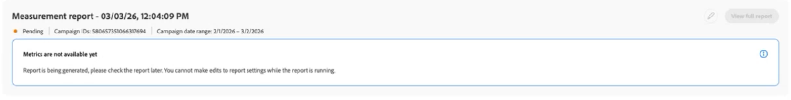

# 创建[!DNL Amazon Marketing Cloud]测量报告 {#amc-measurement-reports}

{{limited-availability-release-note}}

在[!DNL Amazon Marketing Cloud] ([!DNL AMC])项目中使用&#x200B;**[!UICONTROL 度量]**&#x200B;选项卡查看受众范围、频率和转化结果。 创建AMC项目后，为已使用[!DNL AMC]实例中可用的数据运行的营销活动创建测量报告。

>[!IMPORTANT]
>
>在完成后台数据设置查询之前，**[!UICONTROL 度量]**&#x200B;选项卡显示“没有可用的度量数据”。 此过程可能需要24小时。 如果消息在24小时后仍然存在，请参阅[疑难解答](#troubleshooting)部分。

## 创建报告 {#create-report}

要创建[!DNL AMC]测量报告，请按照[创建营销活动摘要报告](../measure.md#create-campaign-summary-report-create-campaign-summary-report)中的步骤操作。

{zoomable="yes"}

### 营销活动详细信息 {#campaign}

**[!UICONTROL 广告商ID]**&#x200B;标识与[!DNL AMC]实例关联的[!DNL Amazon Advertising]帐户。 [!DNL AMC]使用此帐户上下文检索促销活动以进行测量。

**[!UICONTROL 促销活动ID]**&#x200B;列表自动填充了连接的[!DNL AMC]实例中可用的促销活动。 仅当营销活动在默认发现回顾窗口内并具有足够的唯一用户以满足[!DNL AMC]的最低聚合阈值时，才会显示该营销活动。 选择要测量其[!DNL Amazon Ads]活动的营销活动。

如果未列出您需要的营销活动，请验证它是否属于连接的[!DNL Amazon Ads]帐户，并查看[疑难解答](#troubleshooting)。 有关阈值的详细信息，请参阅[AMC聚合阈值文档](https://advertising.amazon.com/API/docs/en-us/guides/amazon-marketing-cloud/aggregation-threshold)。

#### 日期范围、运行日期和报表名称 {#dates}

>[!CONTEXTUALHELP]
>id="rtcdp_collaboration_amc_measure_report_date_range"
>title="日期范围"
>abstract="设置要包含在报表中的促销活动数据的开始和结束日期。 日期范围限制为365天的回溯时段，最大跨度为90天。 您只能报告过去的营销活动。"

>[!CONTEXTUALHELP]
>id="rtcdp_collaboration_amc_measure_report_run_date"
>title="运行日期"
>abstract="报表执行的日期。 必须至少比报表结束日期晚一天，并且未来最多可为46天。"

>[!NOTE]
>
>您只能报告已运行的营销活动。

将&#x200B;**[!UICONTROL 报表日期范围]**&#x200B;设置为所选[!DNL AMC]营销活动运行的时段。 [!DNL AMC]支持365天的回溯时段，最大跨度为90天。

设置&#x200B;**[!UICONTROL 报表运行日期]**。 这是报表执行的日期。 运行日期必须至少比报表结束日期晚一天，并且将来最多可为46天。 有关完整的日期约束集，请参阅[AMC约束引用](#constraints)。

>[!TIP]
>
>对于日期范围在当前日期的30天内的归因报表，请将运行日期设置为将来30天，以确保在报表运行之前捕获固定30天回顾窗口内的所有转化。

#### 报告类型 {#report-type}

所有[!DNL AMC]报告都包含&#x200B;**[!UICONTROL 营销活动摘要]**。 或者，您可以包含&#x200B;**[!UICONTROL 归因]**&#x200B;数据，以测量在广告曝光后的30天内，促销活动展示次数是否导致客户操作，例如购买或注册。 归因要求在[!DNL AMC]实例中提供相关的转化事件。 对于侧重于触及率或认知度的营销活动，**[!UICONTROL 营销活动摘要]**&#x200B;可提供您所需的投放量度。

| 报告类型 | 描述 |
| --- | --- |
| **[!UICONTROL 营销活动摘要]** | 提供选定营销活动的范围、频率和展示次数量度。 始终包含。 |
| **[!UICONTROL 归因]** | 将转化数据添加到报表。 仅在[!DNL AMC]实例中存在转化事件时才可用。 查看[转化事件](#conversion-events)。 |

#### 转化事件（仅限归因） {#conversion-events}

>[!CONTEXTUALHELP]
>id="rtcdp_collaboration_amc_attribution_lookback_period"
>title="归因回顾周期"
>abstract="AMC 强制使用 30 天的固定归因窗口：在最后一次展示后最多 30 天内发生的转化可以归因于报告日期范围内的展示次数。 此值不可编辑；请计划在时间范围结束至少 30 天后运行报告，以确保捕获所有符合条件的转化。"

>[!CONTEXTUALHELP]
>id="rtcdp_collaboration_amc_measure_conversion_events"
>title="转化事件"
>abstract="选择最多三个要包含在归因报表中的转化事件。 自动从您的[!DNL AMC]实例中发现可用事件。 如果未显示任何事件，则您的[!DNL AMC]实例可能没有任何记录的转化事件，并且归因将不可用。"

>[!NOTE]
>
>归因数据要求在[!DNL AMC]实例中配置转化事件。 如果[!UICONTROL 归因]不可用或未选择，请跳过此部分并选择&#x200B;**[!UICONTROL 创建]**&#x200B;以提交表单。

对于[!UICONTROL 归因]报表，[!DNL AMC]应用固定的30天归因回顾时间范围。 无法调整此设置。

{zoomable="yes"}

转化事件表示由[!DNL Amazon Ads]跟踪的现场客户操作，如购买、愿望清单添加、购物车操作或产品详细信息视图。 归因报表支持最多三个事件。 选择与要测量的营销活动结果一致的事件。 如果[!UICONTROL 归因]选项不可用，请参阅[疑难解答](#troubleshooting)。

创建报告后，该报告将显示在&#x200B;**[!UICONTROL 度量]**&#x200B;选项卡中，并带有计划或待定状态。 在配置的运行日期，[!DNL AMC]处理报告查询并在24小时内返回结果。

{zoomable="yes"}

## 查看报表 {#view-report}

报表运行后，结果将显示在[!DNL AMC]项目的&#x200B;**[!UICONTROL 度量值]**&#x200B;选项卡中。 找到您的报告并选择&#x200B;**[!UICONTROL 查看完整报告]**&#x200B;以查看结果。

![&#x200B; [!DNL AMC]项目中的“度量”选项卡显示一个已完成的报表卡，其运行日期、报表类型和“查看完整报表”按钮突出显示。](../../../assets/collaborate/advertising-platforms/view-full-report.png){zoomable="yes"}

报告显示所选报告类型的可用结果。 **[!UICONTROL 营销活动摘要]**&#x200B;报告显示所选Amazon营销活动的投放结果。

{zoomable="yes"}

包含&#x200B;**[!UICONTROL 归因]**&#x200B;的报表也会显示与所选Amazon Ads转化事件关联的转化活动。

{zoomable="yes"}

有关解释报告结果的详细信息，请参阅[度量值性能](../measure.md#view-reports-view-reports)。

## [!DNL AMC]约束引用 {#constraints}

以下约束适用于所有[!DNL AMC]测量报告。

| 约束 | 值 |
| --- | --- |
| 最早的报表日期范围开始 | 当前日期前365天 |
| 最新报表日期范围结束 | 即期日期后45天。 使用此选项可以为仍在运行且将在未来45天内结束的营销活动预配置报表；报表在营销活动结束后于其计划运行日期自动执行。 |
| 最大报表日期范围 | 90 天 |
| 归因回顾时间范围 | 30天（固定为[!DNL AMC]） |
| 运行日期最小值 | 报表结束日期后至少1天 |
| 运行日期上限 | 未来46天 |
| 每个报告的最大转化事件数 | 3 |
| 营销活动选择 | 每个报告一个营销活动 |
| 报告编辑 | 不可用。 现有报表将被保留。 [需要更改时创建新报告](#create-report) |

## 故障排除 {#troubleshooting}

**没有可用的测量数据**

在完成项目创建时触发的后台数据设置查询之前，**[!UICONTROL 度量]**&#x200B;选项卡显示“没有可用的度量数据”。 这最多可能需要24小时。 如果“没有可用的测量数据”消息在24小时后仍然存在，请验证您的[!DNL AMC]实例是否具有过去三个月内运行的营销活动，因为这是营销活动发现期间使用的默认回顾时间范围。 如果存在符合条件的促销活动且消息仍然存在，请在[Amazon Ads帐户](https://advertising.amazon.com/sign-in){target="_blank"}中检查您的促销活动状态。

**在[!UICONTROL 营销活动ID]下拉列表中未显示营销活动**

即使&#x200B;**[!UICONTROL 度量]**&#x200B;选项卡可见，营销活动也可能不存在。 [!DNL AMC]将最低用户阈值应用于营销活动数据。 排除不符合最低独特用户阈值的营销活动，并且报告查询不会返回任何结果。 验证您要报告的营销活动是否有足够的触及范围。 有关[!DNL AMC]聚合阈值的详细信息，请参阅[AMC聚合阈值文档](https://advertising.amazon.com/API/docs/en-us/guides/amazon-marketing-cloud/aggregation-threshold){target="_blank"}。

**运行日期**&#x200B;后结果不可见

允许[!DNL AMC]在计划运行日期后最多24小时处理报告查询并返回结果。 如果在此时间段后报告仍处于“挂起”状态，请验证运行日期已过，并且报告状态不再显示为“挂起”。

**转化事件不可用，[!UICONTROL 归因]呈灰显状态**

出现这种情况可能有三个原因：

1. 未启用&#x200B;**转化跟踪。** 您的[!DNL AMC]广告商帐户可能未配置转化跟踪。 导航到您的[Amazon Ads帐户](https://advertising.amazon.com/sign-in){target="_blank"}，并验证相关营销活动的转化事件是否受到跟踪。
2. **没有记录的转化事件。** 即使启用了跟踪，您的[!DNL AMC]实例可能尚未记录任何转化事件。
3. **聚合阈值不符合。** [!DNL AMC]对转化数据应用最小阈值。 如果转化事件类型的发生次数不足，则不会返回该类型，也不会将其显示在列表中。

**转化次数似乎低于预期值**

如果报表运行日期在日期范围结束后的30天内，[!DNL AMC]可能尚未捕获归因窗口内的所有转化。 [创建一个运行日期在日期范围结束至少30天的新报告](#create-report)。

## 后续步骤 {#next-steps}

使用报告结果评估营销活动绩效，并为[!DNL Amazon Advertising]中的未来营销活动规划提供信息。 例如，您可以调整定位、抑制在频率分布中标识的过度展示的受众，或重新分配支出到效果较好的投放位置。 要分析不同的营销活动或报告周期，请使用相应的设置创建另一个测量报表。

有关所有可用的[!DNL AMC]协作功能的概述，请参阅[[!DNL Amazon Marketing Cloud]](./amc.md)。
