# 通过权限管理用户访问 {#manage-user-access}

{{limited-availability-release-note}}

通过Experience Cloud [权限](https://experienceleague.adobe.com/zh-hans/docs/experience-platform/access-control/abac/permissions-ui/browse){target="_blank"}界面管理对Real-Time CDP Collaboration中各个组件的权限和用户访问权限。 权限允许系统和产品管理员定义[角色](./manage-roles.md)来管理用户对特定功能和资源的访问权限。

## 配置对权限的访问 {#permissions-access}

要获得访问权限，您必须同时拥有产品管理员和用户对Adobe Experience Platform产品的访问权限。 系统管理员需要配置产品管理员权限，而用户权限可由系统管理员或产品管理员配置。 有关管理角色的更多信息，请阅读[访问控制层次结构](./overview.md#hierarchy)指南。

>[!TIP]
>
>在本指南中，**管理员**&#x200B;将同时引用&#x200B;**系统和产品管理员**。

### 系统管理员：配置产品管理员访问权限 {#admin-access}

授予用户产品管理员访问权限，以便他们可通过以下步骤在Experience Platform产品中授予管理权限：

>[!IMPORTANT]
>
>作为系统管理员，您可以开箱即用地访问特定的Experience Cloud产品，例如Adobe Admin Console。 但是，要使用权限，您需要为您自己授予产品管理员和用户访问Experience Platform产品的权限。 请按照下面的分步指南为您授予系统管理员访问权限。

使用您的凭据登录到[Adobe Experience Cloud](https://experience.adobe.com/){target="_blank"}。 主视图显示在&#x200B;**[!UICONTROL 快速访问]**&#x200B;部分中，其中包含可用产品的列表。 选择&#x200B;**[!UICONTROL Admin Console]**。

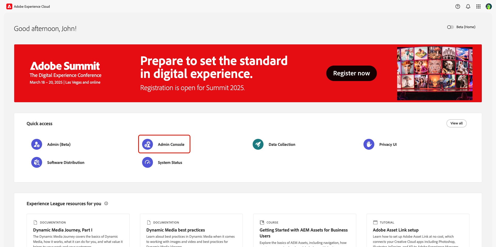{zoomable="yes"}

将显示[Adobe Admin Console](https://adminconsole.adobe.com/)概述仪表板。 从&#x200B;**[!UICONTROL 产品和服务]**&#x200B;下的&#x200B;**[!UICONTROL 产品]**&#x200B;列表中选择&#x200B;**[!UICONTROL Adobe Experience Platform]**。

{zoomable="yes"}

此时将显示Adobe Experience Platform功能板。 选择&#x200B;**[!UICONTROL 管理员]**&#x200B;选项卡，然后选择&#x200B;**[!UICONTROL 添加管理员]**。

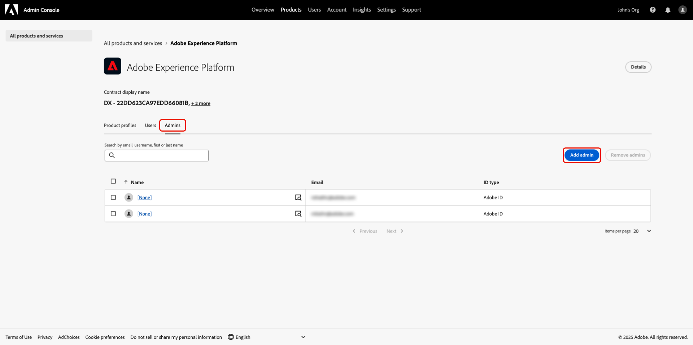{zoomable="yes"}

出现&#x200B;**[!UICONTROL 添加产品管理员]**&#x200B;对话框。 在&#x200B;**[!UICONTROL 电子邮件或用户名]**&#x200B;文本字段中输入用户电子邮件或用户名，然后从下拉列表中选择正确的帐户。 选择&#x200B;**[!UICONTROL 保存]**&#x200B;以完成将用户添加为产品管理员。

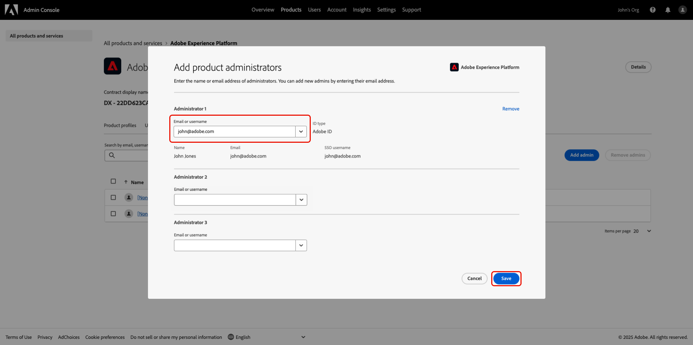{zoomable="yes"}

用户现在具有产品管理员权限，并且可以在Admin Console中执行管理功能，例如将用户或其他管理员添加到产品。 接下来，他们需要用户对Experience Platform产品的访问权限，才能在权限内访问和执行功能。

### 管理员：配置用户对Experience Platform的访问权限 {#user-access}

现在您已授予用户产品管理员访问权限，您需要向他们提供对Experience Platform产品的用户访问权限。 作为访问配置的一部分，您将分配特定于用户的[产品配置文件](https://helpx.adobe.com/cn/enterprise/using/manage-product-profiles.html)。

>[!TIP]
>
>如果您是按照上一节进行操作，则您已加入Adobe Experience Platform产品，并且可跳过第一步。

导航到[Admin Console](https://adminconsole.adobe.com/){target="_blank"}，并从&#x200B;**[!UICONTROL 产品和服务]**&#x200B;下的&#x200B;**[!UICONTROL 产品]**&#x200B;列表中选择&#x200B;**[!UICONTROL Adobe Experience Platform]**。

{zoomable="yes"}

选择&#x200B;**[!UICONTROL 用户]**&#x200B;选项卡，然后选择&#x200B;**[!UICONTROL 添加用户]**。

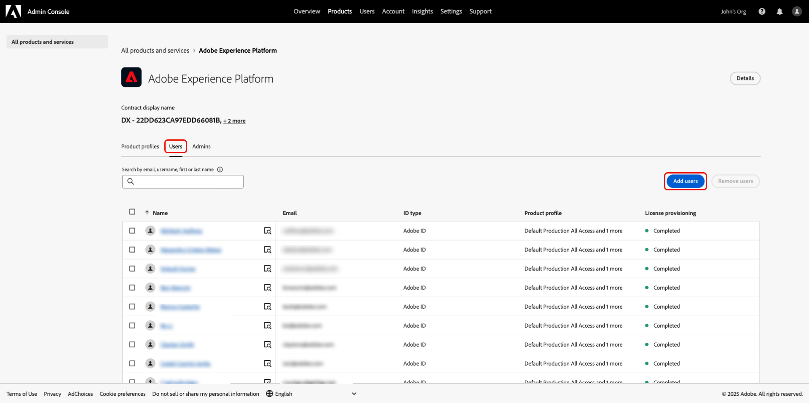{zoomable="yes"}

出现&#x200B;**[!UICONTROL 将用户添加到此产品]**&#x200B;对话框。 在&#x200B;**[!UICONTROL 名称、用户组或电子邮件地址]**&#x200B;文本字段中输入用户名或电子邮件，然后从下拉列表中选择正确的帐户。 接下来，选择&#x200B;**[!UICONTROL 产品]**&#x200B;添加选项。

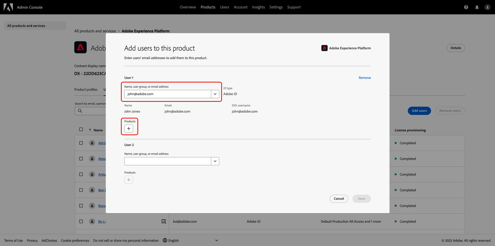{zoomable="yes"}

将显示&#x200B;**[!UICONTROL 选择产品配置文件]**&#x200B;对话框。 选择&#x200B;**[!UICONTROL AEP-Default-All-Users]**&#x200B;和&#x200B;**[!UICONTROL Default Production All Access]**，然后选择&#x200B;**[!UICONTROL 应用]**。

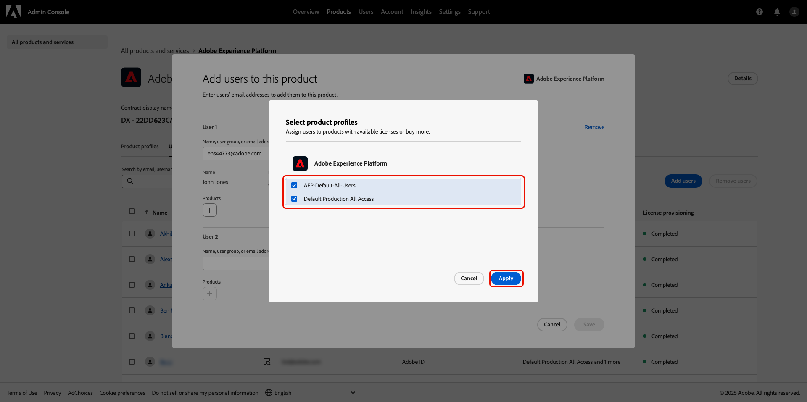{zoomable="yes"}

确认信息正确，然后选择&#x200B;**[!UICONTROL 保存]**。

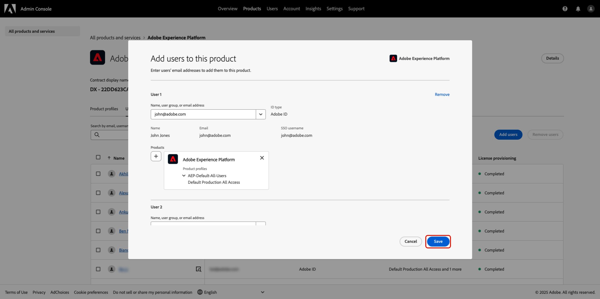{zoomable="yes"}

用户现在应具有产品管理员和产品对Experience Platform的访问权限，从而授予他们权限访问权限。 接下来，您需要为用户分配两个基本角色，以授予他们访问Experience Platform UI的权限。

### 管理员：配置Experience Platform UI访问权限 {#product-access}

在Real-Time CDP Collaboration中，管理员和最终用户将使用Experience Platform中的数据，如受众和审核日志。 此数据保存在称为沙盒的Experience Platform实例中。 为确保用户可以与此数据交互，您需要将[默认角色](https://experienceleague.adobe.com/zh-hans/docs/experience-platform/access-control/home#default-roles){target="_blank"}分配给用户。

要开始，请导航到[Adobe Experience Cloud](https://experience.adobe.com/)。 您现在应该会在&#x200B;**[!UICONTROL 快速访问]**&#x200B;中看到&#x200B;**[!UICONTROL Experience Platform]**&#x200B;和&#x200B;**[!UICONTROL 权限]**。

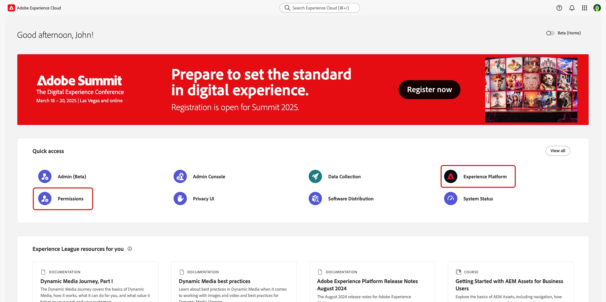{zoomable="yes"}

>[!NOTE]
>
> 这些产品可能需要几分钟才能访问，您将收到一封电子邮件，提醒您已获得访问权限。 如果在收到电子邮件后，您未在Adobe Experience Cloud中看到Experience Platform或“权限”，请注销，然后重新登录您的帐户。

在此阶段，您现在可以访问&#x200B;**[!UICONTROL 权限]**。 如果尝试访问&#x200B;**[!UICONTROL Experience Platform]**，您将收到一条警告，指出没有启用沙盒，如下所示。 要解决此问题，您需要为用户分配默认角色。 要开始，请选择&#x200B;**[!UICONTROL 权限]**。

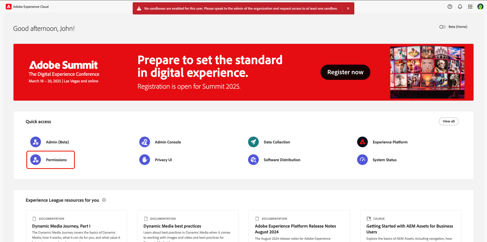{zoomable="yes"}

将显示&#x200B;**[!UICONTROL 权限]**&#x200B;仪表板。 从左侧面板中选择&#x200B;**用户**，然后选择用户的名称。

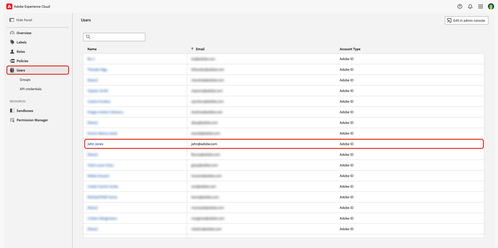{zoomable="yes"}

选择&#x200B;**[!UICONTROL 角色]**&#x200B;选项卡，然后选择&#x200B;**[!UICONTROL 添加角色]**。

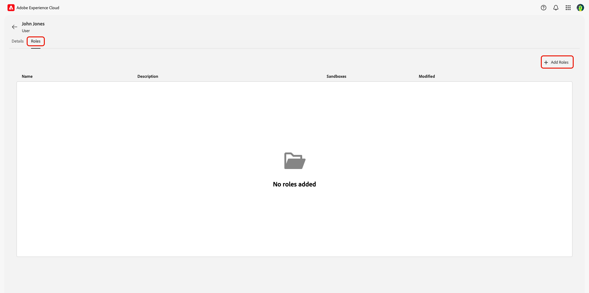{zoomable="yes"}

出现&#x200B;**[!UICONTROL 添加角色]**&#x200B;对话框。 选择&#x200B;**[!UICONTROL 默认的生产所有访问]**&#x200B;和&#x200B;**[!UICONTROL 沙盒管理员]**，然后选择&#x200B;**[!UICONTROL 保存]**。

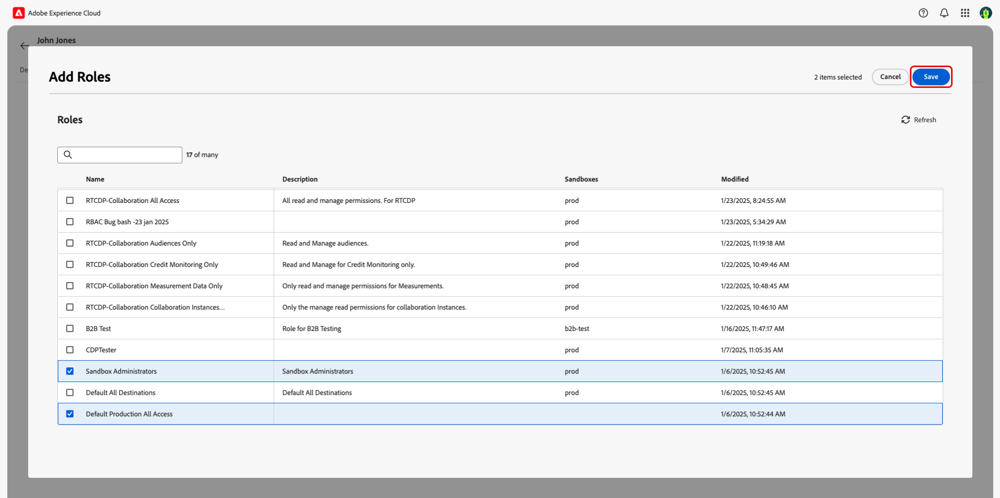{zoomable="yes"}

您现在可以访问Experience Platform和权限。 在最后一步，您将授予对Real-Time CDP Collaboration的访问权限。

### 管理员：配置Real-Time CDP Collaboration访问权限 {#RTCDP-collaboration-access}

要授予用户访问Real-Time CDP Collaboration的权限，您将使用称为角色的访问控制概念。 角色定义管理员或用户在组织中对[资源](https://experienceleague.adobe.com/zh-hans/docs/experience-platform/access-control/home#permissions)的访问权限级别。

在配置个人对Real-Time CDP Collaboration的访问权限时，您将分配包含协作资源权限的用户角色。 您可以使用[管理角色](./manage-roles.md)指南查找以下信息：

- [两个标准角色](./manage-roles.md#standard-roles)及其授予Real-Time CDP Collaboration的访问权限级别
- 使用Collaboration资源创建[自定义角色](./manage-roles.md#specific-access-roles)
- 协作资源中包含的权限列表

>[!NOTE]
>
>此外，必须将用户分配给&#x200B;**[!UICONTROL 沙盒]**&#x200B;资源中包含&#x200B;**[!UICONTROL Prod]**&#x200B;权限的角色。 两个标准角色都包含此权限。 如果选择为用户分配自定义角色而不是标准角色，则必须确保分配给用户的其中一个角色包含此权限。

选择或创建包含用户所需访问级别的角色后，您需要将用户分配给该角色。

#### 分配角色

您可以将多个角色分配给单个用户，也可以将多个用户分配给单个角色。 前面讨论过第一种情况，即[分配默认角色](#product-access)以授予用户访问Experience Platform的权限。 在接下来的步骤中，您将直接将用户分配给您选择的角色。

在&#x200B;**[!UICONTROL 权限]**&#x200B;中，从左侧面板中选择&#x200B;**[!UICONTROL 角色]**，然后从列表中选择您的角色。

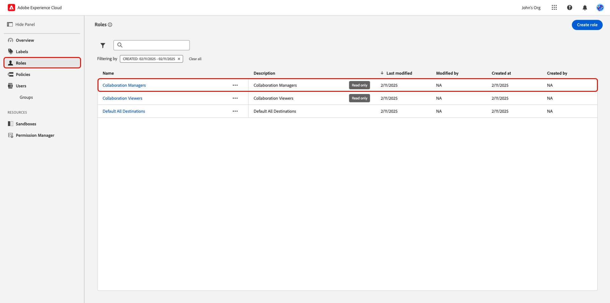{zoomable="yes"}

将显示角色的详细信息页面。 选择&#x200B;**[!UICONTROL 用户]**&#x200B;选项卡，然后选择&#x200B;**[!UICONTROL 添加用户]**。

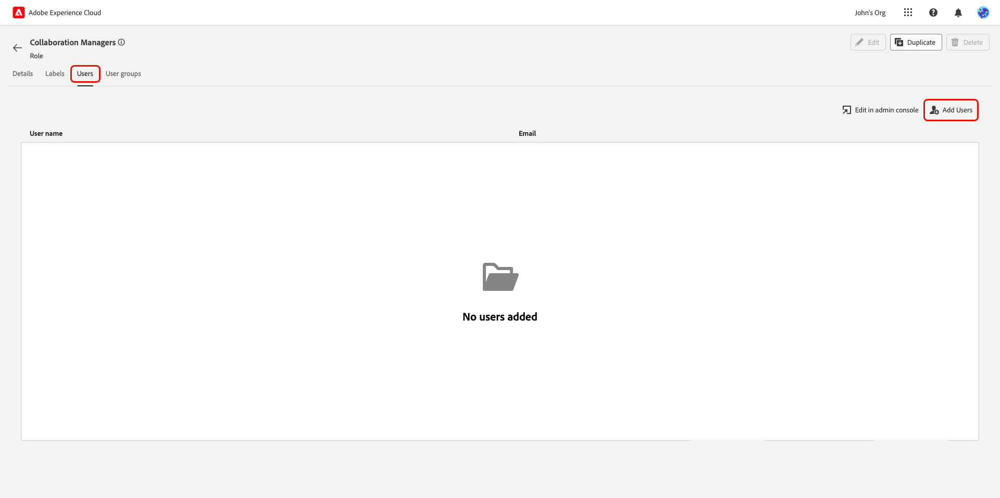{zoomable="yes"}

出现&#x200B;**[!UICONTROL 添加用户]**&#x200B;对话框。 从列表中选择用户，然后选择&#x200B;**[!UICONTROL 保存]**。

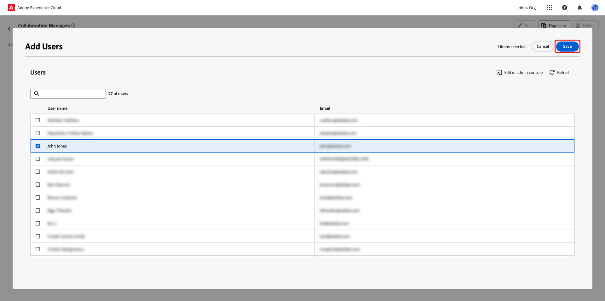{zoomable="yes"}

用户现在应该看到&#x200B;**[!UICONTROL RTCDP Collaboration]**&#x200B;在Experience Cloud中的&#x200B;**[!UICONTROL 快速访问]**&#x200B;下列为产品。

在“快速访问”下突出显示带有RTCDP Collaboration产品的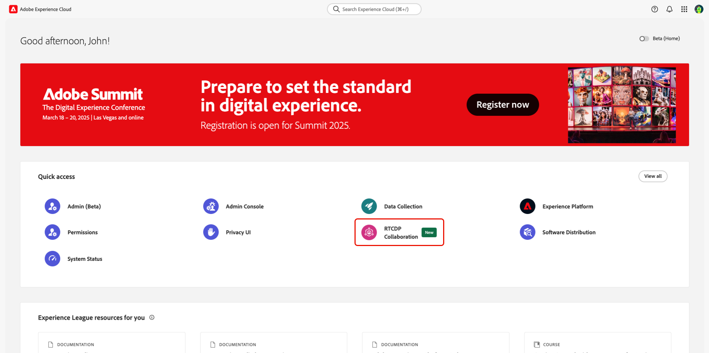

## 后续步骤

现在，用户有权访问Real-Time CDP Collaboration，他们可以开始使用产品了。 若要详细了解整个产品，请阅读[概述指南](../home.md)。
