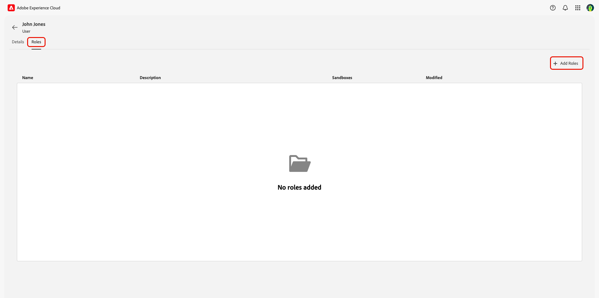
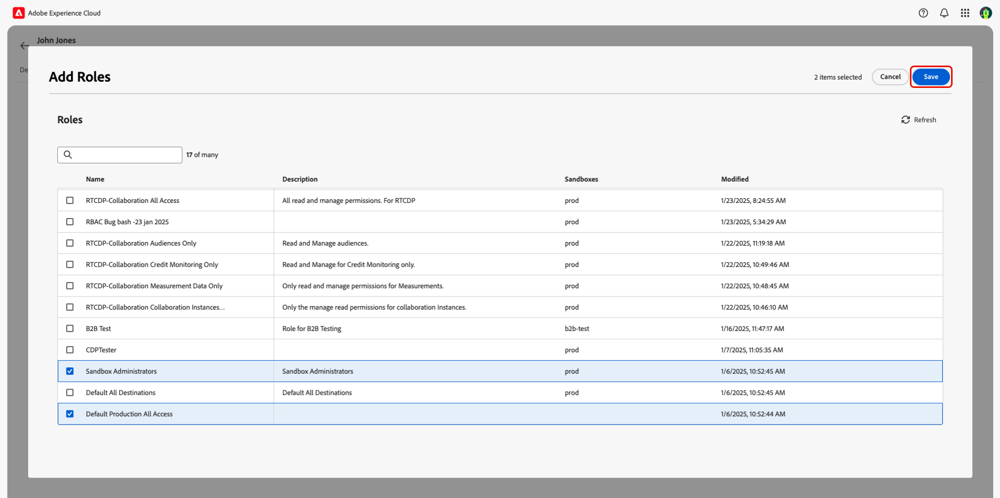
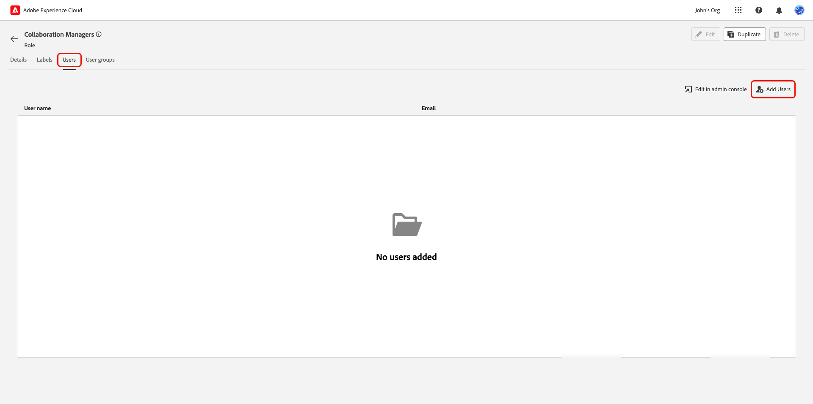
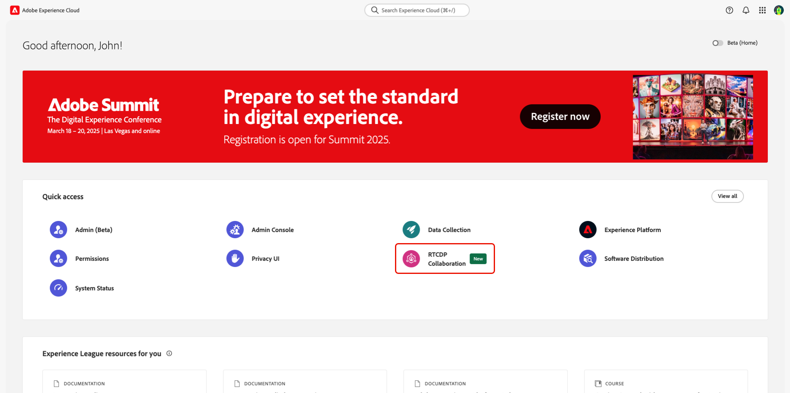

# 通过权限管理用户访问 {#manage-user-access}

{{limited-availability-release-note}}

通过Experience Cloud [权限](https://experienceleague.adobe.com/zh-hans/docs/experience-platform/access-control/abac/permissions-ui/browse){target="_blank"}界面管理对Adobe Real-Time CDP Collaboration中各个组件的权限和用户访问权限。 权限允许系统和产品管理员定义[角色](./manage-roles.md)来管理用户对特定功能和资源的访问权限。

## 配置对权限的访问 {#permissions-access}

要获得访问权限，您必须同时拥有产品管理员和用户对Adobe Experience Platform产品的访问权限。 系统管理员需要配置产品管理员权限，而用户权限可由系统管理员或产品管理员配置。 有关管理角色的更多信息，请阅读[访问控制层次结构](./overview.md#hierarchy)指南。

>[!TIP]
>
>在本指南中，**管理员**&#x200B;将同时引用&#x200B;**系统和产品管理员**。

### 系统管理员：配置产品管理员访问权限 {#admin-access}

授予用户产品管理员访问权限，以便他们可通过以下步骤在Experience Platform产品中授予管理权限：

>[!IMPORTANT]
>
>作为系统管理员，您可以开箱即用地访问特定的Experience Cloud产品，例如Adobe Admin Console。 但是，要使用权限，您需要为您自己授予产品管理员和用户访问Experience Platform产品的权限。 请按照下面的分步指南为您授予系统管理员访问权限。

使用您的凭据登录到[Adobe Experience Cloud](https://experience.adobe.com/){target="_blank"}。 主视图显示在&#x200B;**[!UICONTROL 快速访问]**&#x200B;部分中，其中包含可用产品的列表。 选择&#x200B;**[!UICONTROL Admin Console]**。

{zoomable="yes"}

将显示[Adobe Admin Console](https://adminconsole.adobe.com/)概述仪表板。 从&#x200B;**[!UICONTROL 产品和服务]**&#x200B;下的&#x200B;**[!UICONTROL 产品]**&#x200B;列表中选择&#x200B;**[!UICONTROL Adobe Experience Platform]**。

{zoomable="yes"}

此时将显示Adobe Experience Platform功能板。 选择&#x200B;**[!UICONTROL 管理员]**&#x200B;选项卡，然后选择&#x200B;**[!UICONTROL 添加管理员]**。

{zoomable="yes"}

出现&#x200B;**[!UICONTROL 添加产品管理员]**&#x200B;对话框。 在&#x200B;**[!UICONTROL 电子邮件或用户名]**&#x200B;文本字段中输入用户电子邮件或用户名，然后从下拉列表中选择正确的帐户。 选择&#x200B;**[!UICONTROL 保存]**&#x200B;以完成将用户添加为产品管理员。

{zoomable="yes"}

用户现在具有产品管理员权限，并且可以在Admin Console中执行管理功能，例如将用户或其他管理员添加到产品。 接下来，他们需要用户对Experience Platform产品的访问权限，才能在权限内访问和执行功能。

### 管理员：配置用户对Experience Platform的访问权限 {#user-access}

现在您已授予用户产品管理员访问权限，您需要向他们提供对Experience Platform产品的用户访问权限。 作为访问配置的一部分，您将分配特定于用户的[产品配置文件](https://helpx.adobe.com/cn/enterprise/using/manage-product-profiles.html)。

>[!TIP]
>
>如果您是按照上一节进行操作，则您已加入Adobe Experience Platform产品，并且可跳过第一步。

导航到[Admin Console](https://adminconsole.adobe.com/){target="_blank"}，并从&#x200B;**[!UICONTROL 产品和服务]**&#x200B;下的&#x200B;**[!UICONTROL 产品]**&#x200B;列表中选择&#x200B;**[!UICONTROL Adobe Experience Platform]**。

{zoomable="yes"}

选择&#x200B;**[!UICONTROL 用户]**&#x200B;选项卡，然后选择&#x200B;**[!UICONTROL 添加用户]**。

{zoomable="yes"}

出现&#x200B;**[!UICONTROL 将用户添加到此产品]**&#x200B;对话框。 在&#x200B;**[!UICONTROL 名称、用户组或电子邮件地址]**&#x200B;文本字段中输入用户名或电子邮件，然后从下拉列表中选择正确的帐户。 接下来，选择&#x200B;**[!UICONTROL 产品]**&#x200B;添加选项。

{zoomable="yes"}

将显示&#x200B;**[!UICONTROL 选择产品配置文件]**&#x200B;对话框。 选择&#x200B;**[!UICONTROL AEP-Default-All-Users]**&#x200B;和&#x200B;**[!UICONTROL Default Production All Access]**，然后选择&#x200B;**[!UICONTROL 应用]**。

{zoomable="yes"}

确认信息正确，然后选择&#x200B;**[!UICONTROL 保存]**。

{zoomable="yes"}

用户现在应具有产品管理员和产品对Experience Platform的访问权限，从而授予他们权限访问权限。 接下来，您需要为用户分配两个基本角色，以授予他们访问Experience Platform UI的权限。

### 管理员：配置Experience Platform UI访问权限 {#product-access}

在Real-Time CDP Collaboration中，管理员和最终用户将使用Experience Platform中的数据，如受众和审核日志。 此数据保存在称为沙盒的Experience Platform实例中。 为确保用户可以与此数据交互，您需要将[默认角色](https://experienceleague.adobe.com/zh-hans/docs/experience-platform/access-control/home#default-roles){target="_blank"}分配给用户。

要开始，请导航到[Adobe Experience Cloud](https://experience.adobe.com/)。 您现在应该会在&#x200B;**[!UICONTROL 快速访问]**&#x200B;中看到&#x200B;**[!UICONTROL Experience Platform]**&#x200B;和&#x200B;**[!UICONTROL 权限]**。

{zoomable="yes"}

>[!NOTE]
>
> 这些产品可能需要几分钟才能访问，您将收到一封电子邮件，提醒您已获得访问权限。 如果在收到电子邮件后，您未在Adobe Experience Cloud中看到Experience Platform或“权限”，请注销，然后重新登录您的帐户。

在此阶段，您现在可以访问&#x200B;**[!UICONTROL 权限]**。 如果尝试访问&#x200B;**[!UICONTROL Experience Platform]**，您将收到一条警告，指出没有启用沙盒，如下所示。 要解决此问题，您需要为用户分配默认角色。 要开始，请选择&#x200B;**[!UICONTROL 权限]**。

{zoomable="yes"}

将显示&#x200B;**[!UICONTROL 权限]**&#x200B;仪表板。 从左侧面板中选择&#x200B;**用户**，然后选择用户的名称。

{zoomable="yes"}

选择&#x200B;**[!UICONTROL 角色]**&#x200B;选项卡，然后选择&#x200B;**[!UICONTROL 添加角色]**。

{zoomable="yes"}

出现&#x200B;**[!UICONTROL 添加角色]**&#x200B;对话框。 选择&#x200B;**[!UICONTROL 默认的生产所有访问]**&#x200B;和&#x200B;**[!UICONTROL 沙盒管理员]**，然后选择&#x200B;**[!UICONTROL 保存]**。

{zoomable="yes"}

You now have access to Experience Platform and Permissions. In the final step, you&#39;ll grant access to Real-Time CDP Collaboration.

### 管理员：配置 Real-Time CDP Collaboration 访问权限 {#RTCDP-collaboration-access}

>[!CONTEXTUALHELP]
>id="rtcdp_collaboration_organization_permissions"
>title="管理用户访问权限指南"
>abstract=""

To grant users access to Collaboration, you&#39;ll use an access control concept called roles. Roles define the level of access a administrator or user has to [resources](https://experienceleague.adobe.com/zh-hans/docs/experience-platform/access-control/home#permissions) in your organization.

When configuring individual access to Collaboration, you&#39;ll assign users&#39; roles containing permissions from the Collaborations resource. You can use the [manage roles](./manage-roles.md) guide to find out information on:

- the [two standard roles](./manage-roles.md#standard-roles) and the levels of access they grant to Collaboration
- creating [custom roles](./manage-roles.md#specific-access-roles) using the Collaboration resource
- the list of permissions included in the Collaborations resource

>[!NOTE]
>
>Additionally, a user must be assigned to a role containing the **[!UICONTROL Prod]** permission in the **[!UICONTROL Sandboxes]** resources. Both standard roles contain this permission. If you choose to assign a user a custom role instead of a standard role, you must ensure one of the roles they are assigned to contain this permission.

Once you&#39;ve chosen or created a role that encompasses the level of access your user needs, you need to assign the user to that role.

#### Assign a role

You may assign multiple roles to a single user or assign multiple users to a single role. The first case was covered earlier when [assigning the default roles](#product-access) to give a user access to Experience Platform. In the next steps, you&#39;ll assign users directly to the role you&#39;ve selected.

In **[!UICONTROL Permissions]** select **[!UICONTROL Roles]** from the left panel and then select your role from the list.

{zoomable="yes"}

The role&#39;s detail page displays. Select the **[!UICONTROL Users]** tab and then select **[!UICONTROL Add Users]**.

{zoomable="yes"}

The **[!UICONTROL Add Users]** dialog appears. Select the user(s) from the list and then select **[!UICONTROL Save]**.

{zoomable="yes"}

The user should now see **[!UICONTROL RTCDP Collaboration]** listed as a product under **[!UICONTROL Quick Access]** in Experience Cloud.

## 后续步骤

Now that users have access to Real-Time CDP Collaboration, they can begin using the product. To learn more about the product as a whole, read the [overview guide](../home.md).
