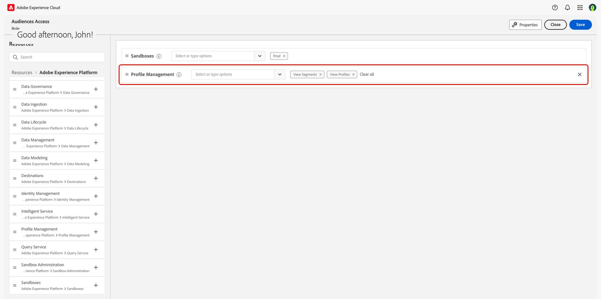

# 访问控制概述

{{limited-availability-release-note}}

>[!IMPORTANT]
>
> 如果您是想要访问Adobe Real-Time CDP Collaboration的最终用户，请联系您的系统或产品管理员以检查现有访问权限。 如果您不知道系统管理员是谁，请联系您的Adobe代表。

Adobe Real-Time CDP Collaboration的访问控制是通过[Adobe Experience Cloud](https://experience.adobe.com/){target="_blank"}中的Admin Console和权限提供的。 在本指南中，您将了解如何根据用例授予自己或团队其他成员的访问权限。

## 访问控制层次结构 {#hierarchy}

要配置对Collaboration的访问控制，您&#x200B;**必须**&#x200B;具有系统管理员或产品管理员权限。 系统管理员没有限制，并在载入过程中进行配置。 同时，产品管理员可以为他们分配到的所有产品提供管理功能。 系统管理员必须向产品管理员授予产品和管理权限。

这些指南将介绍如何为系统管理员、产品管理员和最终用户配置访问权限。 请参阅下表以了解角色之间的主要区别。

| 角色 | 描述 |
| --- | --- |
| 系统管理员 | 组织的超级用户。 他们可以在Admin Console中执行所有管理任务，并有权将管理功能委派给其他用户。 |
| 产品管理员 | 管理分配给他们的产品以及所有相关管理功能，例如向组织添加用户，在产品配置文件中添加或删除用户，以及在产品中添加或删除其他产品管理员。 |
| 最终用户 | 您组织中使用该产品的用户。 |

{style="table-layout:auto"}

有关管理角色的详细信息，请访问[Adobe帮助中心](https://helpx.adobe.com/enterprise/using/admin-roles.html)。

>[!TIP]
>
>在这些指南中使用&#x200B;**管理员**&#x200B;将同时涉及到&#x200B;**系统和产品管理员**。

## 其他产品 {#products}

在授予对Collaboration的访问权限之前，您需要具有对多个产品的访问权限，具体取决于您的[用例](#use-cases)。 访问控制指南可以在您进行过程中通过多个用户界面工作，每个用户界面在访问配置过程中服务于特定目的。 请参阅下表，更深入地了解每个产品的用途。

| 产品 | 用途 |
| --- | --- |
| [管理控制台](https://adminconsole.adobe.com/) | 管理员使用此项为用户分配产品和/或管理员访问权限。 |
| [权限](https://experience.adobe.com/) | 管理员使用此项来分配管理员或最终用户角色。 |
| [Experience Platform](https://platform.adobe.com/) | 管理员和最终用户需要获得对Experience Platform产品的访问权限，才能将其分配给角色。 |

## 从何处开始 {#use-cases}

现在，您已更深入地了解了用户和管理角色以及不同的Experience Cloud产品，您可以开始授予Collaboration访问权限。 有两个主要因素会影响您需要采取的步骤：

- 如果您正在分配管理员或最终用户访问权限
- 如果用户已经有权访问Experience Platform产品

请参阅下图，根据访问控制用例确定配置权限所需的人员以及从何处开始操作。 **请务必从起始位置开始阅读教程直至指南的结尾。**

>[!TIP]
>
> 超级用户是指系统管理员可以获得的最高级别的访问权限。 超级用户可以执行所有管理任务和用户功能。 系统管理员没有开箱即用的产品功能，需要为自己授予适当的访问权限，如下图所示。

| 用例 | 所需角色 | 从何处开始 |
| --- | --- | --- |
| 没有现有Experience Platform产品访问权限的超级用户。 | 系统管理员。 | [配置产品管理员访问权限](./manage-user-access.md#admin-access) |
| 具有&#x200B;**Experience Platform UI访问权限的现有Experience Platform系统管理员**&#x200B;的超级用户。 | 系统管理员。 | [配置Collaboration访问权限](./manage-user-access.md#RTCDP-collab-access) |
| 现有Experience Platform系统管理员&#x200B;**的超级用户，无** Experience Platform UI访问权限。 | 系统管理员。 | [配置产品管理员访问权限](./manage-user-access.md#admin-access) |
| 产品管理员权限和新产品管理员的Collaboration访问权限。 | 系统管理员。 | [配置产品管理员访问权限](./manage-user-access.md#admin-access) |
| 现有Experience Platform产品管理员&#x200B;**具有** Experience Platform UI访问权限的Collaboration访问权限。 | 系统或产品管理员。 | [配置Collaboration访问权限](./manage-user-access.md#RTCDP-collab-access) |
| 现有Experience Platform产品管理员&#x200B;**的Collaboration访问权限，但没有对Experience Platform UI的**&#x200B;访问权限。 | 系统或产品管理员。 | [配置用户访问权限](./manage-user-access.md#user-access) |
| 面向新最终用户的Collaboration访问权限。 | 系统或产品管理员。 | [配置用户访问权限](./manage-user-access.md#user-access) |
| 具有Collaboration访问权限的现有用户的Experience Platform访问权限。 | 系统或产品管理员。 | [配置Collaboration访问权限](./manage-user-access.md#RTCDP-collab-access) |

{style="table-layout:auto"}

## 其他权限

获得Collaboration的访问权限后，您可能需要一些额外的Experience Platform权限才能使用特定功能。

### 受众源 {#audience-sourcing}

在开始向协作者发送受众之前，您需要将受众源至Collaboration。 目前，唯一支持导入受众的自助数据连接是Experience Platform。 要开始，需要为管理受众入门的用户分配一个角色，该角色包含以下&#x200B;**[!UICONTROL 配置文件管理]**&#x200B;资源权限：

| 权限 | 描述 |
| ---- | ---- |
| [!UICONTROL 查看区段] | 允许用户查看沙盒中可用受众的列表。 |
| [!UICONTROL 查看配置文件] | 允许用户查看可用于映射到协作字段的字段。 |

在下方，您可以看到添加有上述权限的示例角色。 有关创建或分配角色的更多信息，请参阅[管理角色](./manage-roles.md)指南。

>[!NOTE]
>
>在获得受众之后，用户便可以在Collaboration中与其合作，而无需具有任何上述权限。

## 后续步骤

确定开始位置后，按照用例的链接开始配置访问权限。 如果您想了解如何在这些用例之外以管理员身份配置对Collaboration的访问权限，请参阅[管理用户访问权限](manage-user-access.md)指南。 要了解角色及其在配置对Collaboration各个组件的访问权限中所扮演的角色，请参阅[管理角色](manage-roles.md)指南。
