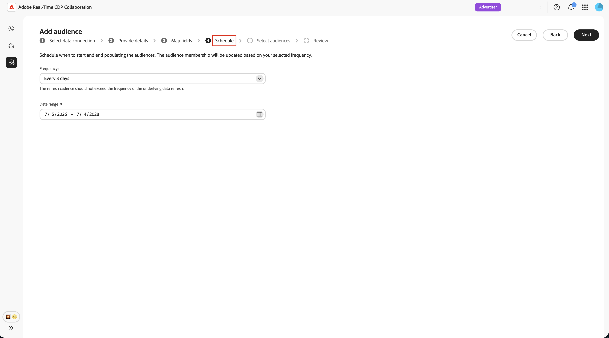
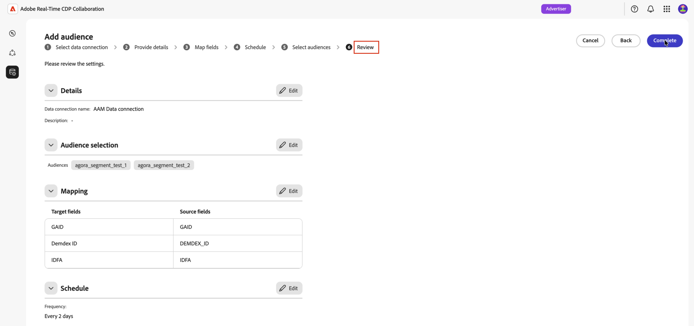

# 为受众源配置Adobe Audience Manager

了解如何将Adobe Audience Manager (AAM)实例连接到Adobe Real-Time CDP Collaboration，以便您可以将符合条件的第一方区段源到平台中。 创建连接后，Collaboration会按定期计划从Adobe Audience Manager中检索受众成员资格，并在您的协作项目中使这些受众可用于重叠分析和激活。

>[!NOTE]
>
> 源自Audience Manager的受众遵循与源自Adobe Experience Platform的受众相同的治理和数据处理规则。 只有通过第一方数据源构建的区段才符合条件。 不支持包含第三方数据或Audience Marketplace源的区段。

## 先决条件 {#prerequisites}

请先完成此部分中的所有项目，然后再启动配置工作流。 未完成先决条件是最常见的原因是设置失败或受众在采购后未出现。 在遵循本指南之前，您必须已完成[帐户登录和设置](./onboard-account.md)。

### Adobe Audience Manager访问和权限 {#aam-access-and-permissions}

在继续之前，请确认您拥有：

* 有效的Adobe Audience Manager合同和已设置的Audience Manager实例。
* 访问Audience Manager用户界面，并有权查看要源的区段。
* 您在同一Adobe IMS组织下配置的Audience Manager实例和Collaboration帐户。 不支持跨组织来源补充。

### 区段资格要求 {#aam-segments-requirements}

在配置连接时，Collaboration会根据以下规则自动筛选区段列表。

**仅限第一方数据**

只有基于您自己的第一方数据的区段才可用于采购。 排除包含来自第三方数据提供程序或AAM Audience Marketplace的特征的区段。

**回访间隔筛选器**

只有过去13个月&#x200B;**内创建或更新的**&#x200B;区段才可用于采购。 在连接设置期间和每次后续刷新时，将排除较旧的区段。

### 同意要求 {#consent-requirements}

所有源自Collaboration的AAM区段都必须在同意后进行过滤。 如果导出时配置文件存在选择退出标记，则该配置文件会在到达Collaboration之前被排除。

>[!IMPORTANT]
>
>在连接到Collaboration之前，您有责任确保在Audience Manager实例中正确配置并强制执行同意。 数据离开Audience Manager后，Adobe不会重新应用同意规则。

## 配置Audience Manager连接 {#configure-aam-connection}

配置工作流是&#x200B;**[!UICONTROL 安装程序]**&#x200B;工作区中的多步骤向导。 按顺序完成每个步骤。 在创建连接之前，您可以使用最终审阅屏幕上的铅笔图标返回到任何步骤。

### 添加数据连接 {#add-data-connection}

从&#x200B;**[!UICONTROL 设置]**&#x200B;工作区的&#x200B;**[!UICONTROL 我的受众]**&#x200B;选项卡中，选择添加图标（） 然后选择&#x200B;**[!UICONTROL 受众]**。

如果这是您的第一个受众，您还可以选择&#x200B;**[!UICONTROL 添加受众]**&#x200B;选项。

此时会显示添加受众工作流。 选择&#x200B;**[!UICONTROL 添加新数据连接]**，然后选择&#x200B;**[!UICONTROL 下一步]**。

{zoomable="yes"}

### 选择Adobe Audience Manager作为数据连接 {#select-aam}

数据源选择屏幕列出了所有可用的连接类型。 选择&#x200B;**[!UICONTROL Adobe Audience Manager]**&#x200B;作为数据连接，然后选择&#x200B;**[!UICONTROL 下一步]**。

### 确认同意和数据使用 {#confirm-consent-data-use}

在继续操作之前，请确认您已对发送到Collaboration的受众数据应用了法律规定的任何选择退出。 如果不确定您的数据是否满足此要求，请先查看[治理策略和实施操作](./onboard-audiences.md#governance-policy-and-enforcement-actions)指南，然后再继续。 选中确认复选框，然后选择&#x200B;**[!UICONTROL 确定]**&#x200B;以继续。

### 提供连接详细信息 {#provide-connection-details}

接下来，输入此数据连接的名称和可选说明。 创建连接后，您提供的名称将显示在&#x200B;**[!UICONTROL 我的数据连接]**&#x200B;选项卡中，并帮助您将来识别此源。

* **[!UICONTROL 数据连接名称]** （必需）
* **[!UICONTROL 数据连接描述]**（可选）

完成后，选择&#x200B;**[!UICONTROL 下一步]**。

### 查看身份映射 {#review-identity-mapping}

**[!UICONTROL 映射]**&#x200B;屏幕是只读的。 Collaboration会自动将受支持的身份输出从AAM区段映射到Collaboration身份字段。 有关更多信息，请参阅下表。

| AAM身份输出 | Collaboration标识字段 | 注释 |
| ------------------- | ---------------------------- | ----- |
| `Demdex ID` | `DEMDEX_ID` | 此集成支持的身份输出。 在采购期间，Collaboration不会将Demdex ID转换为ECID。 |
| `GAID` | `GAID` | 此集成支持的身份输出。 |
| `IDFA` | `IDFA` | 此集成支持的身份输出。 |

{style="table-layout:auto"}

您可以查看映射，但在当前阶段无法对其进行修改。 选择&#x200B;**[!UICONTROL 下一步]**&#x200B;以继续。

### 计划数据刷新 {#schedule-data-refresh}

在&#x200B;**[!UICONTROL 计划]**&#x200B;视图中，设置Collaboration从AAM区段中检索更新的受众成员资格数据的刷新频率，并定义源的有效日期范围。

使用&#x200B;**[!UICONTROL 频率]**&#x200B;下拉菜单选择一到六天的刷新间隔。 然后，使用日历设置受众源的开始和结束日期。 到达结束日期后，来源补充将停止，并且以前来源的受众将过期。

>[!IMPORTANT]
>
>Audience Manager区段通常根据特征回访间隔和频度规则每24-48小时刷新一次。 如果设置的Collaboration刷新间隔短于此值，则可能会使用Collaboration积分，而不会更新结果。 若要监视您的信用使用情况，请参阅[跟踪您的信用使用情况活动](./my-activity.md)。

完成后，选择&#x200B;**[!UICONTROL 下一步]**。

### 选择受众 {#select-audiences}

您可以查看使用第一方数据源特征且在过去13个月内创建或更新的符合条件的区段的列表。

选择要源到Collaboration中的区段。 您可以按名称搜索或滚动以查找特定区段。 完成后，选择&#x200B;**[!UICONTROL 下一步]**。

>[!TIP]
>
>如果未列出您预期看到的区段，请验证该区段在过去13个月内是否进行了更新，并且是否仅使用第一方数据源特征。 排除具有第三方或Audience Marketplace特征的区段。

### 查看并完成连接 {#review-and-complete}

在创建连接之前，请查看完整的配置摘要。 摘要屏幕显示以下部分：

* **[!UICONTROL 详细信息]**：此数据连接的名称和可选描述。
* **[!UICONTROL 受众选择]**：您选择的AAM区段。
* **[!UICONTROL 映射]**：标识字段从AAM源字段映射到Collaboration标识字段。
* **[!UICONTROL 计划]**：刷新频率和活动日期范围。

如果需要更改，请选择任何部分旁边的铅笔图标（）。 选择&#x200B;**[!UICONTROL 完成]**&#x200B;以确认所有节。

此时将显示确认对话框，指示已创建数据连接并且正在获取受众。

## 审查源受众 {#review-sourced-audiences}

完成向导后，Collaboration将开始异步从选定的AAM区段中检索受众成员资格数据。 导航到&#x200B;**[!UICONTROL 设置] > [!UICONTROL 我的受众]**&#x200B;以监视进度。

### 监控受众源获取进度 {#monitor-progress}

在Collaboration检索AAM区段数据时，**[!UICONTROL 我的受众]**&#x200B;工作区顶部的横幅指示源获取正在进行中。 当每个区段的来源补充完成时，各个受众会显示在列表中。

### 查看源受众详细信息 {#view-sourced-audience-details}

源补充完成后，您的AAM区段会显示在&#x200B;**[!UICONTROL 我的受众]**&#x200B;选项卡中。 **[!UICONTROL Source]**&#x200B;列将它们标识为&#x200B;**[!UICONTROL Adobe Audience Manager]**。

选择一行或&#x200B;**[!UICONTROL 查看受众]**&#x200B;选项以打开特定受众的详细信息视图。

详细信息视图显示：

* **[!UICONTROL 身份]**：身份总数和任何可用的划分信息。
* **[!UICONTROL 类别]**：您已应用于组织或筛选受众的任何标记。
* **[!UICONTROL 连接访问]**：受众是私有受众、公共受众还是与特定协作者共享。
* **[!UICONTROL 元数据可见性]**：协作者可以看到哪些受众信息。

在协作项目中使用受众之前，请使用此视图确认受众配置和可见性设置。 要更新类别、连接访问权限或元数据可见性，请参阅[查看和管理单个受众](./onboard-audiences.md#view-individual-audiences)。

## 已知限制

配置和使用Audience Manager源连接器时，请注意以下限制：

* **仅限第一方数据：**&#x200B;无法源自包含来自第三方数据提供商或Adobe Audience Marketplace的特征的区段。 只有完全由您自己的第一方数据源构建的区段才符合条件。
* **13个月的区段回访间隔：**&#x200B;只有过去13个月内创建或更新的区段才可在设置期间和每次计划刷新时选择。
* **没有按需刷新：**&#x200B;受众数据按照您配置的时间表进行刷新。 不支持手动、立即刷新。
* **每个组织有一个活动的AAM连接：**&#x200B;每个IMS组织仅支持一个活动的AAM数据连接。
* **匹配键约束：**&#x200B;为数据连接启用匹配键后，将无法将其删除。 要更改活动匹配键，请删除连接并创建一个新连接。

## 故障排除 {#troubleshooting}

请阅读本节以解决建立初始连接后出现的常见问题。

**受众未出现或来源补充时间长于预期**

* 采购时间会根据选定区段的数量和每个区段群体的大小进行缩放。
* 如果受众没有在24小时内显示，请确认您选择的区段在Audience Manager中仍然处于活动状态并且具有非零群体计数。
* 检查&#x200B;**[!UICONTROL 我的数据连接]**&#x200B;选项卡，查看连接上是否有任何错误指示器。
* 如果问题仍然存在，请联系Adobe客户支持，提供您的数据连接名称和未出现的区段名称。

**安装期间我应选择的区段不可用**

确认区段：

* 在过去13个月内创建或上次更新。 较旧的区段不会显示。
* 仅使用第一方特征。 排除具有第三方或Audience Marketplace特征的区段。
* 属于为连接配置的IMS组织。

**数据连接最初成功后显示失败状态**

* 确认您的AAM实例与Collaboration帐户之间的IMS组织关系未发生更改。
* 确认选定的区段仍然存在于AAM中，并且尚未被删除。
* 如果问题仍然存在，请[删除连接](./manage-data-connection.md#delete-data-connection)并创建一个新连接，或联系Adobe客户支持。

## 后续步骤 {#next-steps}

您现在已将Audience Manager配置为Collaboration中的数据源。 完成源获取后，您的受众可在&#x200B;**[!UICONTROL 我的受众]**&#x200B;工作区中使用，并随时可用于协作项目。 如果受众在初始源获取流程完成后未出现，请查看此页面上的[疑难解答](#troubleshooting)部分。

在那里，您可以：

* [创建和管理协作项目](../collaborate/manage-projects.md)
* [在项目中激活受众](../collaborate/activate.md)
* [审查重叠并衡量绩效](../collaborate/measure.md)
* [管理受众设置和可见性](./onboard-audiences.md)
* [管理您的数据连接](./manage-data-connection.md)

有关其他受众来源补充方法，请参阅：

* [为受众源配置 [!DNL Amazon S3] &#x200B;](./configure-aws-s3-audience-sourcing.md)
* [为受众源配置 [!DNL Google Cloud Storage] &#x200B;](./configure-gcs-audience-sourcing.md)
* [为受众源配置 [!DNL Snowflake] &#x200B;](./configure-snowflake-audience-sourcing.md)
* [来自Experience Platform的Source受众](./onboard-audiences.md)
* [上传CSV文件以进行受众源](./upload-csv-audience-sourcing.md)
