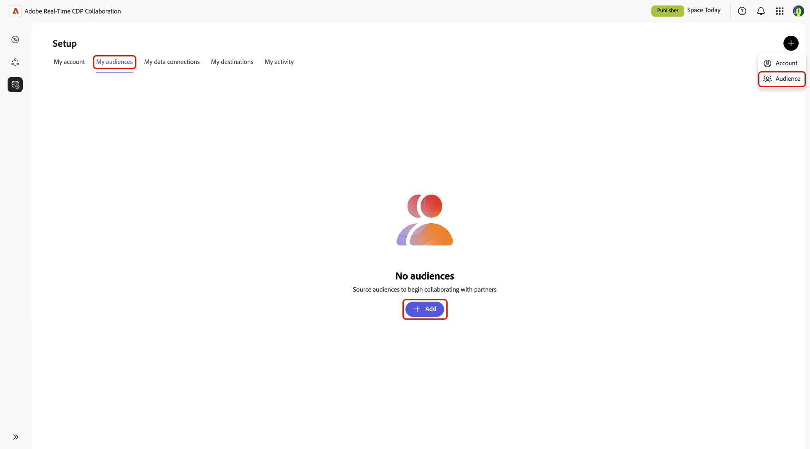
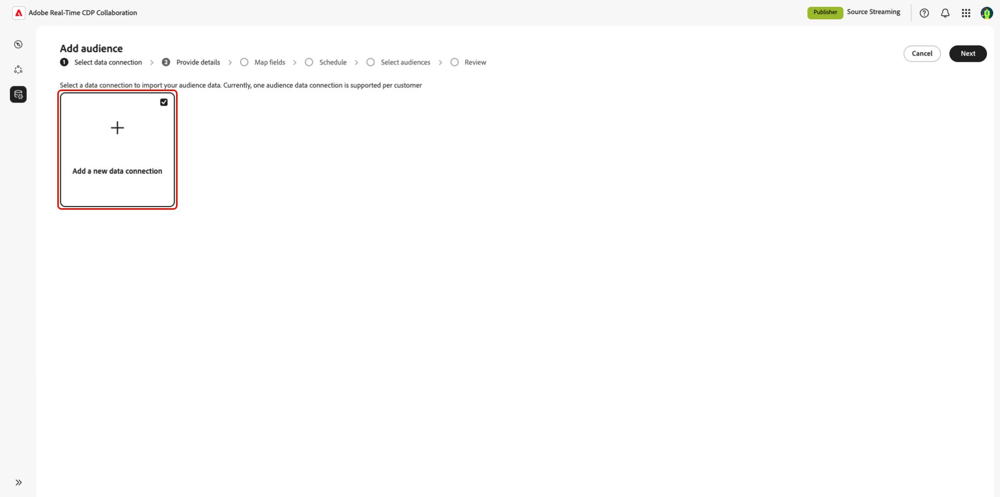
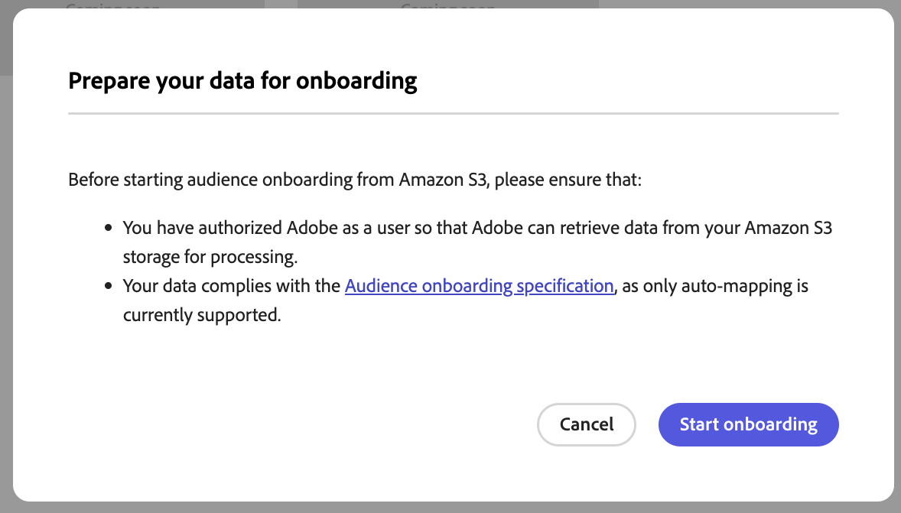
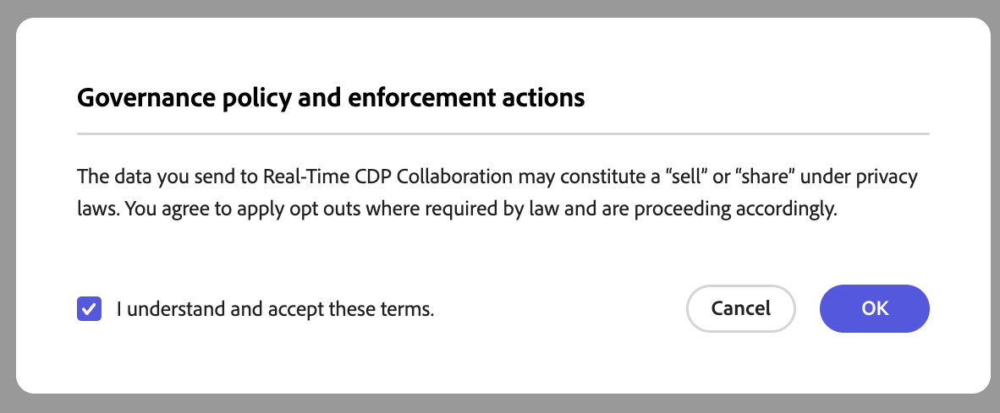
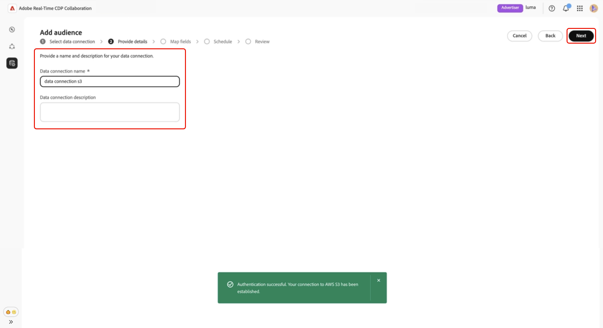
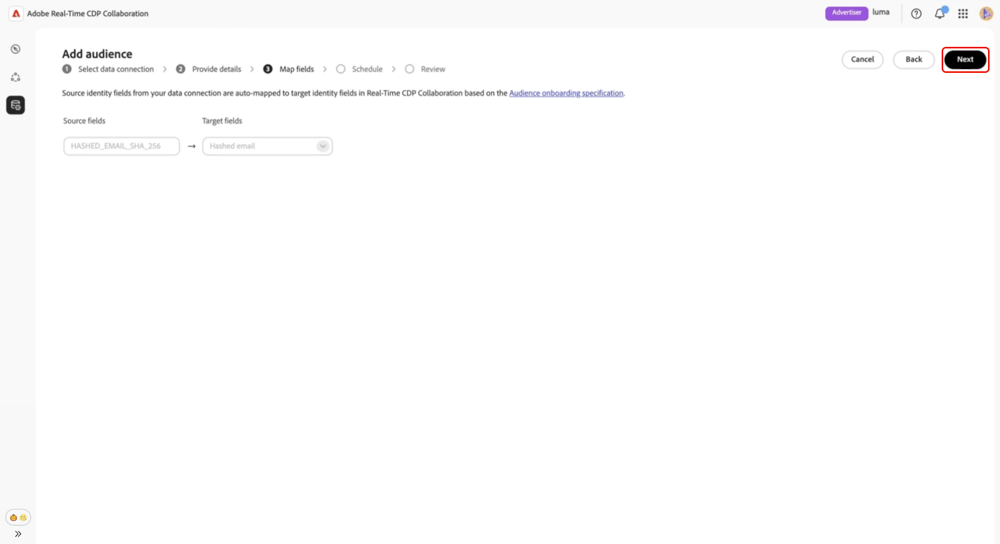
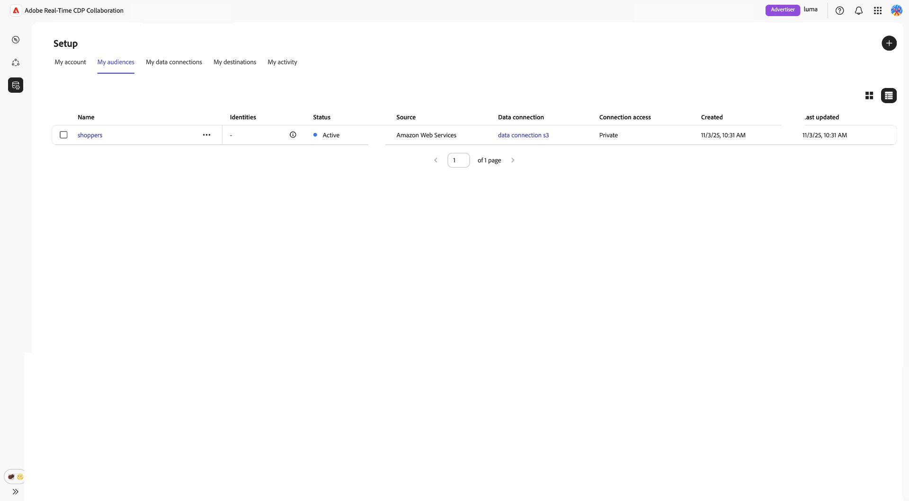

# 为受众源配置[!DNL Amazon S3]

了解如何在Adobe Real-Time CDP Collaboration UI中配置[!DNL Amazon S3]存储并将其连接到受众数据以进行激活和重叠分析。

>[!IMPORTANT]
>
>在遵循本指南之前，您必须完成在AWS帐户中授权Adobe的IAM角色的步骤。\
>有关分步设置说明，请参阅&#x200B;**[为受众源配置AWS权限](./configure-aws-permissions-audience-sourcing.md)**&#x200B;指南。

## 概述 {#overview}

使用此工作流可直接从[!DNL Amazon S3]获取和管理第一方受众。 配置后，Collaboration会自动从您的S3存储桶中获取受众，并将它们用于洞察和激活。

通过S3来源的受众遵循与通过Adobe Experience Platform来源的受众相同的治理和数据处理规则。

## 先决条件 {#prerequisites}

在配置S3数据连接之前，请确保：

* 您有权访问包含符合&#x200B;**[!DNL Amazon S3]受众源规格(v1.1)**&#x200B;的受众文件的活动&#x200B;**[存储段](../../assets/quick-start/RTCDP_Collaboration_Audience_Sourcing_Spec_v1.1.pdf)**。
* 您已在AWS中创建了一个&#x200B;**IAM角色**，该角色授予Adobe使用&#x200B;**假定角色**&#x200B;方法（不是访问/密钥密钥）访问存储段的权限。 有关详细说明，请参阅&#x200B;**[为受众源配置AWS权限](./configure-aws-permissions-audience-sourcing.md)**。 IAM角色必须包括以下权限：

   * `ListBucket`
   * `GetBucketLocation`
   * `GetObject`

* 您已准备好以下值：

   * **IAM角色Amazon资源名称(ARN)**
   * **S3 bucket名称**
   * **文件夹路径**（包含受众文件的目录前缀）

>[!NOTE]
>
>受众文件必须位于授权S3存储段的&#x200B;**根文件夹路径**&#x200B;中。 不支持子文件夹结构。

## 配置您的[!DNL Amazon S3]连接 {#configure-aws-s3-connection}

从&#x200B;**[!UICONTROL 设置]**&#x200B;工作区的&#x200B;**[!UICONTROL 我的受众]**&#x200B;选项卡中，选择添加图标（)，然后选择&#x200B;**[!UICONTROL 受众]**。

如果这是您的第一个受众，您还可以选择&#x200B;**[!UICONTROL 添加]**&#x200B;选项。

此时会显示添加受众工作流。 选择&#x200B;**[!UICONTROL 添加新数据连接]**，然后选择&#x200B;**[!UICONTROL 下一步]**。

{zoomable="yes"}

### 选择[!DNL Amazon S3]作为数据连接 {#select-aws-s3}

选择&#x200B;**[!UICONTROL Amazon S3]**&#x200B;作为数据连接，然后选择&#x200B;**[!UICONTROL 下一步]**。

![具有[!DNL Amazon S3]的数据连接选择屏幕可用作可选选项。](../../assets/setup/aws-audience-sourcing/select-s3-data-connection.png)

### 查看受众文件要求 {#review-audience-requirements}

>[!CONTEXTUALHELP]
>id="rtcdp_collaboration_audience_sourcing_specifications"
>title="请为加入过程准备好您的数据"
>abstract="请参阅受众源规格指南，了解如何设置和构建适用于Collaboration的Amazon S3中的受众数据。"
>additional-url="https://www.adobe.com/go/rtcdp-collaboration-audience-sourcing" text="请参阅指南"

此时将显示一个对话框，其中说明必须如何构建受众文件。 使用指向&#x200B;**[[!UICONTROL 受众源规格]](../../assets/quick-start/RTCDP_Collaboration_Audience_Sourcing_Spec_v1.1.pdf)**&#x200B;的链接了解如何设置和构建[!DNL Amazon S3]中的受众数据，以便Collaboration能够正确读取。

>[!IMPORTANT]
>
>您必须已授权Adobe作为[!DNL Amazon S3]用户，这样Adobe才能从[!DNL Amazon S3]存储中检索数据以供处理。

您的受众文件必须符合受众源规范。 匹配键会根据所需的格式自动映射。

主要考虑因素包括：

* 文件必须为CSV格式，使用逗号作为分隔符，使用管道字符(`|`)表示多个值。
* 如果上传多个文件，请确保所有文件都包含相同的列。
* 每个受众记录必须包含一个`AUDIENCE_ID`和至少一个匹配键，如`HASHED_EMAIL_SHA_256`、`HASHED_PHONE_SHA_256`、`HASHED_IPV4_SHA_256`、`CRM_ID`、`LOYALTY_ID`或`ADFIXUS_ID`。
* 在Collaboration中设置源期间，根据您的选择，每1-6天会刷新一次数据。

### 验证S3连接 {#authenticate-s3-connection}

>[!CONTEXTUALHELP]
>id="rtcdp_collaboration_sources_s3_folderpath"
>title="文件夹路径格式"
>abstract="输入存储受众文件的[!DNL Amazon S3]存储段内的文件夹路径（前缀）。 <ul><li>路径不能以正斜杠(/)开头。</li><li>在路径末尾包括尾随斜杠。</li><ul> 有效示例： `base/path/` 无效示例： `/base/path`"

>[!CONTEXTUALHELP]
>id="rtcdp_collaboration_audience_sharing_amazon_s3"
>title="添加Amazon S3受众"
>abstract="要连接您的Amazon S3存储，请授权Adobe的服务用户检索您的受众数据以供处理。 按照Experience League中概述的步骤，授予Adobe对Amazon S3存储的访问权限。"

接下来，提供您的[!DNL Amazon S3]凭据以将您的S3存储段连接到Collaboration。

按照&#x200B;**[为受众源配置AWS权限](./configure-aws-permissions-audience-sourcing.md)**&#x200B;中概述的步骤操作，以授予Adobe对您的服务器的访问权限
[!DNL Amazon S3]存储。 完成后，将您的值输入到以下UI字段中：

* IAM 角色
* S3 Bucket名称
* 文件夹路径

![包含IAM角色、S3存储段名称和文件夹路径字段的[!DNL Amazon S3]连接表单。](../../assets/setup/aws-audience-sourcing/s3-authentication-credentials-form.png)

### 确认同意确认 {#confirm-consent}

在继续之前，您必须确认同意选择退出已被删除。 选中确认框，然后单击&#x200B;**[!UICONTROL 确定]**&#x200B;进行确认。

### 验证身份验证结果 {#validate-authentication}

连接后，系统会验证您的凭据并显示以下消息之一：

| 状态 | 消息 | 描述 |
|---| ---|---|
| **成功** | **[!UICONTROL 身份验证成功]** | 已成功建立您与[!DNL Amazon S3]的连接。 |
| **失败** | **[!UICONTROL 身份验证失败]** | 请检查您的凭据并重试。 |
| **访问被拒绝** | **[!UICONTROL 访问被拒绝]** | 您的凭据没有访问此[!DNL Amazon S3]存储段所需的权限。 请验证访问设置或与管理员联系。 |
| **文件格式无效** | **[!UICONTROL 文件格式无效]** | 受众数据与预期结构不匹配。 请确保您的文件符合受众源规格。 |
| **未找到受众文件** | **[!UICONTROL 未找到受众文件]** | 请确认您的受众文件存在于指定的文件夹路径中，并且该路径可访问。 |
| **内部错误** | **[!UICONTROL 发生内部错误]** | 请重试。 如果问题仍然存在，请联系客户支持。 |

### 提供连接详细信息 {#provide-connection-details}

为S3数据连接输入描述性名称和可选描述。 将您的值输入到以下UI字段中：

* **[!UICONTROL 数据连接名称]** （必需）
* **[!UICONTROL 数据连接描述]**（可选）

### 查看自动映射的身份字段 {#auto-mapped-fields}

**[!UICONTROL 映射]**&#x200B;屏幕是只读的。 不能添加、删除或应用转换。 Collaboration会根据受众源规范，自动将受众文件中的源标识字段映射到目标字段。

以可视方式确认映射的字段并选择&#x200B;**[!UICONTROL 下一步]**&#x200B;以继续。

### 计划刷新频率和日期范围 {#schedule-refresh}

出现&#x200B;**[!UICONTROL 计划]**&#x200B;视图。 使用下拉菜单选择一个介于1天和6天之间的刷新频率，然后设置活动日期范围。 使用日历图标指定开始日期和结束日期。

>[!IMPORTANT]
>
>要有效地管理Collaboration积分，请将刷新频率设置为匹配或超过基础S3数据的更新频率。 支持的最低刷新间隔为每6天一次。

### 查看并完成连接 {#review-and-complete}

最后，在摘要屏幕中查看配置设置。 此视图包含以下部分的摘要：

* **[!UICONTROL 数据连接]**：显示您配置的IAM角色、S3存储段名称和文件夹路径。
* **[!UICONTROL 详细信息]**：显示数据连接的名称和可选说明，以便帮助以后识别它。
* **[!UICONTROL 映射]**：列出已上载受众文件中的源字段（例如`HASHED_EMAIL`）如何映射到Collaboration中使用的目标字段（例如，哈希电子邮件）。
* **[!UICONTROL 计划]**：汇总连接刷新受众数据的频率以及来源的有效日期范围。

如果需要编辑节，请选择铅笔图标。 选择&#x200B;**[!UICONTROL 完成]**&#x200B;以确认所有节。

此时将显示一个对话框确认，声明已成功创建数据连接，并且正在获取受众。

## 审查源受众 {#review-sourced-audiences}

完成配置后，Collaboration开始从S3存储段获取受众。 通过[!DNL Amazon S3]存储段来源的受众会显示在“**[!UICONTROL 我的受众]**”选项卡中，并且具有与Experience Platform来源的受众相同的功能和信息。

如果受众源正在进行，则屏幕顶部会显示一个横幅。 单个受众仅在采购完成后显示。

![“受众”选项卡显示[!DNL Amazon S3]受众的来源补充正在进行中。](../../assets/setup/aws-audience-sourcing/s3-audiences-sourcing-in-progress.png)

在获取S3受众的来源后，将以表格或卡片视图提供您的可用受众列表。

>[!TIP]
>
>受众获取时间因S3数据大小和您配置的刷新频率而异。 较大的数据集或不太频繁的刷新计划可能需要更长的时间才能显示在&#x200B;**[!UICONTROL 我的受众]**&#x200B;工作区中。

在网格视图或表格视图中，选择行项或&#x200B;**[!UICONTROL 查看受众]**&#x200B;以查看特定受众的概述。 它显示受众的状态、源和数据连接名称，以及以下内容的详细面板：

**[!UICONTROL 身份]**：显示数据可用时的身份总数和划分。
**[!UICONTROL 类别]**：列出用于组织或筛选受众的任何标记。
**[!UICONTROL 连接访问]**：指示受众是私有受众、公共受众还是与特定协作者共享。
**[!UICONTROL 元数据可见性]**：定义协作者可以看到的受众信息（例如身份计数、重叠百分比和索引）。

在协作项目中使用受众之前，请使用此视图确认受众配置和可见性设置。

有关详细信息，请参阅[查看受众仪表板文档](https://experienceleague.adobe.com/zh-hans/docs/real-time-cdp-collaboration/using/setup/onboard-audiences#view-audiences-dashboard)。

## 查看S3数据连接 {#view-s3-connection}

您新添加的[!DNL Amazon S3]连接在&#x200B;**[!UICONTROL 我的数据连接]**&#x200B;选项卡中立即可用。 受众源显示为[!UICONTROL Amazon S3]。

除了不能直接从此视图添加或编辑受众之外，您的S3数据连接具有与其他受众数据连接相同的功能和详细信息。

>[!NOTE]
>
>[!DNL Amazon S3]数据连接不可编辑。 创建连接后，无法修改设置，例如刷新频率。 要更新配置，必须删除现有连接并创建新连接。

![我的数据连接选项卡显示与源状态信息的[!DNL Amazon S3]数据连接。](../../assets/setup/aws-audience-sourcing/s3-data-connections-tab.png)

## 后续步骤 {#next-steps}

您现在已成功配置并连接[!DNL Amazon S3]存储作为Collaboration中的数据源。 通过完成此工作流，您启用了用于激活和重叠分析的第一方受众数据的安全来源。

完成源获取后，您的受众将出现在&#x200B;**[!UICONTROL 我的受众]**&#x200B;工作区中，可随时进行协作和激活。 有关详细管理选项，请参阅[源和管理受众文档](./onboard-audiences.md)。
