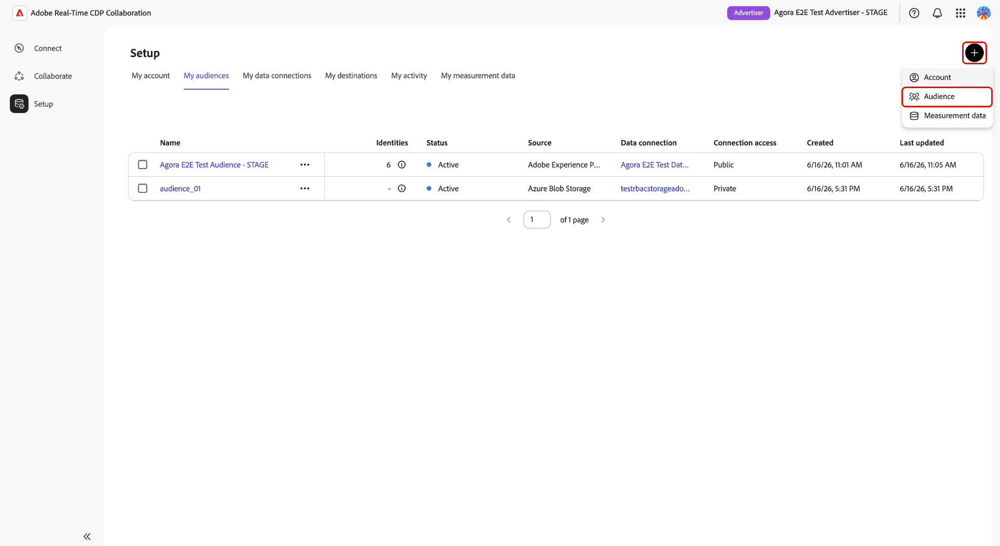

# Azure storage中的Source受众

将[!DNL Azure Blob Storage]或[!DNL Azure Data Lake Storage] (ADLS) Gen2连接到Adobe Real-Time CDP Collaboration以源第一方受众数据以进行激活和重叠分析。

使用本指南创建可重复使用的[!DNL Azure]数据连接，并从配置的存储位置运行一次性导入。 在开始之前，请确认您的受众文件符合[受众源规范](../../assets/quick-start/RTCDP_Collaboration_Audience_Sourcing_Spec_v1_3.pdf)。 您将在设置过程中授予Adobe对Azure存储的读取权限。

## 选择您的[!DNL Azure]源类型 {#choose-source-type}

Collaboration支持两个[!DNL Azure]摄取选项。 使用下表选取与受众文件所在位置匹配的指南路径。

| | **[!DNL Azure Blob Storage]** | **[!DNL Azure Data Lake Storage]Gen2** |
|---|---|---|
| **使用时间** | 文件位于存储帐户上的标准Blob **容器**&#x200B;中（不需要分层命名空间）。 | 文件位于启用了&#x200B;**分层命名空间(ADLS Gen2)**&#x200B;的存储帐户上的&#x200B;**文件系统**&#x200B;中。 |
| Collaboration中的&#x200B;**Source选项** | **[!DNL Azure Blob Storage]** | **[!DNL Azure Data Lake Storage]Gen2** |
| Collaboration中的&#x200B;**必填字段** | 存储帐户，**[!UICONTROL 容器]**，**[!UICONTROL 路径]** | 存储帐户，**[!UICONTROL 容器]** （ADLS Gen2文件系统），**[!UICONTROL 路径]** |
| **权限分区** | [[!DNL Azure Blob] 权限](#set-up-azure-blob-storage-permissions) | [[!DNL Azure Data Lake Storage] Gen2权限](#set-up-adls-gen2-permissions) |

每个数据连接&#x200B;**只能配置**&#x200B;一种源类型。 若要同时从[!DNL Blob]和ADLS获取源，请创建单独的数据连接。

## 先决条件 {#prerequisites}

在遵循本指南之前，请完成[帐户登录和设置](./onboard-account.md)。 然后，请先完成此部分中的先决条件，然后再启动配置工作流。

某些步骤需要&#x200B;**[!DNL Azure]管理员**&#x200B;执行操作。 如果您不是组织的[!DNL Azure]管理员，请在开始之前确定适当的人员。

### [!DNL Azure]访问和权限 {#azure-access-and-permissions}

在Collaboration中配置连接之前，您或您的[!DNL Azure]管理员必须授予Adobe对包含受众文件的存储容器或ADLS Gen2文件系统的读取权限。 权限设置完成后，Collaboration配置工作流会在&#x200B;**[!UICONTROL 同意]**&#x200B;步骤中验证访问权限。

### 准备受众数据 {#prepare-audience-data}

您的受众文件必须符合&#x200B;**[受众源规格(v1.2)](../../assets/quick-start/RTCDP_Collaboration_Audience_Sourcing_Spec_v1_3.pdf)**，然后才能开始源。

主要要求包括：

* **文件格式：** CSV，使用逗号作为字段分隔符，使用管道字符(`|`)作为单个字段中多个值的分隔符。
* **必填字段：**&#x200B;每个记录都必须包含一个`AUDIENCE_ID`列和至少一个受支持的匹配键列。
* **支持的匹配键：** `HASHED_EMAIL_SHA_256`，`HASHED_PHONE_SHA_256`，`HASHED_IPV4_SHA_256`，`CRM_ID`，`LOYALTY_ID`，`ADFIXUS_ID`。
* **哈希处理要求：**&#x200B;上传之前，必须修剪、小写和SHA256哈希处理所有匹配键值。 Collaboration在引入数据之前不会对其进行哈希处理或标准化。
* **列一致性：**&#x200B;配置路径下的所有文件必须使用相同的列结构。

此外，还必须为您的Collaboration帐户启用受众文件中存在的所有匹配键。 有关指导，请参阅[设置匹配键](https://experienceleague.adobe.com/zh-hans/docs/real-time-cdp-collaboration/using/setup/onboard-account#set-up-match-keys)。

>[!IMPORTANT]
>
> 创建连接后，无法删除为数据连接启用的匹配键。 要更改活动的匹配键集，必须删除连接并创建新连接。 在启动设置工作流之前，确认完整的匹配键配置。

### 开始前所需的值 {#values-required}

在启动配置工作流之前，准备好以下值。

| 值 | 描述 | Azure Blob Storage示例 | ADLS Gen2示例 |
| ------------------- | ------------------------ | -------------------------------------- | -------------------------------------- |
| **存储帐户** | 托管受众文件的[!DNL Azure]存储帐户的名称。 | `customerdatastore` | `datalake-prod` |
| **容器** | 对于[!DNL Azure Blob Storage]，包含受众文件的存储容器。 对于[!DNL Azure Data Lake Storage] Gen2，在&#x200B;**[!UICONTROL 容器]**&#x200B;字段中输入ADLS Gen2文件系统名称。 | `audience-ingest` | `audiences` |
| **路径** | 容器或文件系统内的文件夹路径，其中包含要摄取的受众文件。 Collaboration仅摄取已配置路径下的文件，而不会从嵌套子文件夹中摄取文件。 | `sourcing/audiences/path1/` | `sourcing/inbound/` |
| **租户ID** | 与您的[!DNL Azure]存储帐户关联的Microsoft Entra租户ID。 | `00000000-0000-0000-0000-000000000000` | `00000000-0000-0000-0000-000000000000` |

## 设置[!DNL Azure]权限 {#set-up-azure-permissions}

完成此部分中的步骤以准备[!DNL Azure]环境。 Adobe需要具有存储容器的读取权限，Collaboration配置工作流才能建立连接。 此工作在[!DNL Azure]门户中执行，可能需要由[!DNL Azure]管理员完成。

完成此部分后，请继续[配置您的 [!DNL Azure] 连接](#configure-your-azure-connection)。

### 获取Adobe的[!DNL Azure]服务主体标识符 {#obtain-principal-identifier}

在完成以下步骤的角色分配步骤之前，请联系您的Adobe客户团队以获取您所在地区（北美洲、EMEA或澳大利亚和新西兰）的[!DNL Azure]服务主体标识符。 您将使用此标识符来授予Adobe对存储的读取访问权限。

### 设置[!DNL Azure Blob Storage]权限 {#set-up-azure-blob-storage-permissions}

>[!IMPORTANT]
>
> 您需要分配存储帐户或容器上的角色的权限（例如，**所有者**&#x200B;或&#x200B;**用户访问管理员**，或等效者）。

1. 在[[!DNL Azure] 门户](https://portal.azure.com/)中，打开存储帐户，然后转到&#x200B;**[!UICONTROL 容器]**&#x200B;并选择包含受众文件的容器。
2. 选择&#x200B;**[!DNL Access control (IAM)]**，然后选择&#x200B;**[!DNL Add role assignment]**。
3. 在容器作用域中将&#x200B;**[!DNL Storage Blob Data Reader]**&#x200B;角色分配给Adobe的主体。
4. 选择&#x200B;**保存**。

### 设置ADLS Gen2权限 {#set-up-adls-gen2-permissions}

对于ADLS Gen2连接，Collaboration中的&#x200B;**[!UICONTROL Container]**&#x200B;字段对应于[!DNL Azure]中的ADLS Gen2文件系统。 使用包含受众文件的文件系统。

在分配权限之前，请确认存储帐户启用了&#x200B;**分层命名空间**，并且防火墙或专用端点规则允许Adobe访问。

1. 在[[!DNL Azure] 门户](https://portal.azure.com/)中，打开包含您的ADLS Gen2文件系统的存储帐户。
2. 打开包含受众文件的文件系统。
3. 选择&#x200B;**[!UICONTROL 访问控制(IAM)]**，然后选择&#x200B;**[!UICONTROL 添加角色分配]**。
4. 在文件系统或目录作用域中将&#x200B;**[!DNL Storage Blob Data Reader]**&#x200B;角色分配给Adobe的主体。
5. 选择&#x200B;**[!UICONTROL 保存]**。

完成源类型的权限设置后，请继续[配置您的 [!DNL Azure] 连接](#configure-your-azure-connection)。

## 配置您的[!DNL Azure]连接 {#configure-your-azure-connection}

使用Collaboration配置工作流验证[!DNL Azure]存储详细信息，确认Adobe访问权限，查看自动映射的身份字段以及创建数据连接。

### 添加新的数据连接 {#add-new-data-connection}

导航到&#x200B;**[!UICONTROL 设置]** > **[!UICONTROL 我的受众]**，然后选择添加图标（） 并选择&#x200B;**[!UICONTROL 受众]**。

{zoomable="yes"}

出现&#x200B;**[!UICONTROL 添加受众]**&#x200B;工作流。 选择&#x200B;**[!UICONTROL 添加新数据连接]**，然后选择&#x200B;**[!UICONTROL 下一步]**。

{zoomable="yes"}

### 选择您的[!DNL Azure]数据源 {#select-azure-data-source}

选择&#x200B;**[!UICONTROL Azure Blob存储]**&#x200B;或&#x200B;**[!UICONTROL Azure Data Lake存储Gen2]**，然后选择&#x200B;**[!UICONTROL 下一步]**。

![添加受众工作流，其中显示选定的[!DNL Azure Blob Storage]作为数据连接类型以及登录步骤“凭据”、“同意”、“字段映射”和“审阅”。](../../assets/setup/azure-sourcing/azure-source-selection-step.png){zoomable="yes"}

继续其余步骤，以验证Azure连接，确认Adobe访问权限，查看字段映射，并创建数据连接。

### 输入连接凭据 {#enter-connection-credentials}

在&#x200B;**[!UICONTROL 凭据]**&#x200B;步骤中，提供访问[!DNL Azure]存储位置所需的信息。

| 字段 | 描述 |
|---|---|
| **[!UICONTROL 存储帐户]** | 包含受众文件的[!DNL Azure]存储帐户。 |
| **[!UICONTROL 容器]** | 包含受众文件的存储容器或ADLS Gen2文件系统。 |
| **[!UICONTROL 路径]** | 容器中存储受众文件的文件夹路径。 |
| **[!UICONTROL 租户ID]** | 与您的存储帐户关联的[!DNL Azure]租户标识符。 |

输入所需的值后，选择&#x200B;**[!UICONTROL 连接到Azure]**。

确认消息指示连接已成功建立。 选择&#x200B;**[!UICONTROL 下一步]**&#x200B;以继续。

![“凭据”步骤显示已完成的“存储帐户”、“容器”、“路径”和“租户ID”字段，其中包含“已连接到[!DNL Azure]”确认消息。](../../assets/setup/azure-sourcing/azure-credentials-step.png){zoomable="yes"}

### 授予Adobe访问您的[!DNL Azure]存储的权限 {#grant-adobe-access}

在&#x200B;**[!UICONTROL 同意]**&#x200B;步骤中，Collaboration将验证您之前配置的[!DNL Azure]权限。

选择&#x200B;**[!UICONTROL 同意URL]**&#x200B;旁边的启动项图标以在[!DNL Azure]中打开授权工作流。 使用有权同意存储位置的帐户登录，然后完成授予Adobe访问所配置存储位置的权限的Azure授权提示。 授权完成后，返回到Collaboration并选择&#x200B;**[!UICONTROL 确认同意]**&#x200B;以验证Adobe的访问权限。

>[!NOTE]
>
>[!DNL Azure]角色分配可能需要几分钟才能传播。 如果同意验证未立即成功，请等待几分钟，确认Adobe的服务主体具有所需的角色分配，然后重试。

当同意验证成功时，将显示&#x200B;**[!UICONTROL 已授予的同意]**&#x200B;确认消息。 选择&#x200B;**[!UICONTROL 下一步]**&#x200B;以继续。

![同意步骤显示同意URL、\[!DNL Azure\]应用程序标识符和同意授予的确认消息。](../../assets/setup/azure-sourcing/azure-consent-granted-step.png){zoomable="yes"}

### 查看字段映射 {#review-field-mappings}

在&#x200B;**[!UICONTROL 字段映射]**&#x200B;步骤中，Collaboration会自动从源文件中映射支持的标识字段。

无需手动配置。

>[!IMPORTANT]
>
> Collaboration会根据受众源规范自动映射标识字段。 如果显示的映射不正确，请在完成载入工作流之前更新源文件。

查看显示的映射，并确认源字段与受众文件中的标识列相匹配。 选择&#x200B;**[!UICONTROL 下一步]**&#x200B;以继续。

{zoomable="yes"}

### 查看并完成连接 {#review-and-complete}

在&#x200B;**[!UICONTROL 审核]**&#x200B;步骤中，验证存储帐户、容器、源路径、租户ID和字段映射。

审核页面还指示当前[!DNL Azure]工作流执行单个源运行，并且不配置定期计划。

当配置正确时，选择&#x200B;**[!UICONTROL 完成]**。

{zoomable="yes"}

## 确认连接并监控源受众 {#confirm-connection-and-monitor-audiences}

选择&#x200B;**[!UICONTROL 完成]**&#x200B;后，Collaboration将创建数据连接并导航到&#x200B;**[!UICONTROL 设置]** > **[!UICONTROL 我的数据连接]**。

### 确认连接已创建 {#confirm-connection-created}

**[!UICONTROL 我的数据连接]**&#x200B;中的连接卡确认连接已成功创建。 卡片显示源类型（**[!UICONTROL Azure Blob Storage]**&#x200B;或&#x200B;**[!UICONTROL Azure Data Lake Storage] Gen2**）、创建日期、匹配键、受众规模和当前连接状态。

![我的数据连接视图显示新创建的[!DNL Azure Blob Storage]连接卡片，其中包含连接详细信息、匹配键、受众规模和状态信息。](../../assets/setup/azure-sourcing/azure-data-connection-card.png){zoomable="yes"}

### 查看源受众 {#view-sourced-audiences}

创建连接后，Collaboration会自动从配置的[!DNL Azure]位置开始获取受众。 导航到&#x200B;**[!UICONTROL 设置]** > **[!UICONTROL 我的受众]**，以监视源获取进度并审查源受众。

来源受众显示在&#x200B;**[!UICONTROL 我的受众]**&#x200B;表中。 使用受众状态、身份计数、源、数据连接和上次更新日期确认预期受众是否来自您的[!DNL Azure]连接。

>[!TIP]
>
>采购时间因数据量而异。 如果受众24小时后仍未出现，请参阅[疑难解答](#troubleshooting)。

## 已知限制 {#known-limitations}

在创建或管理Azure数据连接之前，请查看以下限制。

* **匹配键约束：**&#x200B;无法从现有连接中删除匹配键。 要更改活动的匹配键，请删除连接并创建一个新连接。
* **每个[!DNL Azure]源类型有一个活动连接：**&#x200B;每个帐户可以有一个活动Blob连接和一个活动ADLS Gen2连接。 要更改存储位置，请删除现有连接并创建一个新连接。
* **子文件夹支持：** Collaboration仅摄取已配置路径下的文件。 它不会从嵌套的子文件夹中摄取文件。
* **单独的源类型：** Blob和ADLS Gen2是不同的连接 — 不要在单个向导运行中混合使用它们之间的配置。

## 故障排除 {#troubleshooting}

### 受众未出现或来源补充缓慢 {#audiences-not-appearing}

如果在创建连接后未显示源受众，请完成以下操作。

* 确认受众文件直接存在于配置的路径下方，并符合受众源规范。
* 检查&#x200B;**[!UICONTROL 我的数据连接]**&#x200B;是否存在错误。
* 如果24小时后问题仍然存在，请联系Adobe支持并提供连接名称、存储帐户和容器详细信息。

### 受众源，但显示零或意外标识 {#zero-identities}

如果受众在采购后出现，但身份计数为零或低于预期，请完成以下操作。

* 验证在上传之前，受众文件中的所有匹配键值是否都已裁切、小写和SHA256散列。 Collaboration不会对摄取的数据进行哈希处理或标准化。
* 确认已为Collaboration帐户启用文件中存在的匹配键。 请参阅[设置匹配键](https://experienceleague.adobe.com/zh-hans/docs/real-time-cdp-collaboration/using/setup/onboard-account#set-up-match-keys)。

### 初次成功后连接失败 {#connection-failed}

当连接创建成功但随后进入失败状态时，使用这些检查。

* 验证是否未删除或缩小Adobe主体的[!DNL Azure] RBAC角色分配。
* 确认文件仍然存在于路径中并符合规范。

### 导入或格式化错误 {#format-errors}

当由于文件结构、散列或列格式问题而导致源获取失败时，请使用这些检查。

* 确保所有文件与初始引入文件保持相同的列结构和散列规则。

## 后续步骤 {#next-steps}

完成来源补充后，受众可在&#x200B;**[!UICONTROL 我的受众]**&#x200B;中用于激活、重叠分析和测量工作流。 要通过协作者激活来源受众，请参阅[激活受众](../collaborate/activate.md)。

其他可用的源方法包括Experience Platform、[!DNL Amazon S3]、[!DNL Google Cloud Storage]、[!DNL Snowflake]和CSV文件上传。 有关其他受众来源补充方法，请参阅：

* [为受众源配置Google Cloud Storage](./configure-gcs-audience-sourcing.md)
* [为受众源配置Snowflake](./configure-snowflake-audience-sourcing.md)
* [为受众源配置AWS S3](./configure-aws-s3-audience-sourcing.md)
* [来自Experience Platform的Source受众](./onboard-audiences.md)
* [上传CSV文件以进行受众源](./upload-csv-audience-sourcing.md)
