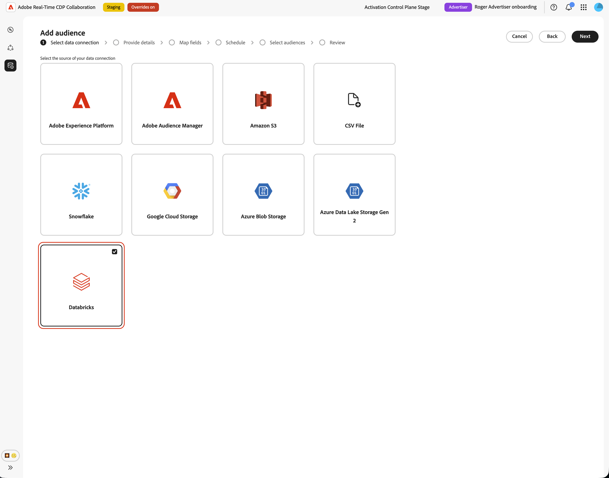
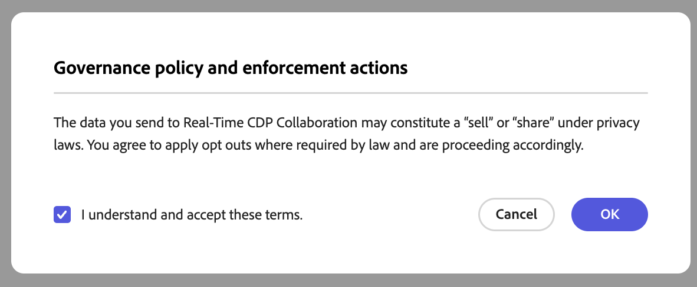
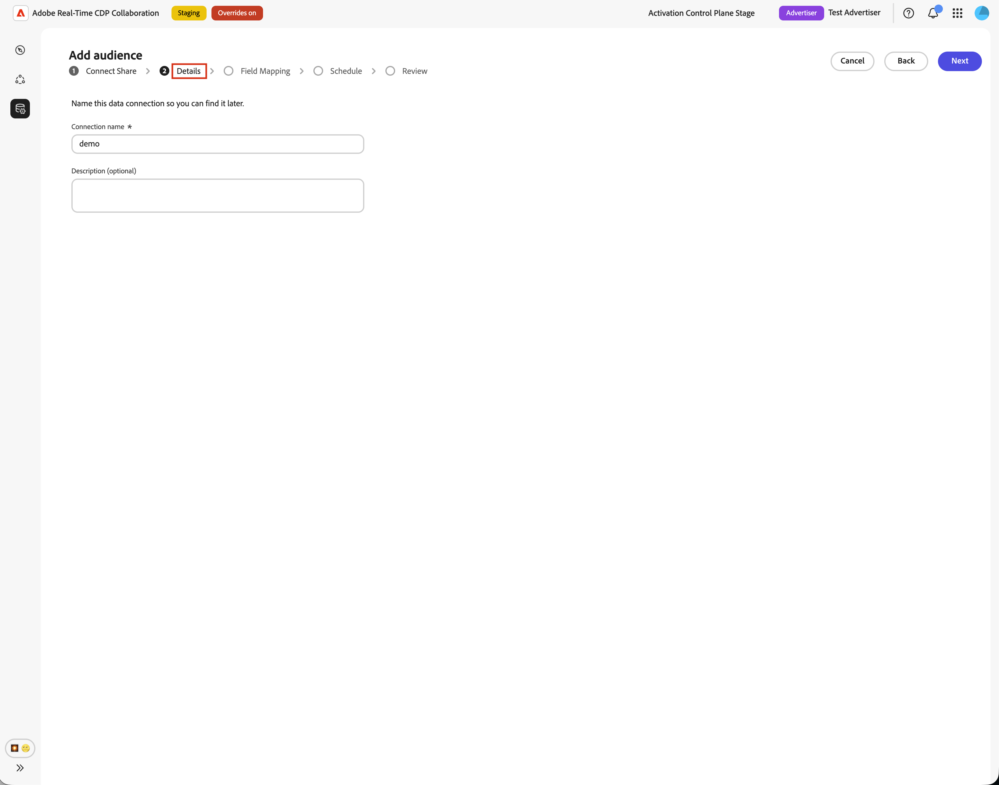
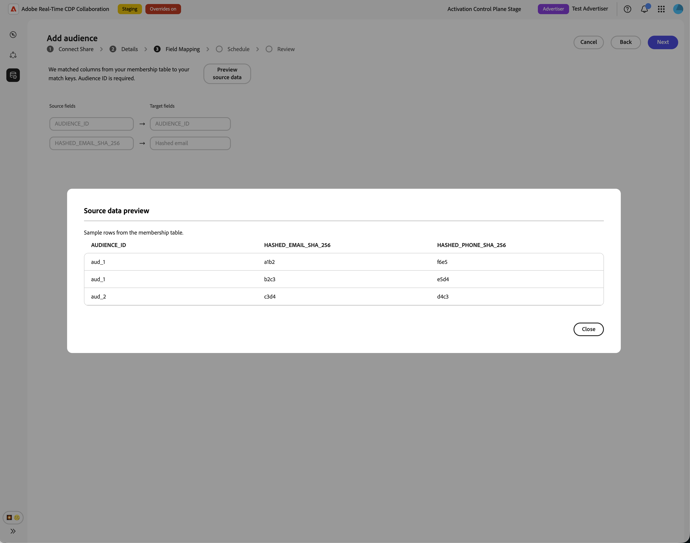

# 为受众源配置[!DNL Databricks Delta Share]

使用本指南通过用户界面将[!DNL Databricks Delta Share]连接到Adobe Real-Time CDP Collaboration和源第一方受众。

连接[!DNL Databricks Delta Share]时，Collaboration会直接从Unity Catalog共享中读取受众数据。 在完成来源补充后，您可以在协作项目中使用受众进行激活和重叠分析。

本指南介绍如何准备先决条件、连接[!DNL Delta Share]、指定源表、映射标识字段以及验证受众源是否成功启动。

源自[!DNL Databricks]的受众遵循与源自Adobe Experience Platform和其他支持的云源的受众相同的治理和数据处理规则。

其他可用的源方法包括[Experience Platform](./onboard-audiences.md)、[Amazon S3](./configure-aws-s3-audience-sourcing.md)、[Google Cloud Storage](./configure-gcs-audience-sourcing.md)、[Snowflake](./configure-snowflake-audience-sourcing.md)、[Azure Storage](./configure-azure-storage-audience-sourcing.md)和[CSV文件上传](./upload-csv-audience-sourcing.md)。 要了解有关Collaboration中所有可用源的更多信息，请参阅[源概述](./source-overview.md)。

## 先决条件 {#prerequisites}

在启动配置工作流之前，请先完成此部分中的先决条件。 缺少先决条件是设置失败或受众在采购后未出现的常见原因。 在遵循本指南之前，请完成[帐户登录和设置](./onboard-account.md)。

本指南中的某些任务需要[!DNL Databricks]管理员的帮助。 如果您没有为您的组织管理[!DNL Databricks]，请在开始之前与相应的管理员合作。

### [!DNL Databricks Delta Share]访问权限 {#databricks-delta-share-access}

在继续之前，请与[!DNL Databricks]管理员确认以下事项：

* 您的组织已使用本机数据库到数据库共享(Unity Catalog)将[!DNL Delta Share]发布到Adobe的[!DNL Databricks]帐户。 Collaboration不支持在此工作流的UI中输入持有者令牌或OIDC凭据。
* 您知道Adobe的Unity Catalog元存储中注册的提供程序名称、共享名称以及包含受众表的架构。
* [!DNL Databricks Delta Share]受众源可用于您的Collaboration帐户和地区。 如果您所在地区尚无法使用数据库采购，请联系您的Adobe客户代表以确认时间线。

有关将共享发布到Adobe的分步说明，请参阅本指南中的[将增量共享发布到Adobe](#publish-delta-share)部分。

### 准备受众数据 {#prepare-audience-data}

构建受众表，以便Collaboration能够发现受众并正确映射身份。

* **成员资格表（必需）：**&#x200B;共享架构中的表，每个个人资料 — 受众对包含一行。 此表必须包含一个可映射到`AUDIENCE_ID`的列和至少一个受支持的匹配键列。 Collaboration使用此表进行源数据预览和字段映射。
* **元数据表（可选）：**&#x200B;如果您维护单独的受众目录（每个受众一行，其中包含受众ID、名称、计数或类似的元数据），则可以提供此表，以便Collaboration从中读取受众定义，而不是仅从成员资格表中推断不同的受众ID。
* **支持的匹配键：** `HASHED_EMAIL_SHA_256`、`HASHED_PHONE_SHA_256`、`HASHED_IPV4_SHA_256`、`CRM_ID`、`LOYALTY_ID`、`ADFIXUS_ID`以及为您的Collaboration帐户启用的其他匹配键。
* **哈希处理要求：**&#x200B;所有匹配的键值都必须经过裁剪、小写和SHA256哈希处理，然后才能存储在[!DNL Databricks]中。 Collaboration在引入数据之前不会对其进行哈希处理或标准化。
* **列一致性：**&#x200B;成员资格表必须公开Collaboration可以映射到已启用的匹配键的稳定列名称。

还必须为您的Collaboration帐户启用成员资格表中存在的所有匹配键。 要添加或启用匹配键，请参阅[设置匹配键](./onboard-account.md#set-up-match-keys)。

### 开始前所需的值 {#required-values}

在启动配置向导之前，请准备好以下值。

| 值 | 描述 |
| ----- | ----------- |
| 提供程序名称 | Adobe在Unity Catalog中用于访问[!DNL Delta Share]的提供程序标识符。 您的[!DNL Databricks]管理员或Adobe入门培训联系人可以提供此值。 此值与[!DNL Databricks]工作区URL不同。 |
| 共享名称 | 发布到Adobe的[!DNL Delta Share]的名称。 |
| 架构 | 共享中包含受众表的架构。 |
| 成员资格表 | 架构内包含受众成员资格行的表名称（受众中每个配置文件一行）。 |
| 元数据表（可选） | 架构中列出受众（每个受众一行）的表名称，如果您使用元数据驱动的受众目录。 |

{style="table-layout:auto"}

## 配置您的[!DNL Databricks]连接 {#configure-databricks-connection}

配置工作流是&#x200B;**[!UICONTROL 安装程序]**&#x200B;工作区中的多步骤向导。 按顺序完成每个步骤。

### 添加新的数据连接 {#add-data-connection}

从&#x200B;**[!UICONTROL 设置]**&#x200B;工作区的&#x200B;**[!UICONTROL 我的受众]**&#x200B;选项卡中，选择添加图标（） 然后选择&#x200B;**[!UICONTROL 受众]**。

如果这是您的第一个受众，您还可以选择&#x200B;**[!UICONTROL 添加]**&#x200B;选项。

此时会显示添加受众工作流。 选择&#x200B;**[!UICONTROL 添加新数据连接]**，然后选择&#x200B;**[!UICONTROL 下一步]**。

{zoomable="yes"}

### 选择 [!DNL Databricks Delta Share] 作为数据源 {#select-databricks-delta-share}

数据源选择屏幕列出了所有可用的连接类型。 选择&#x200B;**[!UICONTROL 数据库增量共享]**，然后选择&#x200B;**[!UICONTROL 下一步]**。

### 连接您的[!DNL Delta Share] {#connect-delta-share}

>[!CONTEXTUALHELP]
>id="rtcdp_collaboration_audience_sharing_databricks"
>title="Experience League"
>abstract="有关为受众源配置共享的说明，请参阅[!DNL Databricks Delta Share]源指南"

提供允许Collaboration访问您的[!DNL Delta Share]所需的详细信息。 输入[!DNL Databricks Delta Share]中的提供程序、共享、架构和表详细信息。 所需的成员资格表必须在共享架构中可用。 如果使用元数据表，则该元数据表必须也可在同一共享架构中使用。
输入所需信息后，选择**[!UICONTROL 连接]**。

Collaboration会在Adobe的工作区中验证并装载共享。 此步骤最多可能需要一分钟。 建立连接时将显示进度指示器。

| 字段 | 描述 |
| --- | --- |
| **[!UICONTROL 提供程序名称]** | Adobe用于使用共享的Unity Catalog提供程序名称。 查看[开始前所需的值](#required-values)。 |
| **[!UICONTROL 共享名称]** | 发布到Adobe的[!DNL Delta Share]的名称。 |
| **[!UICONTROL 架构]** | 共享中包含受众表的架构。 |
| **[!UICONTROL 数据表]** | 架构内包含受众成员资格行的表名称（受众中每个配置文件一行）。 |
| **[!UICONTROL 元数据表]** | 列出受众的表（每个受众一行）。 |

如果找不到共享或架构尚未可见，则会显示一条错误消息。 请向您的[!DNL Databricks]管理员验证这些值，然后重试。

### 确认同意和数据使用确认 {#confirm-consent}

在继续操作之前，请确认您已对发送到Collaboration的受众数据应用了法律规定的任何选择退出。 如果不确定您的数据是否满足此要求，请先查看[治理策略和实施操作](./onboard-audiences.md#governance-policy-and-enforcement-actions)指南，然后再继续。 选中确认复选框，然后选择&#x200B;**[!UICONTROL 确定]**&#x200B;以继续。

### 提供连接详细信息 {#provide-connection-details}

输入此数据连接的名称和可选说明。 您提供的名称显示在&#x200B;**[!UICONTROL 我的数据连接]**&#x200B;选项卡中，如果您管理多个数据连接，该名称有助于区分此源。

* **[!UICONTROL 数据连接名称]** （必需）
* **[!UICONTROL 数据连接描述]**（可选）

选择&#x200B;**[!UICONTROL 下一步]**&#x200B;以继续。

### 映射标识字段 {#map-identity-fields}

**[!UICONTROL 映射]**&#x200B;屏幕显示Collaboration如何将成员资格表中的源列映射到目标标识字段。 Collaboration会根据列名称和为您的帐户启用的匹配键自动映射字段。

>[!TIP]
>
>选择&#x200B;**[!UICONTROL 预览源数据]**&#x200B;以表格格式查看成员资格表的示例，然后选择&#x200B;**[!UICONTROL 关闭]**&#x200B;以返回到映射屏幕。

确认显示的映射反映成员资格表中的列。 选择&#x200B;**[!UICONTROL 下一步]**&#x200B;以继续。

### 计划刷新频率和日期范围 {#schedule-refresh}

出现&#x200B;**[!UICONTROL 计划]**&#x200B;视图。 使用下拉菜单选择一个介于1天和6天之间的刷新频率，然后设置活动日期范围。 使用日历图标指定开始日期和结束日期。

>[!IMPORTANT]
>
>要有效地管理Collaboration积分，请将刷新频率设置为匹配或超过基础数据刷新的更新频率。

### 查看并完成连接 {#review-and-complete}

在创建连接之前，请查看配置摘要。 摘要屏幕显示以下部分：

* **[!UICONTROL 数据连接]**：您配置的连接名称、提供程序名称、共享名称和架构。
* **[!UICONTROL 映射]**：源和目标标识字段映射。
* **[!UICONTROL 计划]**：刷新频率和活动日期范围。

验证所有节是否正确，然后选择&#x200B;**[!UICONTROL 完成]**。

此时会显示一个确认对话框，指示Collaboration已创建数据连接，并且受众源正在进行。

## 审查源受众 {#review-sourced-audiences}

完成配置向导后，Collaboration将开始异步从[!DNL Databricks]表中获取受众。 导航到&#x200B;**[!UICONTROL 设置] > [!UICONTROL 我的受众]**&#x200B;以监视进度。 采购不会立即完成；所需时间取决于您的数据大小。

### 监控受众源获取进度 {#monitor-sourcing-progress}

在Collaboration检索受众数据时，**[!UICONTROL 我的受众]**&#x200B;工作区顶部的横幅指示正在采购。 只有在为每个受众完成采购后，各个受众才会显示在列表中。

>[!TIP]
>
>受众源获取时间因您的成员资格表的大小以及您是否使用元数据表进行受众发现而异。 较大的数据集可能需要更长的时间才能显示在&#x200B;**[!UICONTROL 我的受众]**&#x200B;工作区中。

### 查看源受众详细信息 {#view-audience-details}

来源补充完成后，您的[!DNL Databricks]受众将与其他连接来源的受众一起显示在&#x200B;**[!UICONTROL 我的受众]**&#x200B;选项卡中。 选择行项目或&#x200B;**[!UICONTROL 查看受众]**&#x200B;以打开特定受众的详细信息视图。

详细信息视图显示受众的状态、来源和数据连接名称，以及以下面板：

* **[!UICONTROL 标识]**：数据可用后，受众的标识总数和划分。
* **[!UICONTROL 类别]**：应用于组织或筛选受众的任何标记。
* **[!UICONTROL 连接访问]**：受众是私有受众、公共受众还是与特定协作者共享。
* **[!UICONTROL 元数据可见性]**：协作者可以看见哪些受众信息，如身份计数、重叠百分比和索引。

在协作项目中使用受众之前，请查看这些设置。 要更新类别、连接访问权限或元数据可见性，请参阅[查看和管理单个受众](./onboard-audiences.md#view-individual-audiences)。

### 编辑受众设置 {#edit-audience-settings}

您可以直接从&#x200B;**[!UICONTROL 我的受众]**&#x200B;列表视图中编辑受众元数据，而无需打开详细信息视图。 选中受众的复选框以显示操作工具栏，然后选择操作： **[!UICONTROL 编辑元数据可见性]**、**[!UICONTROL 编辑连接访问权限]**、**[!UICONTROL 编辑名称和描述]**、**[!UICONTROL 编辑类别]**&#x200B;或&#x200B;**[!UICONTROL 删除]**。

### 查看您的[!DNL Databricks]数据连接 {#view-databricks-connection}

要查看连接本身，包括其匹配键，请导航到&#x200B;**[!UICONTROL 设置]** > **[!UICONTROL 我的数据连接]**。 您的新[!DNL Databricks]连接在该处可用。 受众源显示为&#x200B;**[!UICONTROL 数据库增量共享]**。

![我的数据连接选项卡显示与源状态信息的[!DNL Databricks Delta Share]数据连接。](../../assets/setup/databricks-audience-sourcing/databricks-my-data-connections-tab.png)

## 已知限制 {#known-limitations}

在配置和使用[!DNL Databricks Delta Share]受众源时，请注意以下限制：

* **仅限本机共享：**&#x200B;用户界面仅支持本机数据库到数据库[!DNL Delta Sharing]。 配置向导中无法使用持有者令牌和OIDC身份验证流程。
* **没有向导中的表浏览器：**&#x200B;必须手动输入表名。 在预览表时，Collaboration会验证表名；它不会自动列出共享中的所有表。
* **元数据表行限制：**&#x200B;当您使用元数据表进行受众发现时，Collaboration最多会从该表中导入100,000个受众行。 如果您的目录超出此限制，请联系Adobe支持。
* **匹配键约束：**&#x200B;为数据连接启用匹配键后，将无法将其删除。 可以将匹配密钥添加到现有连接，但不能禁用或删除它们。 要更改活动的匹配键，您必须[删除数据连接](./manage-data-connection.md#delete-data-connection)并创建一个新连接。
* **所需的成员资格表：**&#x200B;即使您使用元数据表进行受众发现，也必须指定成员资格表。 Collaboration在摄取期间从成员资格表中读取身份行。

## 故障排除 {#troubleshooting}

使用此部分解决配置期间或配置之后出现的问题。 有关共享连接期间出现的错误，请与[!DNL Databricks]管理员一起查看你的提供程序名称、共享名称和架构。

**共享连接失败或超时**

* 验证您的[!DNL Delta Share]是否已发布到Adobe的[!DNL Databricks]帐户，以及提供程序名称、共享名称和架构是否正确。
* 确认架构在共享中可见。 新发布的股票可能需要一段时间才能传播。
* 如果连接在几分钟后仍失败，请重新启动设置并重试，或联系Adobe客户支持并提供提供程序名称、共享名称、架构和任何相关错误详细信息。 不包括敏感凭据。

**表预览失败**

* 确认表名拼写正确并存在于您指定的架构中。
* 确保该表包含在发布到Adobe的[!DNL Delta Share]中。
* 对于元数据驱动的发现，请先预览成员资格表和元数据表，然后再继续。

**字段映射验证块进度**

* 确认您的成员资格表包含可映射到&#x200B;**`AUDIENCE_ID`**&#x200B;的列。
* 确保至少完全映射了两个标识字段（源和目标）。
* 使用&#x200B;**[!UICONTROL 预览源数据]**&#x200B;验证列名是否与启用的匹配键匹配。

**受众未出现或来源补充时间长于预期**

* 采购时间会随着数据量的增加而扩展。 大型成员资格表的处理时间应会延长。
* 如果受众未在24小时内出现，请检查&#x200B;**[!UICONTROL 我的数据连接]**&#x200B;选项卡，以查看连接上的错误指示器。
* 在[准备受众数据](#prepare-audience-data)中，验证成员资格表结构和字段映射是否符合要求。
* 如果问题仍然存在，请联系Adobe客户支持并提供数据连接名称和表详细信息。

**数据连接最初成功后显示失败状态**

* 确认自您创建连接后，[!DNL Delta Share]和表尚未在[!DNL Databricks]中删除或重命名。
* 验证是否尚未撤销Adobe对共享的访问权限。
* 如果问题仍然存在，请联系Adobe客户支持。

## 将您的[!DNL Delta Share]发布到Adobe {#publish-delta-share}

[!DNL Databricks] Unity目录[!DNL Delta Sharing]允许您与其他[!DNL Databricks]帐户安全地共享表，而无需复制数据。 要允许Collaboration读取您的受众数据，您的[!DNL Databricks]管理员必须将[!DNL Delta Share]发布到Adobe的[!DNL Databricks]使用者帐户。

### 发布之前 {#before-you-publish}

与您的Adobe客户代表或入门培训联系人合作，以获取：

* 确认Adobe已准备好接收您在您所在地区的份额。
* Adobe在其Unity Catalog元存储中使用的提供程序名称，用于将您的组织标识为共享提供程序。

在[!DNL Databricks]工作区中准备以下内容：

* 包含架构和表的[!DNL Delta Share]将由Collaboration读取。
* 成员资格表，每个个人资料 — 受众对都有一行，**`AUDIENCE_ID`**&#x200B;的列和匹配键。
* 可选的元数据表（如果您计划使用元数据驱动的受众发现）。

### 发布共享 {#publish}

按照贵组织的[!DNL Databricks Delta Sharing]过程授予Adobe的用户帐户访问共享的权限。 具体步骤取决于您的[!DNL Databricks]部署和治理模型。 一般而言：

1. 在Unity Catalog中，创建或标识包含受众模式和表的共享。
2. 将模式（或单个表）添加到共享。
3. 使用本地数据库到数据库共享将共享授予Adobe的[!DNL Databricks]使用者帐户。
4. 与您的Adobe联系人确认共享是否在使用者端可见，并记下Collaboration配置向导的提供程序名称和共享名称。
5. 有关[!DNL Delta Sharing]上的[!DNL Databricks]产品文档，请参阅[数据库增量共享文档](https://docs.databricks.com/aws/en/delta-sharing)。

### 收集Collaboration的[!DNL Databricks]详细信息 {#collect-databricks-details}

发布共享后，请确保您的提供程序名称、共享名称、架构和表名称可用于Collaboration配置工作流。

在启动Collaboration配置向导之前收集以下详细信息。

| 字段 | 描述 | 示例 |
| ------| ----------- | ------- |
| 提供程序名称 | Adobe Unity Catalog元存储中的提供商标识符（来自Adobe入门） | `your_org_provider` |
| 共享名称 | 已发布[!DNL Delta Share]的名称 | `audience_share_prod` |
| 架构 | 架构 | `collaboration_audiences` |
| 成员资格表 | 具有个人资料受众成员资格行的表 | `audience_members` |
| 元数据表（可选） | 列出受众的表（每个受众一行） | `audience_catalog` |

{style="table-layout:auto"}

## 后续步骤 {#next-steps}

您已将[!DNL Databricks Delta Share]配置为Collaboration中的数据源。 完成源获取后，您的受众可在&#x200B;**[!UICONTROL 我的受众]**&#x200B;工作区中使用，并随时可用于协作项目。

在那里，您可以：

* [创建和管理协作项目](../collaborate/manage-projects.md)
* [在项目中激活受众](../collaborate/activate.md)
* [审查重叠并衡量绩效](../collaborate/measure.md)
* [管理受众设置和可见性](./onboard-audiences.md#view-individual-audiences)
* [查看和管理数据连接](./manage-data-connection.md)

有关其他受众来源补充方法，请参阅：

* [为受众源配置 [!DNL Google Cloud Storage] ](./configure-gcs-audience-sourcing.md)
* [为受众源配置 [!DNL Amazon S3] ](./configure-aws-s3-audience-sourcing.md)
* [为受众源配置 [!DNL Snowflake] ](./configure-snowflake-audience-sourcing.md)
* [来自Experience Platform的Source受众](./onboard-audiences.md)
* [上传CSV文件以进行受众源](./upload-csv-audience-sourcing.md)
