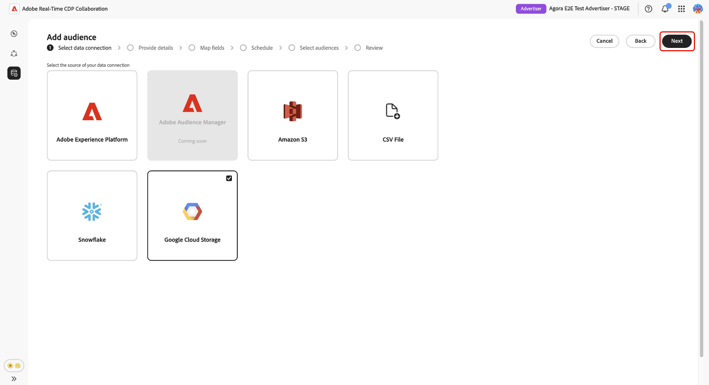
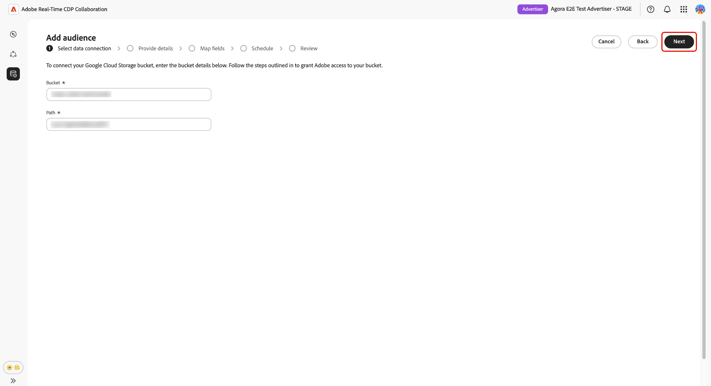
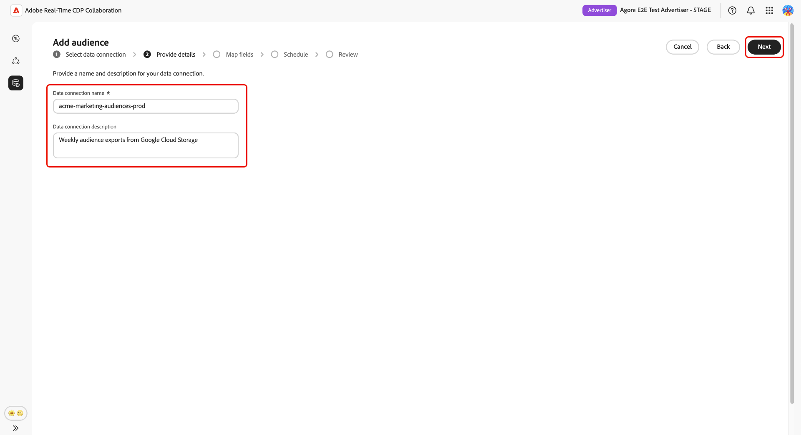
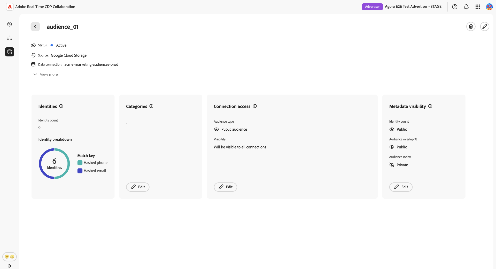

# 为受众源配置[!DNL Google Cloud Storage]

按照本指南中的步骤将您的[!DNL Google Cloud Storage] (GCS)存储段连接到Adobe Real-Time CDP Collaboration，并开始通过UI获取第一方受众数据。

将GCS存储段连接到Collaboration以直接摄取第一方受众数据，而无需工程支持。 连接后，Collaboration会按照定期计划从存储段中获取受众，并在您的协作项目中对其进行激活和重叠分析。 采购受众是激活受众或将其用于与协作者进行重叠分析之前的必需步骤。

本指南涵盖端到端配置工作流：准备前提条件、验证GCS存储段、复查自动映射的身份字段、计划数据刷新以及确认来源补充已成功完成。

源自[!DNL Google Cloud Storage]的受众遵循与源自Adobe Experience Platform的受众相同的治理和数据处理规则。

其他可用的源方法包括[Experience Platform](./onboard-audiences.md)、[Amazon S3](./configure-aws-s3-audience-sourcing.md)、[Snowflake](./configure-snowflake-audience-sourcing.md)和[CSV文件上传](./upload-csv-audience-sourcing.md)。

## 先决条件 {#prerequisites}

请先完成此部分中的所有项目，然后再启动配置工作流。 未完成先决条件是最常见的原因是设置失败或受众在采购后未出现。 在遵循本指南之前，您必须已完成[帐户登录和设置](./onboard-account.md)。

此部分中的某些步骤需要由[!DNL Google Cloud]管理员执行操作。 如果您不是组织的[!DNL Google Cloud]管理员，请在开始之前确定适当的人员。

### GCS访问和权限 {#gcs-access-permissions}

<!-- [LINK REQUIRED: Once the GCS permissions and roles guide is published, replace this NOTE with a direct link to that guide and remove the placeholder instructions below.] -->

>[!NOTE]
>
>一个专用指南正在等待发布，该指南涵盖此集成所需的特定[!DNL Google Cloud]个IAM角色、服务帐户配置和存储段级权限。 在该指南可用之前，请与您的[!DNL Google Cloud]管理员合作，确认Adobe具有针对存储段进行身份验证和读取受众文件所需的权限。

在继续之前，请与[!DNL Google Cloud]管理员确认以下事项：

* Adobe已获得根据GCS存储段进行身份验证和读取受众文件所需的权限。
* [!DNL Google Cloud Storage]受众源在您的地区可用。 供应情况因地区（北美地区、欧洲、中东和非洲地区、澳新银行）而异。 如果您所在地区尚未提供GCS源，请联系您的Adobe客户代表以确认时间线。

### 准备受众数据 {#prepare-audience-data}

您的受众文件必须符合&#x200B;**[受众源规格(v1.2)](../../assets/quick-start/RTCDP_Collaboration_Audience_Sourcing_Spec_v1.2.pdf)**，然后才能开始源。 查看完整模式定义和字段级示例的规范。 主要要求包括：

* **文件格式：** CSV，使用逗号作为字段分隔符，使用管道字符(`|`)作为单个字段中多个值的分隔符。
* **必填字段：**&#x200B;每个记录都必须包含一个`AUDIENCE_ID`列和至少一个受支持的匹配键列。
* **支持的匹配键：** `HASHED_EMAIL_SHA_256`，`HASHED_PHONE_SHA_256`，`HASHED_IPV4_SHA_256`，`CRM_ID`，`LOYALTY_ID`，`ADFIXUS_ID`。
* **哈希处理要求：**&#x200B;上传之前，必须修剪、小写和SHA256哈希处理所有匹配键值。 Collaboration在引入数据之前不会对其进行哈希处理或标准化。
* **列一致性：**&#x200B;如果您的存储桶包含多个受众文件，则所有文件必须使用相同的列结构。

此外，还必须为您的Collaboration帐户启用受众文件中存在的所有匹配键。 要添加或启用匹配键，请参阅[设置匹配键](./onboard-account.md#set-up-match-keys)。

### 开始前所需的值 {#required-values}

在启动配置向导之前，请准备好以下值。

| 值 | 描述 |
| --- | --- |
| **[!UICONTROL 存储桶]** | 包含受众文件的[!DNL Google Cloud Storage]存储段的名称。 |
| **[!UICONTROL 路径]** | 存储受众文件的存储段中的路径前缀（例如，`sourcing/testdata/path1/`）。 |

## 配置您的[!DNL Google Cloud Storage]连接 {#configure-gcs-connection}

配置工作流是&#x200B;**[!UICONTROL 安装程序]**&#x200B;工作区中的多步骤向导。 按顺序完成每个步骤。 在创建连接之前，您可以使用最终审阅屏幕上的铅笔图标返回到任何步骤。

### 添加新的数据连接 {#add-data-connection}

从&#x200B;**[!UICONTROL 设置]**&#x200B;工作区的&#x200B;**[!UICONTROL 我的受众]**&#x200B;选项卡中，选择添加图标（） 然后选择&#x200B;**[!UICONTROL 受众]**。

如果这是您的第一个受众，您还可以选择&#x200B;**[!UICONTROL 添加]**&#x200B;选项。

此时会显示添加受众工作流。 选择&#x200B;**[!UICONTROL 添加新数据连接]**，然后选择&#x200B;**[!UICONTROL 下一步]**。

{zoomable="yes"}

### 选择[!DNL Google Cloud Storage]作为数据源 {#select-gcs}

>[!CONTEXTUALHELP]
>id="rtcdp_collaboration_audience_sourcing_specifications_gcs"
>title="请为加入过程准备好您的数据"
>abstract="请参阅受众源规格指南，了解如何设置和构建适用于Collaboration的Google云存储中的受众数据。"
>additional-url="https://www.adobe.com/go/rtcdp-collaboration-audience-sourcing" text="查看指南"

数据源选择屏幕列出了所有可用的连接类型。 选择&#x200B;**[!UICONTROL Google Cloud Storage]**，然后选择&#x200B;**[!UICONTROL 下一步]**。

此时会出现一个先决条件对话框，其中概述了所需的配置步骤（例如，GCS存储段设置和IAM角色分配），并指出，数据必须符合&#x200B;**[[!UICONTROL 受众源规格]](../../assets/quick-start/RTCDP_Collaboration_Audience_Sourcing_Spec_v1.2.pdf)**。 选择&#x200B;**[!UICONTROL 开始载入]**&#x200B;以确认合规性，然后再继续。

### 输入您的[!DNL Google Cloud Storage]连接详细信息 {#authenticate-gcs-connection}

提供允许Collaboration访问您的[!DNL Google Cloud Storage]存储段所需的详细信息。 输入所需信息后，选择&#x200B;**[!UICONTROL 下一步]**。

| 字段 | 描述 |
| --- | --- |
| **[!UICONTROL 存储桶]** | [!DNL Google Cloud Storage]存储段的名称。 查看[开始前所需的值](#required-values)。 |
| **[!UICONTROL 路径]** | 存储受众文件的存储段中的路径前缀。 |

### 确认同意和数据使用确认 {#confirm-consent}

您必须先确认已从受众数据中删除同意选择退出，Collaboration才能处理。 如果不确定您的数据是否满足此要求，请先查看[治理策略和实施操作](./onboard-audiences.md#governance-policy-and-enforcement-actions)指南，然后再继续。 选中确认复选框，然后选择&#x200B;**[!UICONTROL 确定]**&#x200B;以继续。

### 提供连接详细信息 {#provide-connection-details}

输入此数据连接的名称和可选说明。 您提供的名称显示在&#x200B;**[!UICONTROL 我的数据连接]**&#x200B;选项卡中，如果您管理多个数据连接，该名称有助于区分此源。

* **[!UICONTROL 数据连接名称]** （必需）
* **[!UICONTROL 数据连接描述]**（可选）。

选择&#x200B;**[!UICONTROL 下一步]**&#x200B;以继续。

### 查看自动映射的身份字段 {#auto-mapped-fields}

**[!UICONTROL 映射]**&#x200B;屏幕是只读的。 Collaboration会根据受众源规格中定义的列名称，自动将受众文件中的源标识字段映射到目标字段。 您无法在此阶段添加、删除或应用转换到映射的字段。

>[!TIP]
>
>选择&#x200B;**[!UICONTROL 预览源数据]**&#x200B;以表格格式查看受众数据的示例，然后选择&#x200B;**[!UICONTROL 关闭]**&#x200B;以返回到映射屏幕。

{zoomable="yes"}

确认显示的映射反映了受众文件中的字段。 如果不符合，请先停止并更正您的文件以符合[受众源规范](../../assets/quick-start/RTCDP_Collaboration_Audience_Sourcing_Spec_v1.2.pdf)，然后再继续。 选择&#x200B;**[!UICONTROL 下一步]**&#x200B;以继续。

### 计划数据刷新 {#schedule-data-refresh}

在&#x200B;**[!UICONTROL 计划]**&#x200B;视图中，设置Collaboration从GCS存储段中检索更新的受众数据的频率，并定义来源的有效日期范围。

使用&#x200B;**[!UICONTROL Frequency]**&#x200B;下拉菜单选择Collaboration从GCS存储桶中检索更新的受众数据的频率。 可用间隔范围从&#x200B;**[!UICONTROL 每天]**&#x200B;到&#x200B;**[!UICONTROL 每6天]**。

在输入字段中键入日期范围，或选择日历图标以设置有效来源补充期间的&#x200B;**[!UICONTROL 开始日期]**&#x200B;和&#x200B;**[!UICONTROL 结束日期]**。 当到达结束日期时，来源补充将停止，以前来源的受众将过期并且无法在协作项目中使用。

>[!IMPORTANT]
>
>设置刷新频率以匹配或不超过基础GCS受众数据的更新速率。 支持的最低刷新间隔为每6天一次。 刷新频率高于数据更改占用了Collaboration积分，而不会产生更新结果。 若要监视您的信用使用情况，请参阅[跟踪您的信用使用情况活动](./my-activity.md)。

选择&#x200B;**[!UICONTROL 下一步]**&#x200B;以继续。

### 查看并完成连接 {#review-and-complete}

在创建连接之前，请查看配置摘要。 摘要屏幕显示以下部分：

* **[!UICONTROL 数据连接]**：您配置的GCS存储段凭据和文件夹路径。
* **[!UICONTROL 详细信息]**：此数据连接的名称和可选描述。
* **[!UICONTROL 映射]**：自动映射的源标识和目标标识字段。
* **[!UICONTROL 计划]**：刷新频率和活动日期范围。

选择铅笔图标（） ，以返回该步骤并进行更改。 当所有节都正确时，选择&#x200B;**[!UICONTROL 完成]**。

此时会显示一个确认对话框，指示Collaboration已创建数据连接，并且受众源正在进行。

## 审查源受众 {#review-sourced-audiences}

完成配置向导后，Collaboration将开始异步从GCS存储段获取受众。 导航到&#x200B;**[!UICONTROL 设置]** > **[!UICONTROL 我的受众]**&#x200B;以监视进度。 采购不会立即完成；所需时间取决于数据大小和配置的刷新频率。

### 监控受众源获取进度 {#monitor-sourcing-progress}

在Collaboration检索受众数据时，**[!UICONTROL 我的受众]**&#x200B;工作区顶部的横幅指示正在采购。 只有在为每个受众完成采购后，各个受众才会显示在列表中。

>[!TIP]
>
>受众源获取时间因GCS数据的大小和您配置的刷新频率而异。 较大的数据集或不太频繁的刷新计划可能需要更长的时间才能显示在&#x200B;**[!UICONTROL 我的受众]**&#x200B;工作区中。

### 查看源受众详细信息 {#view-audience-details}

来源补充完成后，您的[!DNL Google Cloud Storage]受众将与其他连接来源的受众一起显示在&#x200B;**[!UICONTROL 我的受众]**&#x200B;选项卡中。 选择行项目或&#x200B;**[!UICONTROL 查看受众]**&#x200B;以打开特定受众的详细信息视图。

详细信息视图显示受众的状态、来源和数据连接名称，以及以下面板：

* **[!UICONTROL 标识]**：数据可用后，受众的标识总数和划分。
* **[!UICONTROL 类别]**：应用于组织或筛选受众的任何标记。
* **[!UICONTROL 连接访问]**：受众是私有受众、公共受众还是与特定协作者共享。
* **[!UICONTROL 元数据可见性]**：协作者可以看见哪些受众信息，如身份计数、重叠百分比和索引。

在协作项目中使用受众之前，请查看这些设置。 要更新类别、连接访问权限或元数据可见性，请参阅[查看和管理单个受众](./onboard-audiences.md#view-individual-audiences)。

### 编辑受众设置 {#edit-audience-settings}

您可以直接从&#x200B;**[!UICONTROL 我的受众]**&#x200B;列表视图中编辑受众元数据，而无需打开详细信息视图。 选中受众的复选框以显示操作工具栏，然后选择操作： **[!UICONTROL 编辑元数据可见性]**、**[!UICONTROL 编辑连接访问权限]**、**[!UICONTROL 编辑名称和描述]**、**[!UICONTROL 编辑类别]**&#x200B;或&#x200B;**[!UICONTROL 删除]**。

### 查看您的GCS数据连接 {#view-gcs-connection}

要查看或管理连接本身，包括其匹配键和计划，请导航到&#x200B;**[!UICONTROL 设置]** > **[!UICONTROL 我的数据连接]**。 您的新GCS连接立即可用。 受众源显示为&#x200B;**[!UICONTROL Google Cloud Storage]**。

## 已知限制 {#known-limitations}

在配置和使用[!DNL Google Cloud Storage]受众源时，请注意以下限制：

* **匹配键约束：**&#x200B;为数据连接启用匹配键后，将无法将其删除。 可以将匹配密钥添加到现有连接，但不能禁用或删除它们。 要更改活动的匹配键，您必须[删除数据连接](./manage-data-connection.md#delete-data-connection)并创建一个新连接。
* **每个源有一个活动数据连接：**&#x200B;一次只支持一个活动[!DNL Google Cloud Storage]数据连接。 如果您需要从其他存储桶获取受众，请[删除现有连接](./manage-data-connection.md#delete-data-connection)，并创建一个指向新存储桶的新连接。
* **子文件夹支持：**&#x200B;受众文件必须直接位于指定的文件夹路径中。 Collaboration不会遍历该路径中的子文件夹。

## 疑难解答 {#troubleshooting}

使用此部分解决建立初始连接后出现的问题。 对于身份验证期间发生的错误，请检查您的凭据和存储桶权限，或与管理员联系。

**受众未出现或来源补充时间长于预期**

* 采购时间随数据量和配置的刷新频率而扩展。 大型数据集需要更长的处理时间。
* 如果受众未在24小时内出现，请确认您的受众文件位于您在设置期间指定的文件夹路径中，并且符合受众源规范。
* 检查&#x200B;**[!UICONTROL 我的数据连接]**&#x200B;选项卡，查看连接上的错误指示器。
* 如果在完成这些步骤后问题仍然存在，请联系Adobe客户支持并提供数据连接名称和存储段详细信息。

**数据连接最初成功后显示失败状态**

* 确认自您创建连接以来，GCS存储段权限和凭据未发生更改。 任何删除Adobe对存储桶访问权限的更改都会导致后续源运行失败。
* 验证受众文件仍然存在于配置的文件夹路径中，并符合受众源规范。
* 如果在确认权限和文件可用性后问题仍然存在，请[删除连接](./manage-data-connection.md#delete-data-connection)并创建一个新连接，或联系Adobe客户支持。

在计划的刷新期间出现&#x200B;**受众文件格式错误**

* 确认存储桶中更新的文件符合[受众源规格](../../assets/quick-start/RTCDP_Collaboration_Audience_Sourcing_Spec_v1.2.pdf)中的列结构和字段要求。
* 请确保配置的文件夹路径中的所有文件都使用相同的列结构。 同一路径中的混合格式文件可能会导致部分源失败。

## 后续步骤 {#next-steps}

您已将[!DNL Google Cloud Storage]配置为Collaboration中的数据源。 完成源获取后，您的受众可在&#x200B;**[!UICONTROL 我的受众]**&#x200B;工作区中使用，并随时可用于协作项目。

在那里，您可以：

* [创建和管理协作项目](../collaborate/manage-projects.md)
* [在项目中激活受众](../collaborate/activate.md)
* [审查重叠并衡量绩效](../collaborate/measure.md)
* [管理受众设置和可见性](./onboard-audiences.md#view-individual-audiences)
* [管理此数据连接的匹配键和计划](./manage-data-connection.md)

有关其他受众来源补充方法，请参阅：

* [为受众源配置 [!DNL Amazon S3] &#x200B;](./configure-aws-s3-audience-sourcing.md)
* [为受众源配置 [!DNL Snowflake] &#x200B;](./configure-snowflake-audience-sourcing.md)
* [来自Experience Platform的Source受众](./onboard-audiences.md)
* [上传CSV文件以进行受众源](./upload-csv-audience-sourcing.md)
