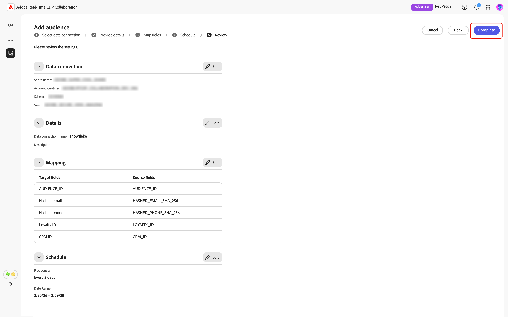

# 为受众源配置[!DNL Snowflake]

了解如何在Adobe Real-Time CDP Collaboration UI中配置您的[!DNL Snowflake Secure Data Share]并将其连接到受众数据以进行激活和重叠分析。

## 概述 {#overview}

[!DNL Snowflake]是支持将第一方受众数据获取到Collaboration中的选项之一。 其他可用方法包括从[Experience Platform](./onboard-audiences.md)获取受众、连接[[!DNL AWS S3] 存储桶](./configure-aws-s3-audience-sourcing.md)或上传[CSV文件](./upload-csv-audience-sourcing.md)。

按照以下步骤连接您的[!DNL Snowflake Secure Data Share]并将受众数据来源到Collaboration。 设置完成后，您可以审核、激活和管理协作项目的来源受众。

## 先决条件 {#prerequisites}

在配置[!DNL Snowflake]连接之前，请确保满足以下先决条件：

* 您已创建一个[!DNL Snowflake Share]并在您的[!DNL Snowflake]帐户中设置必要的权限来授予对您的[!DNL Snowflake Secure Data Share]的Adobe访问权限。 了解[如何配置 [!DNL Snowflake] 权限](#set-up-snowflake-permissions)。
* 您已准备好[!DNL Snowflake Share]个值：

   * **共享名称**
   * **帐户标识符**
   * **架构**
   * **视图**

* [!DNL Snowflake Secure Data Share]中的受众数据必须符合[受众源规格(v1.3)](../../assets/quick-start/RTCDP_Collaboration_Audience_Sourcing_Spec_v1_3.pdf)指南中所述的格式要求。
* 还必须为您的Collaboration帐户启用[!DNL Snowflake]受众文件中的所有匹配键。 了解如何[启用匹配键](./onboard-account.md#set-up-match-keys)或[将新的匹配键](./onboard-account.md#edit-match-keys)添加到您的帐户。

## 设置[!DNL Snowflake]权限 {#setup-snowflake-permissions}

[!DNL Snowflake Secure Data Share]提供了一种在[!DNL Snowflake]帐户之间安全地共享实时只读数据的方法，而无需复制或移动数据。 要授予Adobe对您[!DNL Secure Data Share]的访问权限，请确保在您的[!DNL Snowflake]帐户中配置适当的权限。

在继续操作之前，请确保满足以下条件：

* 您有权访问[!DNL Snowflake]帐户。
* 您的[!DNL Snowflake]帐户已订阅私人列表。 您需要Snowflake的管理员权限才能配置所需的权限。
* 您知道您的[!DNL Snowflake]帐户的云提供商和地区。

有关必要权限的更多信息，请阅读[[!DNL Snowflake] 文档](https://docs.snowflake.com/en/collaboration/consumer-listings-access#access-a-private-listing)。

### 收集Adobe的[!DNL Snowflake]帐户信息 {#collect-account-information}

要开始配置，请找到并记下与您所在地区匹配的Adobe [!DNL Snowflake]帐户标识符。 在后续步骤中，您将需要此标识符来授予Adobe访问权限。

| 区域 | [!DNL Snowflake]生产帐户完整标识符 |
| ------------- | --------------- |
| 北美洲 | Adobe.AGORA_SF_02 |
| EMEA | Adobe.RTCDP_COLLABORATION_DEU1_EXTERNAL |
| 澳大利亚 | Adobe.RTCDP_COLLABORATION_AUS3_EXTERNAL |

{style="table-layout:auto"}

### 创建并授予[!DNL Snowflake Share]的访问权限 {#create-grant-access-to-share}

接下来，按照以下步骤在您的[!DNL Snowflake]帐户中创建[!DNL Secure Data Share]，并授予Adobe对您的受众数据的只读访问权限。

1. 创建一个安全视图，仅对源表中的必要列具有有限访问权限。

   ```sql
   CREATE OR REPLACE SECURE VIEW my_database.my_schema.secure_view_for_adobe AS
   SELECT 
       column1,
       column2,
       column3
   FROM my_database.my_schema.source_table;
   ```

2. 创建新[!DNL Snowflake Secure Data Share]。

   ```sql
   CREATE OR REPLACE SHARE adobe_data_share;
   ```

3. 将数据库的USAGE权限授予[!DNL Snowflake Secure Data Share]，以便它可以访问数据库中的对象。

   ```sql
   GRANT USAGE ON DATABASE my_database TO SHARE adobe_data_share;
   ```

4. 将架构上的USAGE授予[!DNL Snowflake Secure Data Share]，以使其能够访问架构中的对象。

   ```sql
   GRANT USAGE ON SCHEMA my_database.my_schema TO SHARE adobe_data_share;
   ```

5. 将安全视图的SELECT权限授予[!DNL Snowflake Secure Data Share]，以便Adobe能够读取您的受众数据。

   ```sql
   GRANT SELECT ON VIEW my_database.my_schema.secure_view_for_adobe TO SHARE adobe_data_share;
   ```

6. 使用您所在地区的正确标识符将Adobe的[!DNL Snowflake]帐户添加到[!DNL Snowflake Secure Data Share]。 请参阅[&#128279;](#collect-account-information)上方的区域/帐户映射表。

   ```sql
   ALTER SHARE adobe_data_share ADD ACCOUNTS = <Account Identifier based on region from the mapping table>;
   ```

### 收集[!DNL Snowflake Share]详细信息 {#collect-share-details}

最后，收集您[!DNL Snowflake Share]的详细信息，如下表所示。 您需要此信息才能设置[!DNL Snowflake Share]与Collaboration之间的连接。

| 字段 | 示例 |
| -------------------------- | --------------- |
| 帐户标识符 | CUSTOMER_ORG.CUSTOMER_SNOWFLAKE_ACCOUNT |
| [!DNL Share]名称 | adobe_data_share |
| 架构名称 | customer_schema |
| 视图名称 | secure_view_for_adobe |

{style="table-layout:auto"}

## 配置您的[!DNL Snowflake]连接 {#configure-snowflake-connection}

完成[Snowflake权限配置](#set-up-snowflake-permissions)并确保满足所有[先决条件](#prerequisites)后，您现在可以将您的[!DNL Snowflake Secure Data Share]连接到Collaboration以开始获取受众。

从&#x200B;**[!UICONTROL 设置]**&#x200B;工作区的&#x200B;**[!UICONTROL 我的受众]**&#x200B;选项卡中，选择添加图标（） 然后选择&#x200B;**[!UICONTROL 受众]**。

如果这是您的第一个受众，您还可以选择&#x200B;**[!UICONTROL 添加受众]**&#x200B;选项。


此时会显示添加受众工作流。 选择&#x200B;**[!UICONTROL 添加新数据连接]**，然后选择&#x200B;**[!UICONTROL 下一步]**。

{zoomable="yes"}

### 选择[!DNL Snowflake]作为数据连接 {#select-snowflake}

接下来，选择&#x200B;**[!UICONTROL Snowflake]**&#x200B;作为数据连接，然后选择&#x200B;**[!UICONTROL 下一步]**。

![具有[!DNL Snowflake]的数据连接选择屏幕可用作可选选项。](../../assets/setup/snowflake-audience-sourcing/select-snowflake-data-connection.png)

### 审阅受众文件 {#review-audience-file}

>[!CONTEXTUALHELP]
>id="rtcdp_collaboration_audience_sourcing_specifications_snowflake"
>title="请为加入过程准备好您的数据"
>abstract="阅读受众来源规范指南，了解如何为 Collaboration 格式化和结构化来自 Snowflake 的受众数据。"
>additional-url="https://www.adobe.com/go/rtcdp-collaboration-audience-sourcing" text="查看指南"

此时会出现一个对话框，说明在开始获取之前[!DNL Snowflake Share]和[!DNL Snowflake]受众文件的要求。 确保使用正确的共享名、帐户标识符、架构和视图创建您的[!DNL Snowflake Share]。 要确认受众数据的格式和结构正确无误，以便在Collaboration中使用，请查看&#x200B;**[[!UICONTROL 受众源规格]](../../assets/quick-start/RTCDP_Collaboration_Audience_Sourcing_Spec_v1_3.pdf)**&#x200B;指南。

完成后，选择&#x200B;**[!UICONTROL 开始载入]**。

![使用指向受众源规范的链接准备[!DNL Snowflake Share]以加入对话框。](../../assets/setup/snowflake-audience-sourcing/prepare-snowflake-share-onboarding-dialog.png)

### 对 [!DNL Snowflake Share] 连接进行身份验证 {#authenticate-snowflake-share-connection}

>[!CONTEXTUALHELP]
>id="rtcdp_collaboration_audience_sharing_snowflake"
>title="从 Snowflake 添加受众"
>abstract="要连接您的 Snowflake Share，请授权 Adobe 的服务用户能够检索您的受众数据以进行处理。 按照 Experience League 中列出的步骤，授予 Adobe 对您的 Snowflake Share 的访问权限。"

在此步骤中，您需要提供将您的[!DNL Snowflake Share]连接到Collaboration所需的[!DNL Snowflake Share]凭据：

| 字段 | 描述 | 示例 |
|--------------------|-------------|------------------------------|
| 共享名称 | [!DNL Snowflake Share]的名称。 | `ADOBE_DATA_SHARE` |
| 帐户标识符 | Snowflake帐户的唯一标识符。 | `CUSTOMER_ORG.CUSTOMER_SNOWFLAKE_ACCOUNT` |
| 架构 | [!DNL Snowflake Share]中包含受众数据的架构。 | `CUSTOMER_SCHEMA` |
| 视图 | Collaboration拉入受众数据的实际数据集。 | `SECURE_VIEW_FOR_ADOBE` |

{style="table-layout:auto"}

输入所有必需的凭据后，选择&#x200B;**[!UICONTROL 下一步]**。

![已填写[!DNL Snowflake Share]连接表单，其中的“共享名称”、“帐户标识符”、“架构”和“视图”字段已填写，并且“下一步”按钮已突出显示。](../../assets/setup/snowflake-audience-sourcing/snowflake-authentication-credentials-form.png)

下一页底部会显示一个确认对话框，用于确认您的[!DNL Snowflake Share]已成功连接到Collaboration。

![确认对话框确认您的[!DNL Snowflake Share]连接已成功建立。](../../assets/setup/snowflake-audience-sourcing/snowflake-share-connection-established.png)

### 提供名称和描述 {#provide-name-description}

在&#x200B;**[!UICONTROL 提供详细信息]**&#x200B;视图中，为您的[!DNL Snowflake]数据连接输入描述性名称和可选描述。 完成后，选择&#x200B;**[!UICONTROL 下一步]**。


### 映射字段 {#map-fields}

**[!UICONTROL 映射]**&#x200B;屏幕当前为只读。 不能添加、删除或应用转换。 Collaboration根据&#x200B;**[受众源规格(v1.3)](../../assets/quick-start/RTCDP_Collaboration_Audience_Sourcing_Spec_v1_3.pdf)**&#x200B;自动将源标识字段从[!DNL Snowflake Share]数据映射到目标字段。

以可视方式确认映射的字段并选择&#x200B;**[!UICONTROL 下一步]**&#x200B;以继续。 您还可以使用&#x200B;**[!UICONTROL 预览源数据]**&#x200B;选项预览[!DNL Snowflake Share]中的示例数据。


当您选择预览时，将显示&#x200B;**[!UICONTROL [!DNL Snowflake Share]数据预览]**&#x200B;对话框，其中以表格格式显示样本数据。 查看此内容，然后选择&#x200B;**[!UICONTROL 关闭]**。

![[!DNL Snowflake Share]数据预览对话框显示[!DNL Snowflake Share]中的示例数据，并且突出显示了“关闭”选项。](../../assets/setup/snowflake-audience-sourcing/preview-source-data.png)

<!-- NOTE: Manual mapping will be available in the future. -->
<!-- In the **[!UICONTROL Map fields]** screen, you can use the **[!UICONTROL Source field]** and **[!UICONTROL Target field]** dropdowns to update the auto-mapped fields, or include additional fields with the **[!UICONTROL Add field]** option. Once finished, select **[!UICONTROL Next]**. -->

<!--  -->

### 计划刷新频率和日期范围 {#refresh-frequency-date-range}

接下来，在&#x200B;**[!UICONTROL 计划]**&#x200B;视图中，使用下拉菜单选择一到六天之间的刷新频率。 然后，使用日历图标指定来源受众的开始和结束日期。

>[!IMPORTANT]
>
>要有效地管理Collaboration积分，请将刷新频率设置为匹配或不超过基础[!DNL Snowflake]数据的更新频率。 支持的最低刷新间隔为每6天一次。


### 查看并完成连接 {#review-and-complete}

最后，在摘要屏幕中查看配置设置。 此视图包含以下部分的摘要：

* **[!UICONTROL 数据连接]**：显示[!DNL Snowflake Share]的共享名、帐户标识符、方案和视图。
* **[!UICONTROL 详细信息]**：显示数据连接的名称和可选说明，以便帮助以后识别它。
* **[!UICONTROL 映射]**：显示受众文件中的源字段如何映射到Collaboration中使用的目标字段。
* **[!UICONTROL 计划]**：显示连接刷新受众数据的频率以及来源的有效日期范围。

如果需要编辑节，请选择铅笔图标（）。 选择&#x200B;**[!UICONTROL 完成]**&#x200B;以确认所有节。



确认对话框用于确认数据连接是否已成功创建以及受众获取是否正在进行中。

## 审查源受众 {#review-sourced-audiences}

设置完成后，Collaboration开始从您的[!DNL Snowflake Share]中获取受众。 如果受众源正在进行，则会在视图顶部显示横幅。


>[!TIP]
>
>受众源获取时间因[!DNL Snowflake]数据的大小和您配置的刷新频率而异。 较大的数据集或不太频繁的刷新计划可能需要更长的时间才能显示在&#x200B;**[!UICONTROL 我的受众]**&#x200B;工作区中。

采购完成后，您的受众将位于&#x200B;**[!UICONTROL 我的受众]**&#x200B;选项卡中，其功能和信息与源自Experience Platform的受众相同。


在网格视图或表格视图中，选择行项或&#x200B;**[!UICONTROL 查看受众]**&#x200B;以查看特定受众的概述。 它显示受众的状态、源和数据连接名称，以及&#x200B;**[!UICONTROL 身份]**、**[!UICONTROL 类别]**、**[!UICONTROL 连接访问]**&#x200B;和&#x200B;**[!UICONTROL 元数据可见性]**&#x200B;的详细面板。 有关详细信息，请参阅[如何查看单个受众](./onboard-audiences.md#view-individual-audiences)。

在协作项目中使用受众之前，请使用此视图确认受众配置和可见性设置。

## 查看您的[!DNL Snowflake]数据连接 {#view-snowflake-connection}

您新添加的[!DNL Snowflake]连接在&#x200B;**[!UICONTROL 我的数据连接]**&#x200B;选项卡中立即可用。 受众源显示为[!UICONTROL [!DNL Snowflake]]。

您的[!DNL Snowflake]数据连接包含与其他受众数据连接相同的功能和详细信息。 详细了解[如何查看和管理数据连接](../setup/manage-data-connection.md)。

![我的数据连接选项卡显示与源状态信息的[!DNL Snowflake]数据连接。](../../assets/setup/snowflake-audience-sourcing/data-connection-tab-snowflake.png)

## 后续步骤 {#next-steps}

您现在已成功将您的[!DNL Snowflake]配置为Collaboration中的数据源并将其连接。 完成源获取后，您可以[创建协作项目](../collaborate/manage-projects.md)、[激活受众](../collaborate/activate.md)、[查看重叠和见解](../collaborate/measure.md)以及[管理受众设置和可见性](./onboard-audiences.md)。

有关其他受众来源补充方法的信息，请参阅以下文档：

* [为受众源配置 [!DNL Amazon S3] &#x200B;](./configure-aws-s3-audience-sourcing.md)
* [来自Experience Platform的Source受众](./onboard-audiences.md)
* [上传CSV文件以进行受众源](./upload-csv-audience-sourcing.md)
