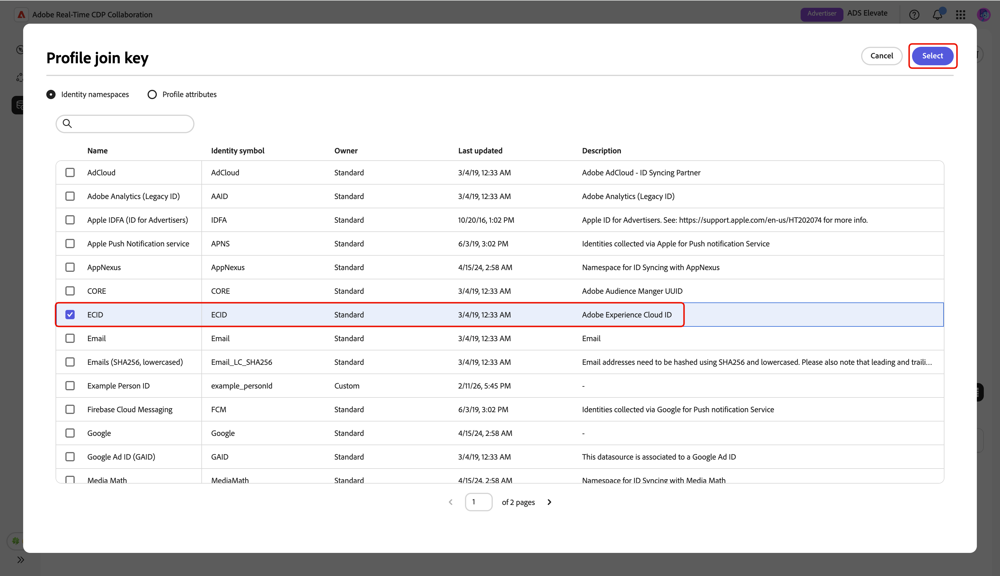

# 管理测量数据连接

{{limited-availability-release-note}}

## 概述

在Real-Time CDP Collaboration中使用测量数据连接从各种平台获取转化数据。 了解如何管理详细信息以及匹配现有数据连接的密钥。

## 查看测量数据连接 {#view-measurement-data-connections}

您可以查看任何现有测量数据连接的详细信息，包括转化数据的来源方式、正在使用的匹配键以及链接到该连接的所有转化事件。

从&#x200B;**[!UICONTROL 设置]**&#x200B;工作区，导航到&#x200B;**[!UICONTROL 我的数据连接]**&#x200B;选项卡。 所有当前测量数据连接都显示在表格视图或网格视图的&#x200B;**[!UICONTROL 测量]**&#x200B;节下。 在相关连接卡上选择&#x200B;**[!UICONTROL 查看数据连接]**，或在表视图中选择数据连接名称以打开其工作区并查看所有详细信息。

{zoomable="yes"}

### 测量数据连接详细信息 {#measurement-data-connection-details}

在此部分中，您可以查看数据连接的以下详细信息：

| 字段 | 描述 |
|-------------------|-------------|
| 状态 | 测量数据连接的当前状态，例如&#x200B;**[!UICONTROL 活动]**。 |
| 来源 | 为此连接提供测量数据的平台或系统。 |
| 沙盒 | 配置测量数据连接的沙盒的名称。 |
| 数据集 | 用于在连接中获取测量数据的数据集的名称。 |
| 上次更新时间 | 测量数据连接最近更新的时间戳。 |
| 上次更新者 | 上次修改测量数据连接的用户。 |
| 创建时间 | 创建测量数据连接时的时间戳。 |
| 创建者 | 最初创建测量数据连接的用户。 |

{style="table-layout:auto"}

### 匹配键 {#match-keys}

匹配键是您[源测量数据](./onboard-measurement-data.md)时映射源字段的目标字段。 要了解有关匹配键如何工作的更多信息，请参阅[匹配键](./onboard-account.md#set-up-match-keys)指南。

{zoomable="yes"}

### 转化事件 {#conversion-events}

附加到数据连接的转化事件列表显示在工作区的底部。 该列表显示每个事件的简短概述，包括其状态、转化类型和来源。 您可以选择事件名称来查看和编辑其配置，或使用删除选项（）删除转化事件。 有关管理转化事件的完整指南，请参阅[添加和管理测量数据](./onboard-measurement-data.md)指南。

{zoomable="yes"}

## 编辑测量数据连接 {#edit-measurement-data-connection}

您可以随时更新现有测量数据连接的详细信息和匹配键，以确保报告和分析保持准确。 要开始，请导航到&#x200B;**[!UICONTROL 我的数据连接]**&#x200B;选项卡，然后选择要编辑的测量数据连接。 此操作将打开数据连接工作区，您可以在其中执行以下步骤以进行必要更改。

### 编辑名称和描述 {#edit-name-and-description}

要更新数据连接的名称和说明，请选择当前连接名称旁边的编辑图标（）。

{zoomable="yes"}

在&#x200B;**[!UICONTROL 编辑数据连接]**&#x200B;对话框中，使用所需的值更新字段，然后选择&#x200B;**[!UICONTROL 保存]**&#x200B;以应用更改。

{zoomable="yes"}

将显示确认对话框，确认详细信息已成功更新。

### 编辑匹配键 {#edit-match-keys}

>[!IMPORTANT]
>
>在编辑数据连接的匹配键之前，请注意以下事项：
>
>* 只有为您的帐户配置的匹配键才能用于数据连接。
>* 此时，您可以向数据连接添加其他匹配键，但一旦启用了匹配键，就无法将其删除。

在数据连接工作区中，在&#x200B;**[!UICONTROL 匹配键]**&#x200B;面板中选择&#x200B;**[!UICONTROL 编辑]**。

{zoomable="yes"}

此时将显示一个确认对话框，其中说明对数据连接所做的任何更改都将应用于所有关联的转化。 选择&#x200B;**[!UICONTROL 确定]**&#x200B;确认。 您可以选择以后跳过此确认。

{zoomable="yes"}

在&#x200B;**[!UICONTROL 匹配键]**&#x200B;对话框中，您可以查看扩充设置并查看源字段与目标字段之间的当前映射（匹配键）。

{zoomable="yes"}

#### 扩充 {#enrichment}

如果您[为测量数据](./onboard-measurement-data.md)提供来源时未启用扩充，则可选择使用实时客户资料中的属性扩充事件数据集。 请注意，一旦为测量数据启用了扩充，则无法禁用该功能。 您仍然可以根据需要更新扩充连接键。

当您在&#x200B;**[!UICONTROL 匹配键]**&#x200B;对话框中启用扩充时，UI将展开并在&#x200B;**[!UICONTROL 使用用户档案]**&#x200B;中的ID扩充您的事件数据部分下显示更多配置选项。

选择&#x200B;**[!UICONTROL Source字段连接键]**&#x200B;选项。

{zoomable="yes"}

在&#x200B;**[!UICONTROL Source字段联接键]**&#x200B;对话框中，选择源字段，然后选择&#x200B;**[!UICONTROL 选择]**。

{zoomable="yes"}

接下来，选择&#x200B;**[!UICONTROL 配置文件连接键]**&#x200B;选项。 在&#x200B;**[!UICONTROL 配置文件连接键]**&#x200B;对话框中，从列表中选择配置文件字段。 您可以使用“搜索”选项来查找所需的字段。 然后，选择&#x200B;**[!UICONTROL 选择]**&#x200B;进行确认。

{zoomable="yes"}

#### 编辑映射 {#edit-mapping}

要编辑现有的匹配键，请在&#x200B;**[!UICONTROL 匹配键]**&#x200B;对话框中更新其关联的源字段和目标字段。 如果要包含新的匹配键，请选择&#x200B;**[!UICONTROL 添加字段]**。 这会创建一个空行，您可以在其中定义源字段和目标字段之间的其他映射。

{zoomable="yes"}

接下来，选择空的源字段。 此时将显示&#x200B;**[!UICONTROL 选择源字段]**&#x200B;对话框，其中包含分组到选项（如&#x200B;**[!UICONTROL 身份命名空间]**&#x200B;和&#x200B;**[!UICONTROL 配置文件属性]**）下的可用源字段列表。 您可以筛选列表并使用搜索选项查找所需的源字段。

选择所需的源字段，然后选择&#x200B;**[!UICONTROL 选择]**。

{zoomable="yes"}

在&#x200B;**[!UICONTROL 匹配键]**&#x200B;对话框中，使用下拉菜单将新的源字段映射到目标字段。 所有可用的目标字段都是为Collaborator帐户配置的匹配键。 如果未看到所需的目标字段，请[编辑帐户的匹配键](./onboard-account.md#edit-match-keys)以添加它。

如果您要将非哈希字段源到哈希目标字段，例如，将纯文本电话源字段映射到&#x200B;**[!UICONTROL 哈希电话]**&#x200B;目标字段时，请使用&#x200B;**[!UICONTROL 应用转换]**&#x200B;选项。

{zoomable="yes"}

完成字段映射后，查看更新并选择&#x200B;**[!UICONTROL 确认]**&#x200B;以应用更改。

{zoomable="yes"}

确认对话框用于确认匹配键已成功更新。

## 删除数据连接

删除数据连接将会删除Collaboration中的所有基础转化、关联设置和使用情况。 无法撤消此操作。

要删除现有的数据连接，请选择单个数据连接工作区中的删除图标（）。

{zoomable="yes"}

将显示确认对话框。 选择&#x200B;**[!UICONTROL 删除]**&#x200B;以完成数据连接的删除。

{zoomable="yes"}

确认对话框用于确认是否已成功删除数据连接。

## 后续步骤 {#next-steps}

管理测量数据连接后，您可以：

* 根据需要添加更多链接到您的数据连接的转化事件。 有关详细步骤，请阅读[添加和管理测量数据](./onboard-measurement-data.md)文档。
* 生成测量报告，以深入了解营销活动的绩效和影响。 有关可用报表类型以及如何创建这些报表类型的详细信息，请参阅[度量性能](/help/guide/collaborate/measure.md)指南。
