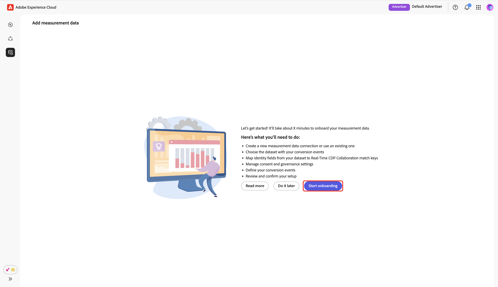
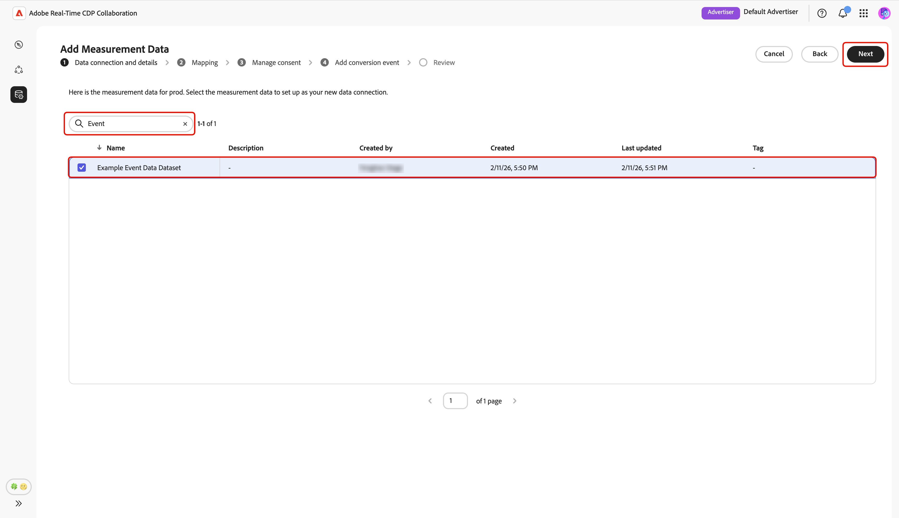
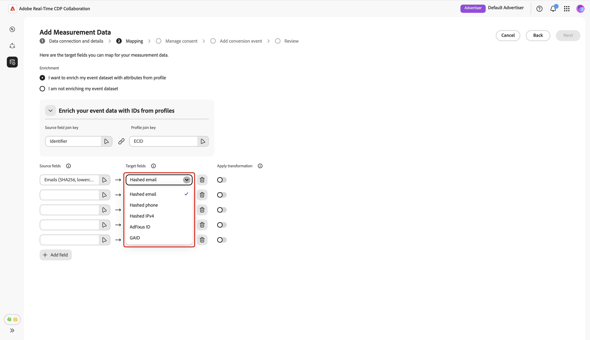

# 添加和管理衡量数据 {#add-and-manage-measurement-data}

>[!CONTEXTUALHELP]
>id="rtcdp_collaboration_onboard_measurement_data"
>title="了解更多信息"
>abstract=""

>[!CONTEXTUALHELP]
>id="rtcdp_collaboration_measurement_data_target_fields"
>title="目标字段"
>abstract="衡量目标字段占位符。"

>[!CONTEXTUALHELP]
>id="rtcdp_collaboration_measurement_data_source_fields"
>title="源字段"
>abstract="衡量来源字段占位符。"

>[!CONTEXTUALHELP]
>id="rtcdp_collaboration_import_measurement_mapping_source_fields"
>title="映射来源字段"
>abstract="来源字段衡量映射占位符。"

>[!CONTEXTUALHELP]
>id="rtcdp_collaboration_import_measurement_mapping_target_fields"
>title="映射目标字段"
>abstract="目标字段衡量映射占位符。"

{{limited-availability-release-note}}

本文档概述了将促销活动测量数据添加到Adobe Real-Time CDP Collaboration的步骤。 发布者可与Adobe团队合作，上传促销活动测量数据。 在上传和处理该数据后，发布商和广告商将能够查看大量的[促销活动测量报告](/help/guide/collaborate/measure.md)。

## 添加测量数据 {#add-measurement-data}

作为广告商，您可以将包含转化事件的测量数据上传到Collaboration，以供在促销活动测量报表中使用。 转化数据通常包括用户标识符（例如经过哈希处理的电子邮件或设备ID）、转化事件时间戳和特定转化事件详细信息（例如购买或注册）等字段。

若要获取测量数据，请导航到&#x200B;**[!UICONTROL 设置]**&#x200B;工作区中的&#x200B;**[!UICONTROL 我的测量数据]**&#x200B;选项卡。 选择添加图标（） 然后选择&#x200B;**[!UICONTROL 测量数据]**。

如果这是您的第一个测量数据，您还可以选择&#x200B;**[!UICONTROL 添加]**&#x200B;选项。

{zoomable="yes"}

出现&#x200B;**[!UICONTROL 添加测量数据]**&#x200B;屏幕，其中显示获取测量数据的步骤摘要。 选择&#x200B;**[!UICONTROL 开始载入]**。

{zoomable="yes"}

### 数据连接和详细信息 {#data-connection-and-details}

在此步骤中，您需要配置数据连接并指定测量数据的详细信息。

#### 选择测量数据类型 {#select-measurement-data-type}

测量数据类型定义您为营销活动测量引入的事件类型。 目前，支持转换数据的类型。

选择&#x200B;**[!UICONTROL 转化数据]**&#x200B;作为度量数据类型，然后选择&#x200B;**[!UICONTROL 下一步]**。

{zoomable="yes"}

#### 选择数据连接 {#select-data-connection}

数据连接是向Collaboration源获取测量数据的来源。 建立初始数据连接并获取第一组测量数据后，您就可以继续使用相同的数据连接获取其他测量数据。

要添加数据连接，请选择&#x200B;**[!UICONTROL 添加新数据连接]**，然后选择&#x200B;**[!UICONTROL 下一步]**。

{zoomable="yes"}

#### 选择数据源 {#select-data-source}

接下来，选择数据连接的源。 目前，Adobe Experience Platform是唯一受支持的数据源。

选择数据源，然后选择&#x200B;**[!UICONTROL 下一步]**。

{zoomable="yes"}

#### 选择沙盒 {#select-sandbox}

选择沙盒，其中包含要用于Collaboration促销活动测量报告的测量数据。 从可用沙盒列表中选择沙盒，然后选择&#x200B;**[!UICONTROL 下一步]**。

{zoomable="yes"}

#### 选择测量数据集 {#select-measurement-dataset}

此时将显示选定沙盒中的数据集列表。 选择一个数据集作为测量数据，然后选择&#x200B;**[!UICONTROL 下一步]**。 您可以使用“搜索”选项来筛选和查找首选数据集。

{zoomable="yes"}

#### 提供名称和详细信息 {#provide-name-and-details}

接下来，提供数据连接的名称和描述。 此信息将帮助您以后识别数据连接。

{zoomable="yes"}

### 映射 {#mapping}

下一步是将测量数据中的字段映射到Collaboration中使用的相应目标字段。 您还可以选择通过映射联接键来使用实时客户配置文件中的属性扩充事件数据集，并使用这些属性来细分测量报表。

#### 丰富事件数据 {#enrich-event-data}

要扩充您的事件数据，请选择&#x200B;**[!UICONTROL Source字段联接键]**&#x200B;选项。

{zoomable="yes"}

在&#x200B;**[!UICONTROL Source字段联接键]**&#x200B;对话框中，选择源字段，然后选择&#x200B;**[!UICONTROL 选择]**。

{zoomable="yes"}

接下来，选择&#x200B;**[!UICONTROL 配置文件连接键]**&#x200B;选项。 在&#x200B;**[!UICONTROL 配置文件连接键]**&#x200B;对话框中，从列表中选择配置文件字段。 您可以使用“搜索”选项来查找所需的字段。 然后，选择&#x200B;**[!UICONTROL 选择]**&#x200B;进行确认。

{zoomable="yes"}

#### 映射字段 {#mapping-fields}

要开始将测量数据的源字段映射到Collaboration中的目标字段，请在&#x200B;**[!UICONTROL 映射]**&#x200B;屏幕中选择空的源字段。

{zoomable="yes"}

出现&#x200B;**[!UICONTROL 选择源字段]**&#x200B;对话框，其中显示了在诸如&#x200B;**[!UICONTROL 身份命名空间]**&#x200B;和&#x200B;**[!UICONTROL 事件架构]**&#x200B;等选项下分组的可用源字段列表。 您可以使用搜索选项从列表中过滤和查找源字段。

选择所需的源字段，然后选择&#x200B;**[!UICONTROL 选择]**。

{zoomable="yes"}

接下来，使用下拉菜单将选定的源字段映射到相应的目标字段。 所有可用的目标字段都是为您的Collaborator帐户[&#128279;](./onboard-account.md#set-up-match-keys)配置的匹配键。

{zoomable="yes"}

您可以根据需要添加或删除映射行。 如果需要将非散列源字段映射到散列目标字段（例如，将纯文本电子邮件映射到[!UICONTROL 散列电子邮件]），请使用&#x200B;**[!UICONTROL 应用转换]**&#x200B;选项来应用所需的散列。

完成后，如果已启用扩充，请查看映射的字段和联接键。 然后选择&#x200B;**[!UICONTROL 下一步]**。

{zoomable="yes"}

### 管理同意 {#manage-consent}

在继续之前，您必须确认您在Collaboration中的数据使用符合您的Real-Time CDP数据治理策略。 所有数据都必须根据同意要求或任何适用的自定义同意策略进行预筛选，因此无需进一步处理。

要确认您的确认，请选择&#x200B;**[!UICONTROL 下一步]**。

{zoomable="yes"}

如果在映射步骤[&#128279;](#enrich-event-data)期间启用配置文件扩充，则可以从预定义选项的列表中配置同意策略。 这包括：

* **营销操作**：使用这些营销操作可以控制要将哪些受众数据从Experience Platform引入Collaboration。
* **同意规则**：选择要应用于源自Collaboration的数据的同意规则。
* **受众**：使用受众筛选器包含或排除要同意的受众配置文件。

>[!NOTE]
>
>**[!UICONTROL Data Collaboration]**&#x200B;支持C4、C5和C9数据使用标签，而&#x200B;**[!UICONTROL Data Science]**&#x200B;仅支持C9。 有关数据使用标签的更多信息，请参阅Experience Platform文档：
>
>* [数据使用标签概述](https://experienceleague.adobe.com/zh-hans/docs/experience-platform/data-governance/labels/overview){target="_blank"}
>* [术语表](https://experienceleague.adobe.com/zh-hans/docs/experience-platform/data-governance/labels/reference){target="_blank"}

选择首选设置，然后选择&#x200B;**[!UICONTROL 下一步]**。

{zoomable="yes"}

在继续之前，您需要确认并接受&#x200B;**[!UICONTROL 治理策略和实施操作]**&#x200B;对话框中的条款。 选中该复选框，然后选择&#x200B;**[!UICONTROL 确定]**。

{zoomable="yes"}

#### 受众过滤器 {#audience-filter}

要包含或排除某些受众配置文件以征求同意，请使用&#x200B;**[!UICONTROL 受众筛选器]**&#x200B;下拉菜单。 选择此筛选器后，UI将更新以显示&#x200B;**[!UICONTROL 浏览受众]**&#x200B;选项。 选择&#x200B;**[!UICONTROL 浏览受众]**。

{zoomable="yes"}

将显示&#x200B;**[!UICONTROL 选择受众]**&#x200B;对话框。 从列表中选择受众，然后选择&#x200B;**[!UICONTROL 选择]**。

{zoomable="yes"}

此时会显示您选择的受众，并提供了根据需要删除受众的选项。 查看您的同意设置，然后选择&#x200B;**[!UICONTROL 下一步]**。

{zoomable="yes"}

### 添加转化事件 {#add-conversion-event}

接下来，定义要衡量营销活动对网站访问、注册或完成购买等产生的影响的转化事件。 您最多可以指定测量的&#x200B;**3**&#x200B;个不同的转换事件。

提供转化事件的名称，然后使用下拉菜单选择转化类型。

{zoomable="yes"}

您可以输入转换值，如果此时不想分配值，则将其留空。

{zoomable="yes"}

接下来，您需要指定重复键以指示事件数据集中的哪些行属于相同的基础转化事件（例如，注册过程中属于相同的时间戳）。 这可以防止在测量报表中多次计算同一转化。 为此，请选择&#x200B;**[!UICONTROL 复制键]**。 在&#x200B;**[!UICONTROL 复制键]**&#x200B;对话框中，查找并选择键，然后选择&#x200B;**[!UICONTROL 选择]**。

{zoomable="yes"}

指定重复键后，最多可以添加&#x200B;**5**&#x200B;个条件以仅包含事件数据集中用于转换的相关行。 选择以应用所有这些条件或其中任何条件。

选择&#x200B;**[!UICONTROL 添加条件]**，然后选择条件选项。

{zoomable="yes"}

在&#x200B;**[!UICONTROL 选择源字段]**&#x200B;对话框中，查找并选择条件规则的源字段，然后选择&#x200B;**[!UICONTROL 选择]**。

{zoomable="yes"}

使用下拉菜单选择一个逻辑运算符，然后输入配置规则的值。

{zoomable="yes"}

要添加另一个转化事件，请选择&#x200B;**[!UICONTROL 添加转化]**。 您最多可以包含&#x200B;**3**&#x200B;个转化事件。 完成后，查看转换配置并选择&#x200B;**[!UICONTROL 下一步]**。

{zoomable="yes"}

### 审阅 {#review}

此时将显示&#x200B;**[!UICONTROL 审核]**&#x200B;屏幕，其中包含测量数据设置的摘要。 查看并确保所有信息正确无误。 如果需要更改任何节，请使用&#x200B;**[!UICONTROL 编辑]**&#x200B;选项。

最后，选择&#x200B;**[!UICONTROL 完成]**&#x200B;以完成添加测量数据。

{zoomable="yes"}

将出现一个确认对话框，用于确认测量数据是否已成功创建。 您可以在&#x200B;**[!UICONTROL 我的测量数据]**&#x200B;工作区中看到根据测量数据配置的新转化事件。

{zoomable="yes"}

在网格视图或表格视图中，选择行项或事件信息卡中的&#x200B;**[!UICONTROL 查看转换]**&#x200B;选项，以查看特定转换事件的概览。 它显示事件的状态、源和数据连接名称，以及以下内容的详细面板：

* **[!UICONTROL 转化详细信息]**：显示有关转化的关键信息，包括其类型、用于标识唯一事件的复制关键和分配的转化值（如果已指定）。
* **[!UICONTROL 条件]**：显示应用于此转化事件的条件规则。

{zoomable="yes"}

## 后续步骤 {#next-steps}

您已在Collaboration中完成测量数据采购。 作为广告商，您现在可以创建归因报表，以探索促销活动如何促进转化并衡量整体影响。 如果您是发布者，请请求您的协作者为营销活动生成归因报表。 有关详细说明，请参阅[创建归因报表](../collaborate/measure.md#create-attribution-report)指南。
