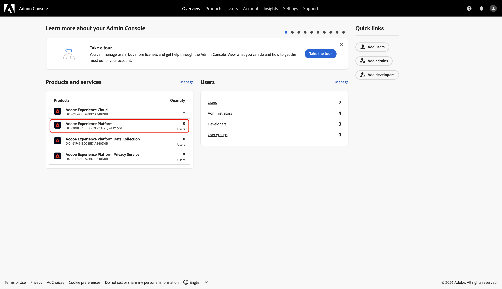
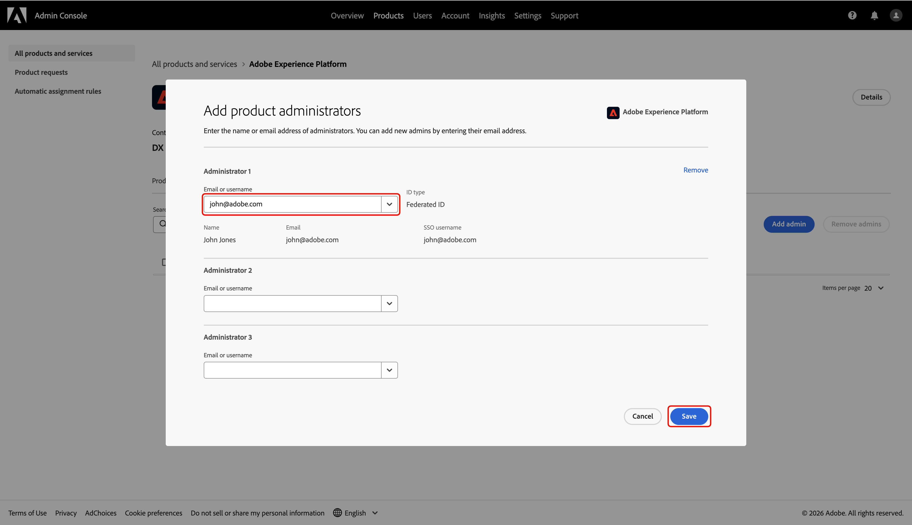
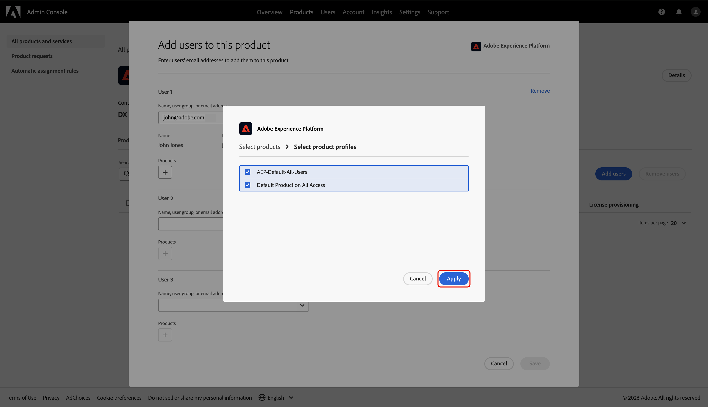

# 配置Collaboration [!DNL Starter]入门培训的管理员访问权限

作为贵组织中第一个通过Collaboration [!DNL Starter]访问Adobe Experience Platform的用户，您负责为团队设置和管理访问权限。 您必须授予自己必要的管理员和用户权限，才能开始使用Real-Time CDP Collaboration。 阅读本指南，了解如何在Admin Console中配置所需的访问权限，以便您可以在权限界面中管理协作权限。

## 先决条件 {#prerequisites}

Before continuing, ensure that you have:

* 已接受您的许可Collaboration合作伙伴的邀请。 For more information about the invitation requirements, see the [Collaboration [!DNL Starter] overview](../overview/starter-overview.md#prerequisites).
* 审核并签署Collaboration条款和条件。
* Received your Adobe welcome email and completed your first-time account creation.

## 设置访问权限 {#setup-access}

通过[!DNL Starter]工作流创建Adobe帐户时，会自动为您分配系统管理员角色。 这允许您在Admin Console中管理用户和产品访问权限。 但是，您还没有访问&#x200B;**[!UICONTROL 权限]**&#x200B;的权限，这是管理Collaboration的访问权限所必需的。

使用Admin Console向自己授予对Experience Platform的&#x200B;**产品管理员访问权限**&#x200B;和对Experience Platform产品的&#x200B;**用户访问权限**，以进入&#x200B;**[!UICONTROL 权限]**。

要详细了解Experience Cloud中的角色和产品，请阅读[访问控制概述](../permissions/overview.md)文档。

>[!TIP]
>
>在本指南中，**管理员**&#x200B;将同时引用&#x200B;**系统和产品管理员**。

### 配置产品管理员访问权限 {#configure-product-admin-access}

请阅读此部分以授予您自己的管理员权限，开始设置Collaboration [!DNL Starter]的访问权限。

#### 访问Admin Console {#access-admin-console}

To begin, sign in to [Adobe Experience Cloud](https://experience.adobe.com/){target="_blank"} with your credentials. 您可以在&#x200B;**[!UICONTROL 快速访问]**&#x200B;部分中看到可用产品的列表。 选择&#x200B;**[!UICONTROL Admin Console]**。

{zoomable="yes"}

#### Access Adobe Experience Platform product dashboard {#access-adobe-experience-platform}

The [Admin Console](https://adminconsole.adobe.com/) workspace opens in a new tab. Select **[!UICONTROL Adobe Experience Platform]** from the **[!UICONTROL Products]** list under **[!UICONTROL Products and services]**.

{zoomable="yes"}

#### Add product admin {#add-product-admin}

In the **[!UICONTROL Adobe Experience Platform]** product dashboard, navigate to the **[!UICONTROL Admins]** tab. Then select **[!UICONTROL Add admin]**.

{zoomable="yes"}

Enter your email address or username in the **[!UICONTROL Add product administrators]** dialog, then select the correct account from the dropdown. Once finished, select **[!UICONTROL Save]**.

{zoomable="yes"}

You are now a product administrator and can add users or other admins to the product within the Admin Console. Next, grant yourself user access to the Experience Platform product to access and perform functions in Permissions.

### Configure user access {#configure-user-access}

To manage Collaboration permissions, you must have **user access** to the product in addition to administrator access. User access can be configured by a system or product administrator.

>[!TIP]
>
>If you are following along from the previous section, you should already be in the **[!UICONTROL Adobe Experience Platform]** product dashboard within the Admin Console. From here, proceed to [add yourself as a user](#add-user).

To begin configuring your user access, complete the following steps:

1. [Access the Admin Console from the Adobe Experience Cloud homepage](#access-admin-console).
2. [Navigate to the Adobe Experience Platform product dashboard](#access-adobe-experience-platform).

#### Add user to product {#add-user}

You are now in the **[!UICONTROL Adobe Experience Platform]** product dashboard. Navigate to the **[!UICONTROL Users]** tab, then select **[!UICONTROL Add users]**.

{zoomable="yes"}

出现&#x200B;**[!UICONTROL 将用户添加到此产品]**&#x200B;对话框，提示您输入姓名、用户组或电子邮件地址。 填写值，然后从下拉列表中选择您的帐户。

{zoomable="yes"}

接下来，选择&#x200B;**[!UICONTROL 产品]**&#x200B;下的添加图标。

此时将显示一个对话框，其中包含可用[产品配置文件](https://helpx.adobe.com/enterprise/using/manage-product-profiles.html)的列表。 选择&#x200B;**[!UICONTROL AEP-Default-All-Users]**&#x200B;和&#x200B;**[!UICONTROL 默认的生产所有访问]**。 然后选择&#x200B;**[!UICONTROL 应用]**。

{zoomable="yes"}

最后，选择&#x200B;**[!UICONTROL 保存]**&#x200B;以完成向产品添加新用户。

{zoomable="yes"}

获得用户访问权限后，导航回[Adobe Experience Cloud](https://experience.adobe.com/){target="_blank"}。 确认&#x200B;**[!UICONTROL 权限]**&#x200B;和&#x200B;**[!UICONTROL Real-Time CDP Collaboration]**&#x200B;在&#x200B;**[!UICONTROL 快速访问]**&#x200B;下可用。

{zoomable="yes"}

>[!TIP]
>
>如果&#x200B;**[!UICONTROL 权限]**&#x200B;和&#x200B;**[!UICONTROL Real-Time CDP Collaboration]**&#x200B;未出现在&#x200B;**[!UICONTROL 快速访问]**&#x200B;中，请尝试注销并重新登录。

## 后续步骤 {#next-steps}

您现在同时具有&#x200B;**管理员访问权限**&#x200B;和&#x200B;**用户访问权限**&#x200B;以输入权限，您可以在其中定义Collaboration功能和资源的角色、分配特定权限以及管理用户访问权限。 有关分步说明，请参阅[权限控制指南](./starter-permission-controls.md)。
