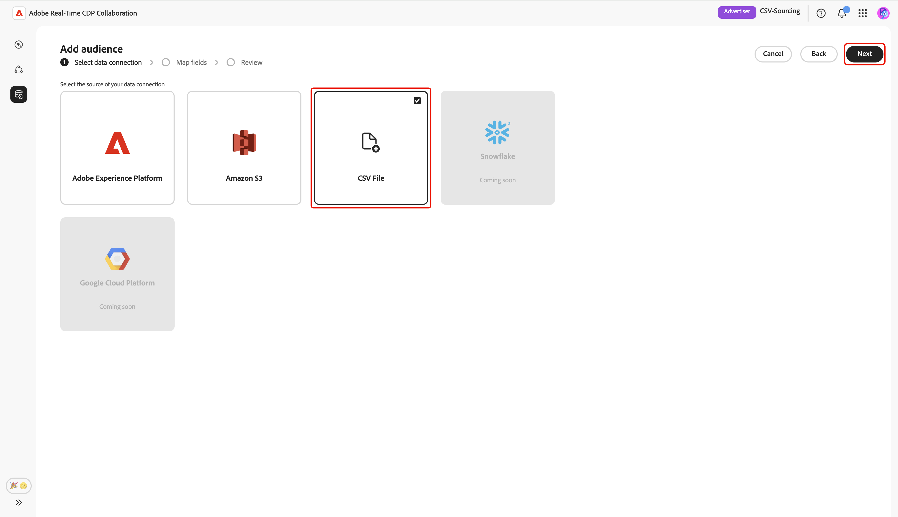
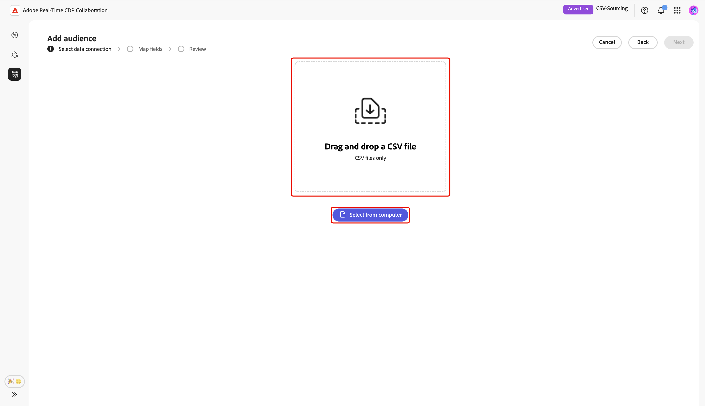
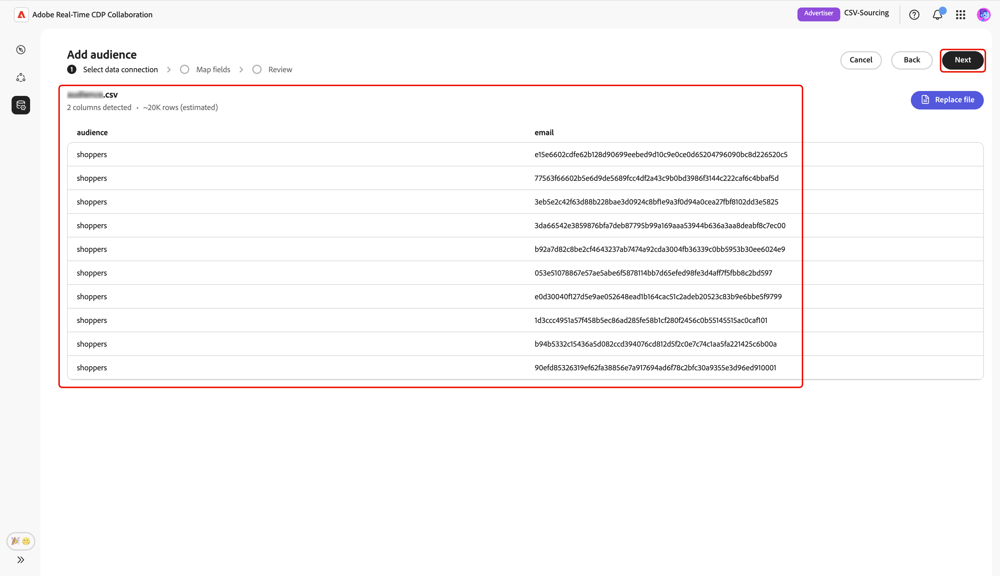
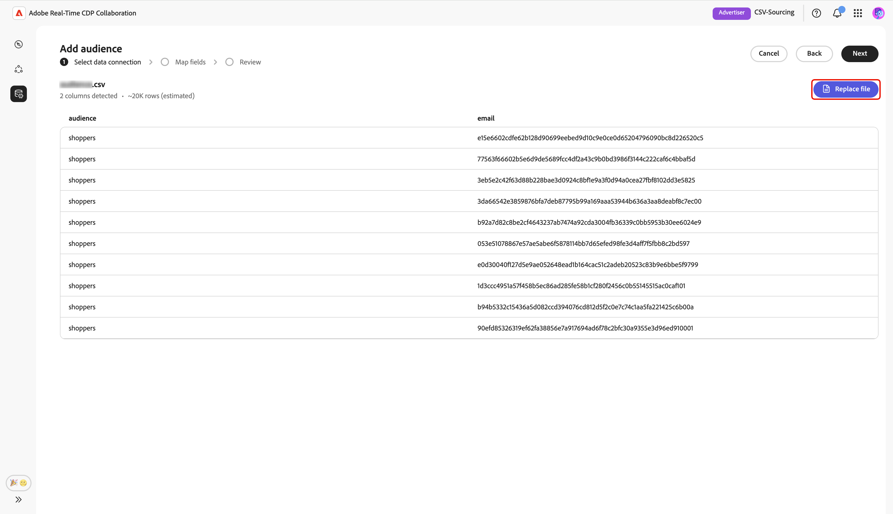
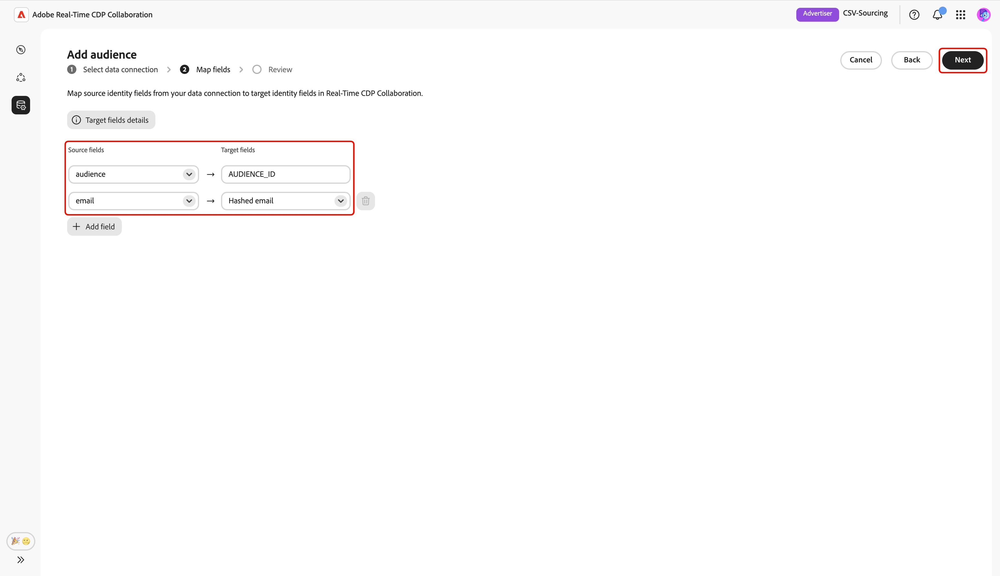
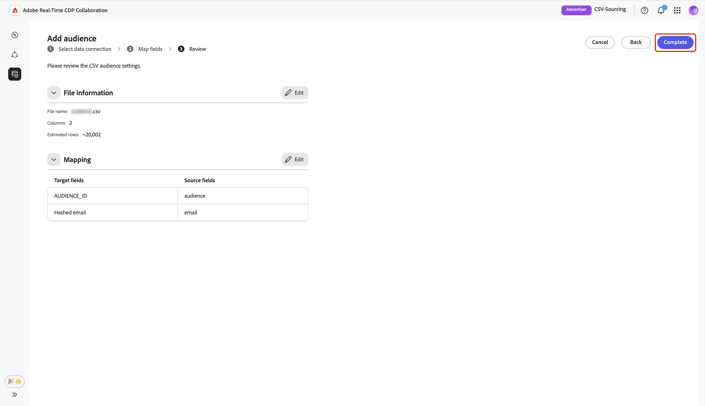
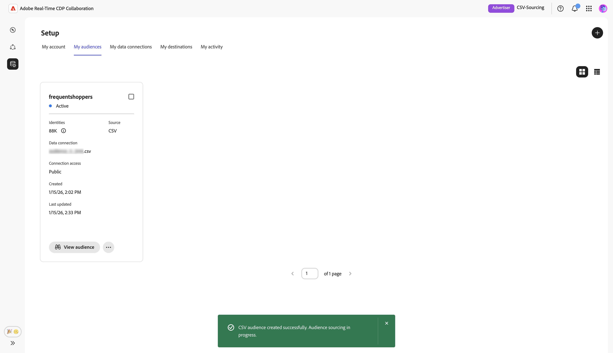
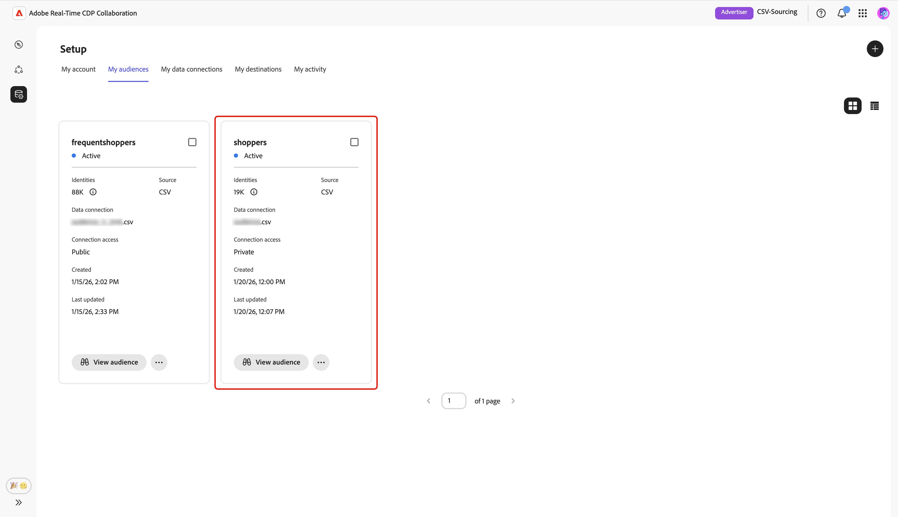

# 上传CSV文件以进行受众源

本指南提供了在Adobe Real-Time CDP Collaboration UI中上传CSV文件的步骤，以便获取您的受众数据以用于协作项目。

## 概述 {#overview}

CSV文件上传是一种为协作项目获取第一方受众数据的方法。 这是[连接您的AWS S3存储桶](./configure-aws-s3-audience-sourcing.md)或[从Experience Platform获取受众的替代方法](./onboard-audiences.md)。

按照此工作流程，将包含受众数据的CSV文件上传到Collaboration中的源和管理第一方受众。 您可以映射标识字段以进行激活和重叠分析。 上传并处理文件后，源受众将在&#x200B;**[!UICONTROL 我的受众]**&#x200B;工作区中可用，您可以在其中查看、激活和管理协作项目。

>[!IMPORTANT]
>
>* 通过CSV上传获得的受众的可用期限为&#x200B;**7天**。 在此时段后，受众过期，必须重新上传以在您的协作项目中使用。
>
>* 此时，您可以为每个会话上传一个CSV文件。 要添加其他受众，请为您要源的每个文件再次完成上传工作流。

## 先决条件 {#prerequisites}

在上传CSV文件以进行受众获取之前，请确保您具有：

* 已在Real-Time CDP Collaboration中完成帐户载入。 有关分步说明，请参阅[登录您的帐户](./onboard-account.md)。
* 在组织中添加受众所需的权限。
* 包含受众数据的CSV文件，其中包含电子邮件或电话等标识字段。

## 上传 CSV 文件 {#upload-csv-file}

从&#x200B;**[!UICONTROL 设置]**&#x200B;工作区的&#x200B;**[!UICONTROL 我的受众]**&#x200B;选项卡中，选择添加图标（)，然后选择&#x200B;**[!UICONTROL 受众]**。

如果这是您的第一个受众，您还可以选择&#x200B;**[!UICONTROL 添加]**&#x200B;选项。

此时会显示添加受众工作流。 选择&#x200B;**[!UICONTROL 添加新数据连接]**，然后选择&#x200B;**[!UICONTROL 下一步]**。

{zoomable="yes"}

### 选择CSV文件作为数据连接 {#select-csv-file}

选择&#x200B;**[!UICONTROL CSV文件]**&#x200B;作为数据连接，然后选择&#x200B;**[!UICONTROL 下一步]**。

### 选择文件 {#select-file}

选择&#x200B;**[!UICONTROL 从计算机中选择]**&#x200B;以从本地系统上传CSV文件。 或者，您也可以将要上载的CSV文件拖放到[!UICONTROL 拖放CSV文件]面板。

>[!IMPORTANT]
>
>仅支持CSV文件。 最大文件大小为&#x200B;**2 GB**。

上传后，UI会显示摘要，包括列数、预计行数、文件结构和前10行数据的预览。

查看摘要，然后选择&#x200B;**[!UICONTROL 下一步]**。

#### 替换文件 {#replace-file}

如果需要上载其他CSV文件，请选择&#x200B;**[!UICONTROL 替换文件]**，然后选择新文件。 然后，界面将刷新以显示新数据的更新摘要。

查看修订的摘要后，选择&#x200B;**[!UICONTROL 下一步]**。

### 确认同意确认 {#confirm-consent}

在继续之前，您必须确认已从受众数据中删除同意选择退出。 Collaboration需要干净的受众数据，而用户却未选择退出数据共享。

选中确认框，然后单击&#x200B;**[!UICONTROL 确定]**&#x200B;进行确认。 该对话框随即关闭，您将进入“映射字段”屏幕。

### 映射源标识字段 {#map-fields}

字段映射确定Collaboration如何使用受众数据进行激活和重叠分析。 在&#x200B;**[!UICONTROL 映射字段]**&#x200B;屏幕上，使用下拉菜单将CSV文件中的每个源标识字段映射到Collaboration中相应的目标字段。

如果需要有关目标字段的其他详细信息，包括数据类型或说明，请选择&#x200B;**[!UICONTROL 目标字段详细信息]**&#x200B;以获取更多信息。

接下来，查看映射的字段，然后选择&#x200B;**[!UICONTROL 下一步]**。

### 查看并完成上传 {#review-and-complete}

此时将显示&#x200B;**[!UICONTROL 审核]**&#x200B;屏幕，其中包含CSV文件中的受众设置摘要。 查看以下部分中的信息：

* **[!UICONTROL 文件信息]**：显示文件名、列数和估计的行数。
* **[!UICONTROL 映射]**：列出您上传的受众文件中的源字段（例如`email`）如何映射到Collaboration中使用的目标字段（例如，哈希电子邮件）。

如果需要编辑节，请选择铅笔图标。 选择&#x200B;**[!UICONTROL 完成]**&#x200B;以确认所有节。

摘要部分下方会显示一个进度条以指示上传进度。 上传完成后，将显示确认对话框，确认您的CSV受众已创建并且受众源获取正在进行中。

## 审查源受众 {#review-sourced-audiences}

上传CSV文件后，Collaboration开始从文件中获取受众。 此过程可能需要几分钟。 采购完成后，您的受众将位于&#x200B;**[!UICONTROL 我的受众]**&#x200B;选项卡中，其功能和信息与源自Experience Platform的受众相同。

在网格视图或表格视图中，选择行项或&#x200B;**[!UICONTROL 查看受众]**&#x200B;以查看特定受众的概述。 它显示受众的状态、源和数据连接名称，以及以下内容的详细面板：

**[!UICONTROL 身份]**：显示数据可用时的身份总数和划分。
**[!UICONTROL 类别]**：显示用于组织或筛选受众的任何标记。
**[!UICONTROL 连接访问]**：显示受众是私有受众、公共受众还是与特定协作者共享。
**[!UICONTROL 元数据可见性]**：显示对协作者可见的受众信息（如身份计数、重叠百分比和索引）。

在协作项目中使用受众之前，请使用此视图确认受众配置和可见性设置。 有关详细信息，请参阅[如何查看单个受众](./onboard-audiences.md#view-individual-audiences)。

## 后续步骤 {#next-steps}

您现在已成功将CSV文件上传到Collaboration。 完成来源补充后，您可以：

* 创建具有源受众的协作项目。 查看[发现受众](../../guide/collaborate/discover.md)。
* 将受众激活到连接的目标。 请参阅[激活受众](../../guide/collaborate/activate.md)。
* 查看受众重叠和见解。 查看[衡量促销活动效果](../../guide/collaborate/measure.md)。
* 管理受众设置和可见性。 查看[Source并管理受众](./onboard-audiences.md)。

有关其他受众源方法的信息，请参阅[为受众源配置AWS S3](./configure-aws-s3-audience-sourcing.md)或从Experience Platform[配置](./onboard-audiences.md)Source受众。
